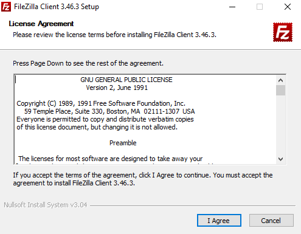
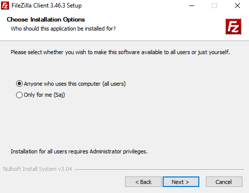
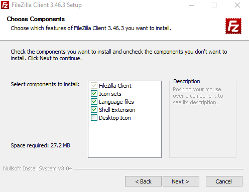
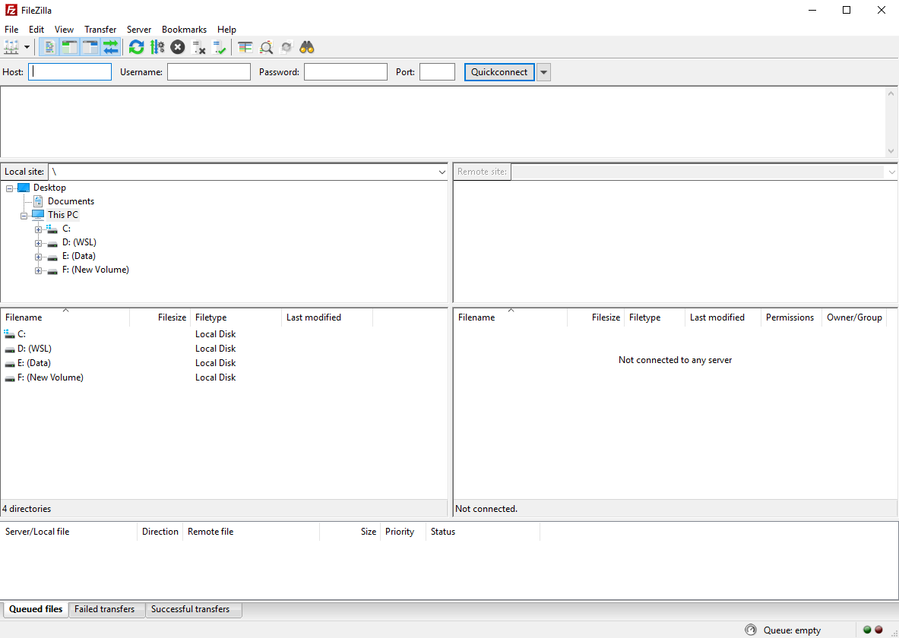

# Connecting to an FTP Server using FileZilla Client

This guide will assist you in connecting to your FTP server using the FileZilla Client.

## Installing FileZilla Client

- If you haven't already, you can download the FileZilla Client from the [official FileZilla website](https://filezilla-project.org/download.php)

Run the FileZilla Client installer file and the following window will be displayed:



- You will be presented with the current FileZilla Client license agreements that you can view prior to installing the application.
- You will need to agree to the license terms in order to install FileZilla Client.

Once you click the `I Agree` button a `Choose Installation Options` window will be displayed.



- Within this window you can select whether you would like to install FileZilla Client for all users or only the user that you are currently logged in as.

After selecting the desired installation option, click the `Next` button and a `Choose Components` window will be displayed.



- Within the components window you are given the options to install various components.
  - **Icon sets** - This component will install additional icons for the FileZilla Client.
  - **Language files** - Select this component if you want to use FileZilla Client in anonther language other than English
  - **Shell Extension** - This allows FileZilla Client to be integrated into Windows Explorer.
  - **Desktop Icon** - This will add the FileZilla Client desktop icon to your desktop.
- Most users will install the components that are selected by default.

After selecting the desired components to install, click the `Next` button and a window where you can choose a location on your server to store the application files will be displayed.

Once you have entered a location for the FileZilla Client files, click the `Next` button again and then you will be prompted with a window where you can `Install` the FileZilla Client with your chosen option.

### Connecting to your FTP Server

After the installation has finished, launch the FileZilla Client and the following window will be displayed:



- Once the FileZilla Client launches, you can connect to your FTP server by entering the relevant details into the bar at the top of the window:
  - **Host:** - Enter the server IP address or hostname.
  - **Username:** - Enter your FTP username.
  - **Password:** - Enter the password for your FTP user.
  - **Port:** - Enter the FTP port that your FTP server is listening on (you can leave this text box blank to use the default FTP port 21).

- Click the `Quickconnect` button and your FTP Client will then attempt to establish a connection to your FTP Server.

If you have successfully connected to your FTP Server, an informational log similar to the below will be displayed:

```console
    Status:	Resolving address of sajbox.co.uk
    Status:	Connecting to 127.0.0.1:21...
    Status:	Connection established, waiting for welcome message...
    Status:	Insecure server, it does not support FTP over TLS.
    Status:	Logged in
    Status:	Retrieving directory listing...
    Status:	Directory listing of "/" successful
```

If you see an error similar to the below, you may need to enable FTP passive ports on your FTP Server or enable the FTP ports through your firewall. Please view our [Configuring FTP passive mode](/operatingsystems/windows/ftp/passive_mode.html/) documentation and our other guides on [managing your firewall](/network/firewalls/).

```console
  Response:   227 Entering Passive Mode (123,123,123,123,174,209)
  Command:    MLSD
  Error:  Failed to retrieve directory listing
```

```eval_rst
  .. meta::
     :title: Connecting to an FTP Server using FileZilla Client | UKFast Documentation
     :description: Guidance on Connecting to an FTP Server using FileZilla Client
     :keywords: ukfast, ftp, filezilla, server, windows, client
