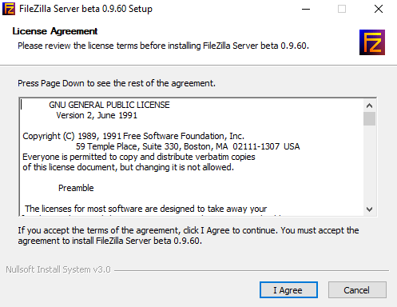
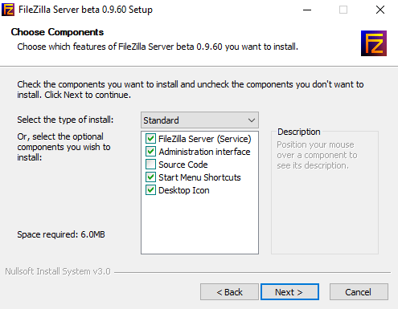
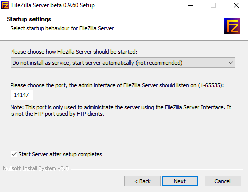
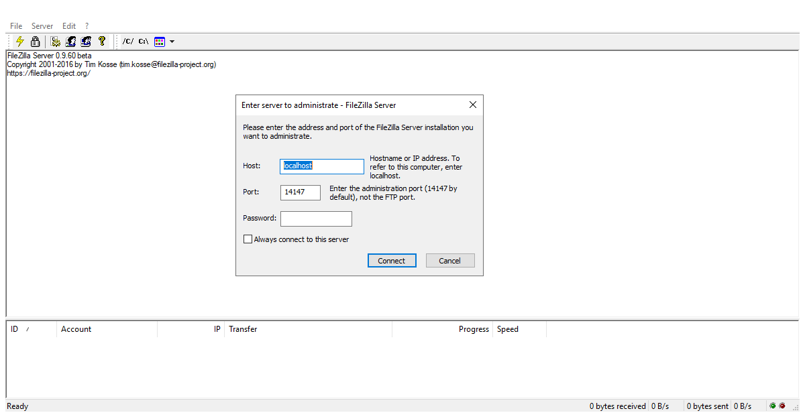
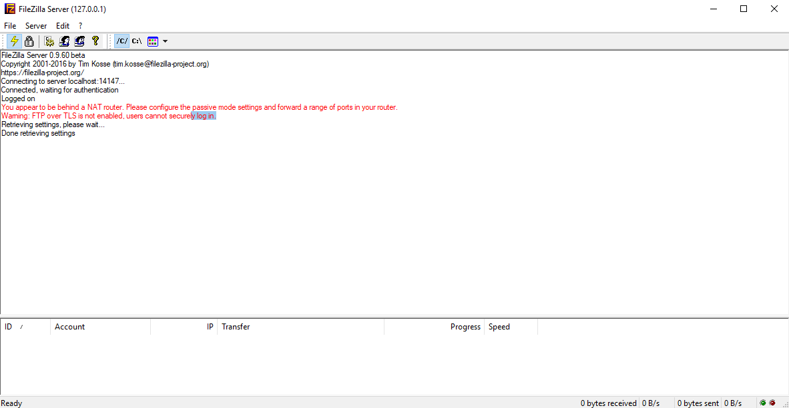

# Installing FileZilla Server for Windows

This guide will help you install the FileZilla Server application on your Windows server.

## Installing FileZilla Server

- You can download the FileZilla server application from the [official FileZilla website](https://filezilla-project.org/download.php?type=server)

Run the FileZilla server installer file as below:



- You will be presented with the current FileZilla server license agreements that you can view prior to installing the application.
- You will need to agree to the license terms in order to install FileZilla Server.

Once you click the `I Agree` button a `Choose Components` window will be displayed.



- Within this window you are given the option to select what type of FileZilla Server install you would like.
  - **Standard** install will install both the FileZilla service and the Administrative interface (we recommend this option).
  - **Full** install includes all components from the **Standard** install, but also installs the source code for the application.
  - **Service only** install will only install the FileZilla Server service, the administrative interface will not be included.
  - **Interface only** install will only install the administrative interface, the FileZilla Server service will not be included.
  - **Custom** install allows you to select any of the optional components listed.

After selecting the desired type of install and click the `Next` button, you will be presented with a window where you can choose a location on your server to store the application files.

Once you have entered a location for the FileZilla Server files you will then be presented with the following window



- Here you are able to choose how you would like the FileZilla Server to be started. We recommend that you leave this option as default, as this will install FileZilla as a service and the server will start on startup
- The next option is the port that the administrative interface will listen on. We recommend that you leave this as default as this is only for the administrative interface and not FTP itself.

Upon clicking the `Next` button you will be asked to choose how the administrative interface is started, we recommend that you leave this as the default option and click the `Install` button. The FileZilla Service will then be installed with the desired options the FTP server will startup automatically depending on your startup options.

## Connecting to the FileZilla Server Administrative Interface

After the installation has finished the administrative interface will startup as can be seen below:



- Within the first window that is displayed, you will need to enter the correct port that the administrative interface is listening on and then click the `Connect` button.

Once you have connected you should see something similar to the following messages within the interface:



- Within the administrative interface, you can make changes to FTP users, FTP groups and modify FileZilla Server settings.
- You can add additional FTP users by proceeding to `Edit > Users`.
- You can add additional FTP groups by proceeding to `Edit > Groups`.
- To modify FileZilla Server settings you will need to go to `Edit > Settings`

```eval_rst
  .. title:: Installing FileZilla Server for Windows
  .. meta::
     :title: Installing FileZilla Server for Windows | UKFast Documentation
     :description: Guidance on installing the FileZilla Server for Windows
     :keywords: ukfast, ftp, filezilla, server, windows
```
