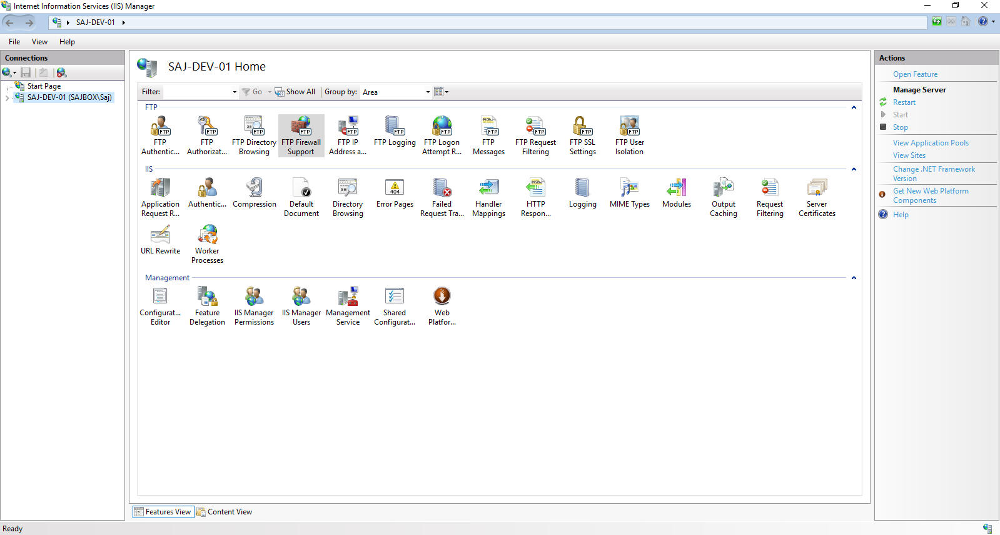

# Configuring FTP passive mode

This guide will help you configure your server and firewall for FTP passive mode.

In most cases, within your FTP client when attempting to connect to an FTP server and you see an error similar to the below, you will most likely need to enable FTP passive ports on your FTP server:

```console
  Response:   227 Entering Passive Mode (123,123,123,123,174,209)
  Command:    MLSD
  Error:  Failed to retrieve directory listing
```

This guide will be based on setting up FTP passive ports for both FileZilla Server and FTP Server for IIS, I will be using the passive port range 40000-40100.

## FileZilla Server

Once you have installed and configured FileZilla Server on your Windows Server and you would like to enable FTP passive ports, you will first need to open the `FileZilla administrative intereface`.

For information on how you can install FileZilla Sever and launch the administrative intereface, please check out our [Installing FileZilla Server guide](/operatingsystems/windows/ftp/filezilla_server.html)

- Once you have connected to the FTP server using the administrative intereface, please proceed to `Edit > Settings`.

The following window will then be displayed within the intereface:


- Then proceed to `Passive mode settings`.
- Within this window, check the checkbox `Use custom port range`, this will then enable the greyed out text boxes to enter the passive port range. 
- Type in the desired port range, I am using the range `40000-40100`.

The `Passive mode settings` window should now look similar to the following image:


Click `Ok` and you have now succesfully enabled FTP passive mode for a select port range on your FileZila Server.

- You will need to ensure that your firewall allows inbound connections on the passive port range you have selected (in our example 40000 to 40100). Please check out our guides on [managing your firewall](/network/firewalls/).

## FTP Server for IIS

Once you have installed and configured an FTP server for IIS, to enable FTP passive mode you will first need to open `IIS`.

For information on how you can install FTP Server for IIS, please check out the [offcial documentation](https://docs.microsoft.com/en-us/iis/publish/using-the-ftp-service/scenario-build-an-ftp-site-on-iis).

- Once you have opened IIS, please click on your `Server`, which will be located on the left-hand side of the IIS window.

You will then presented with a similar window to the below image:



- Next, you will neded to open the `FTP Firewall Support` feature, this can be found within the FTP section of IIS.
- Within this window enter the desired port range within the `Date Channel Port Range` text box.
- Now click `Apply` on the right-hand side of the IIS window to apply the changes.

Your IIS window should now look similar to the following:


You have now successfully enabled FTP passive mode for a select port range with IIS.

## Opening ports on your firewall

If you are a UKFast customer and you're not sure about how to open ports or manage other aspects of your firewall configuration, please do refer to our other guides on [managing your firewall](/network/firewalls/).

If you have windows firewall enabled on your server, you will need to ensure that your passive port range is allowed through the firewall.

```eval_rst
  .. meta::
     :title: Configuring FTP passive mode | UKFast Documentation
     :description: Guidance on enabling FTP passive mode for Windows FTP Servers
     :keywords: ukfast, ftp, filezilla, server, windows, iis, passive, port
