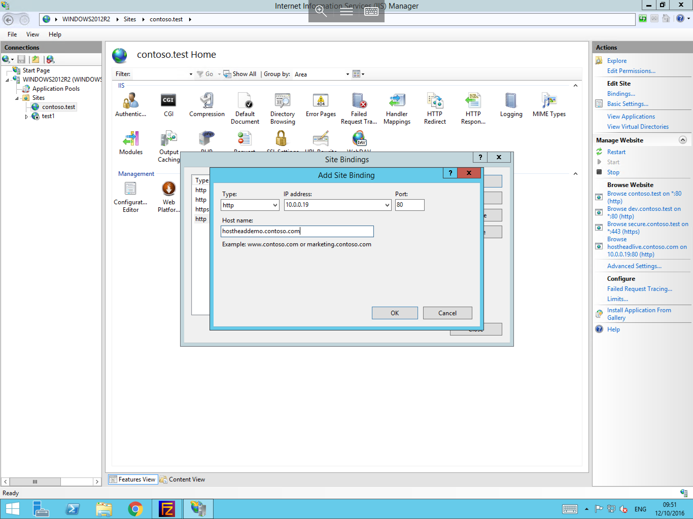

# Configuring Host Headers in IIS
* If you have not already added a site to the Microsoft Internet Information Service (IIS) please review our guide "Setting up your first site in IIS"

* Host headers are used in IIS to direct web requests to different hostnames using the same IP address and port, to configure host headers within IIS, please follow the below steps.
  For this example, we are going to configure host headers for a scenario where 2 subdomains need to be accessible on the same IP address and port.

Load the IIS Manager by navigating to the Internet Information Services icon within the start menu, or by selecting Server manager, selecting tools, and Internet Information Services. you will now be presented with the IIS Manager, from the "Connections" menu on the left, please select the site which you wish to edit the host header for, then select "Bindings" from the Actions pane on the right hand side of the window.


You will now be presented with the "Add Site Binding" menu, select add and create a binding for a subdomain, as below



Repeat the above process to create another binding, but this time for a second subdomain using the same IP and port, but with a different host name entered in the binding as below


* You will now see that both of the subdomains are listed in the site bindings using the same port and IP address. Traffic to these sites will now be filtered by the server depending on the address which is being visited by the user.


```eval_rst
  .. title:: Configuring host headers in IIS
  .. meta::
     :title: Configuring host headers in IIS | ANS Documentation
     :description: A guide to configuring host headers in IIS
     :keywords: ukfast, cloud, windows, host, headers, iis, web, server, site, tutorial, guide
```
