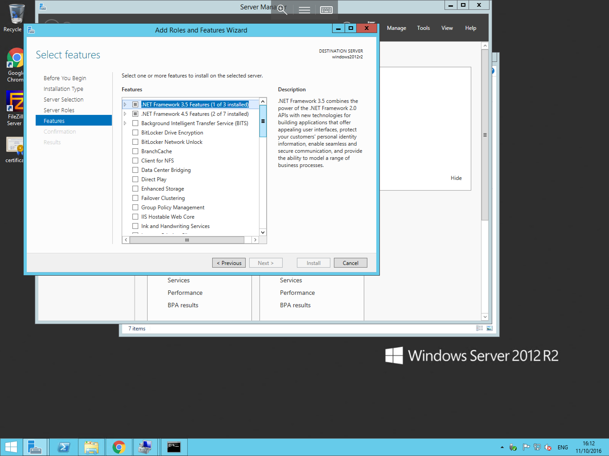

# Installing IIS


* In order to install IIS Please follow the below process.


Open Server Manager and select manage from the top menu, then select "Add Roles and Features" as below


 * You will now be presented with the add roles and features Wizard. The first pane in this wizard is the "Before you begin" pane, this will provide you information on some prerequisite checks which are considered best practice.
 * The next tab will present you with the choice to carry out a role-based or feature-based installation, or a remote desktop services installation. please choose the first option and select next.
 * You will now be taken to the server selection screen, as the name suggests, this page allows you to choose the server on which you wish to install the role/s or feature/s, make your selection and press next.

Once the above steps have been taken, you will be presented with the Roles selection screen, Scroll down the available choices until you are presented with the "Web Server(IIS)" option, select this option by clicking on the box next to it as below and select next.

   

The next page which you will be shown is the Features pane, this allows you to choose additional features and includes to install along side your chosen role/s, you will notice that some options have already been selected here, this is because they are included with the previously chosen role.
Once you are happy with the choices which you have made, please select next.



You will now be asked to confirm your choices, check to ensure that all required components are in the list, and select "install" to begin the installation process.
The installation progress will be displayed in the next window, and will be updated throughout the process, once the installation has completed, the status will change to complete.


* Once this step has finished, IIS will be installed.

```eval_rst
  .. title:: Installing IIS on the Windows Server OS
  .. meta::
     :title: Installing IIS on the Windows Server OS | UKFast Documentation
     :description: A guide to installing IIS on Windows Server
     :keywords: ukfast, windows, iis, web, domain, server, cloud, features, host
