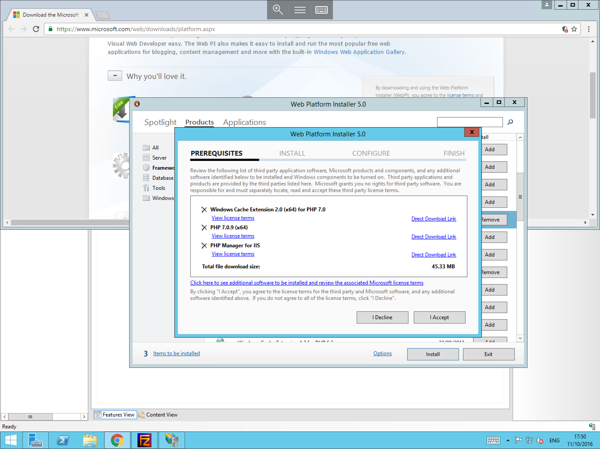
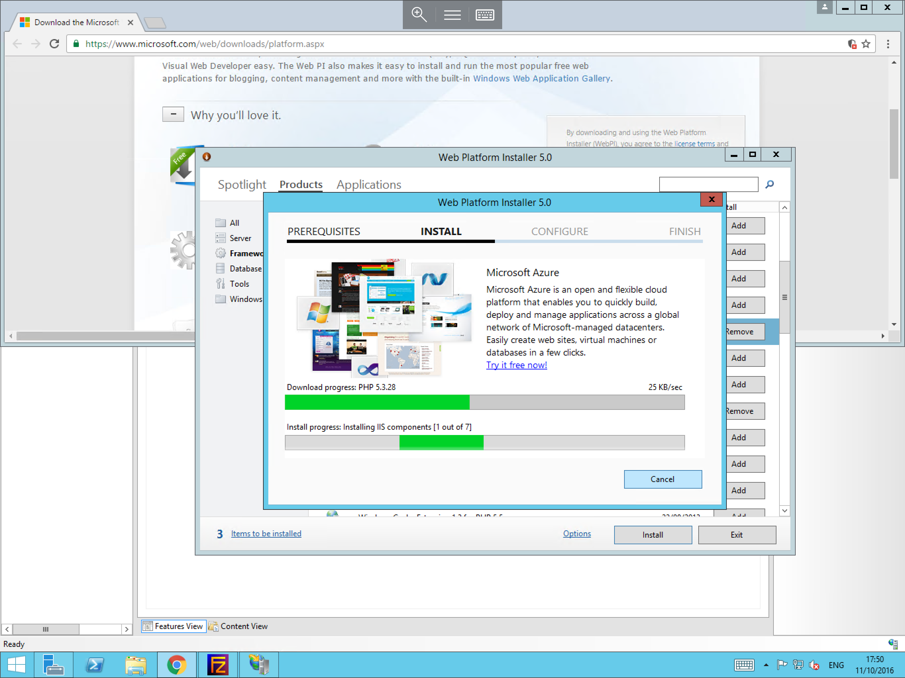
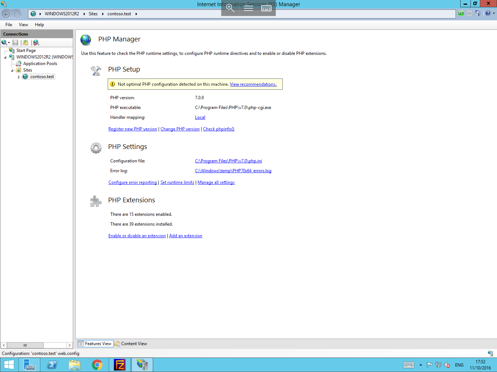

# Installing PHP for use in IIS

To install PHP, please follow the below steps


Firstly, please obtain the Microsoft Web Platform Installer if you do not currently have it installed, this can be downloaded for free from the following link

[Microsoft Web Platform Installer](https://www.microsoft.com/web/downloads/platform.aspx)

Once this has been downloaded, please open the file. you will now be presented with the web platform installer, please select products from the menu on the top banner, then select Frameworks from the left hand side of the window. You will now be shown a list of available IIS modules including PHP as below.


Please select the version of PHP which you wish to install and select "Add" as below, once you have chosen your desired version, please select "Install"


You will be provided with a list of pre-requisites for your version of PHP, select "I Accept" as below



The installation process will now begin and you will be presented with the below progress window



Once the process has completed, you will be presented with the below confirmation screen, please select "Finish" to complete the installation.


* Now that the installation has been completed, please open IIS Manager, and select your site/s. Within the central module section, you should now be able to select PHP Manager as below, this will present information and options related to your PHP installation.




```eval_rst
  .. title:: Installing PHP for use in IIS
  .. meta::
     :title: Installing PHP for use in IIS | UKFast Documentation
     :description: A guide to installing PHP for use in IIS
     :keywords: ukfast, windows, iis, php, install, guide, tutorial, server, net, microsoft
```
