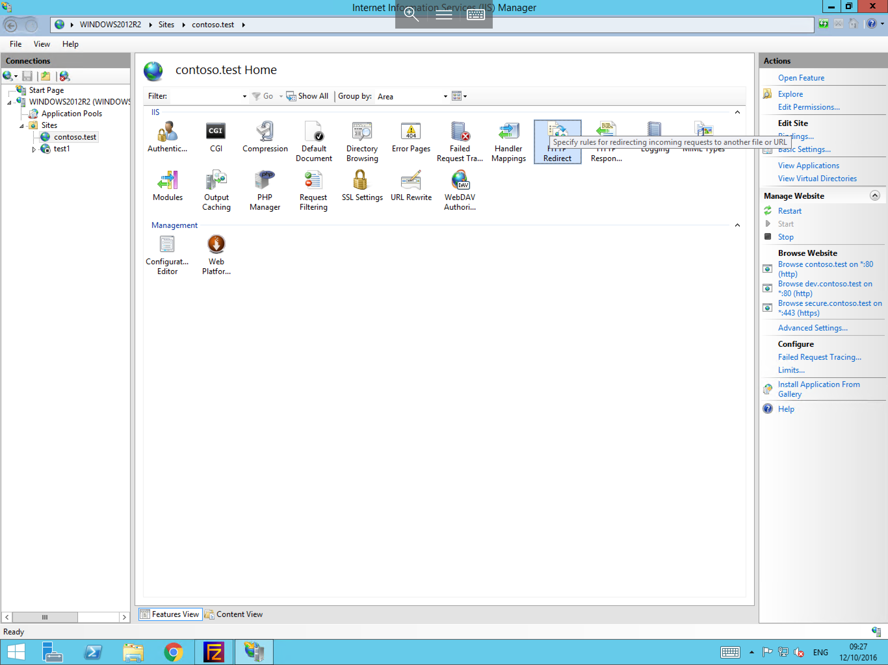
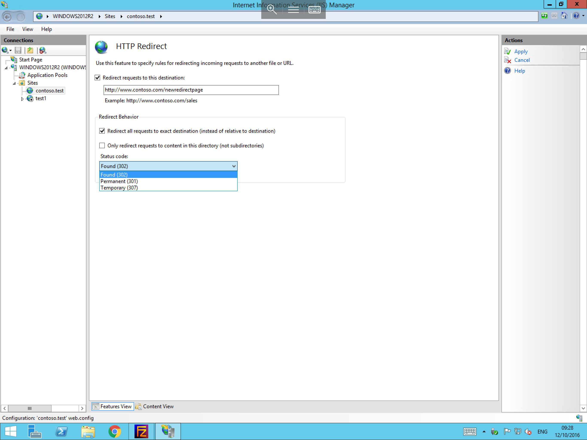

# Configuring a Redirect in IIS

Redirection is helpful in the following situations:

* You change the location of your Web site and want to redirect users to your new site.
* Your Web site is under construction and you want part of the site to be unavailable.
* Your content is not located on the Web server.
* You have changed the name of a virtual directory and you want users to be able to access files from the old URL.

To configure a Redirect in IIS, please follow the below instructions.


Launch IIS Manager on your server by selecting server manager, then selecting tools and Internet Information Services Manager. Once you have opened the IIS Manager, select your site in the "Connections list" and select the "HTTP Redirect" Module which should be located in the central field of IIS Manager as below



The centre field should now Present the HTTP Redirect options as below,




Within the field "Redirect requests to this destination" please enter the destination URL which you would like to redirect to, (Please ensure that you select the tick box next to this option in order to enable it)

When you have entered the new destination URL, continue to configure the behavior of the redirect by selecting from the options within the "Redirect Behavior" section.

* Once you have configured all of the redirect options to your requirements, please select "Apply" from the Actions pane to the right hand side of the window to apply your redirect.

```eval_rst
  .. title:: Configuring a redirect in IIS
  .. meta::
     :title: Configuring a redirect in IIS | UKFast Documentation
     :description: A guide to configuring a redirect in IIS
     :keywords: ukfast, windows, iis, configure, redirect, setup, tutorial, guide
