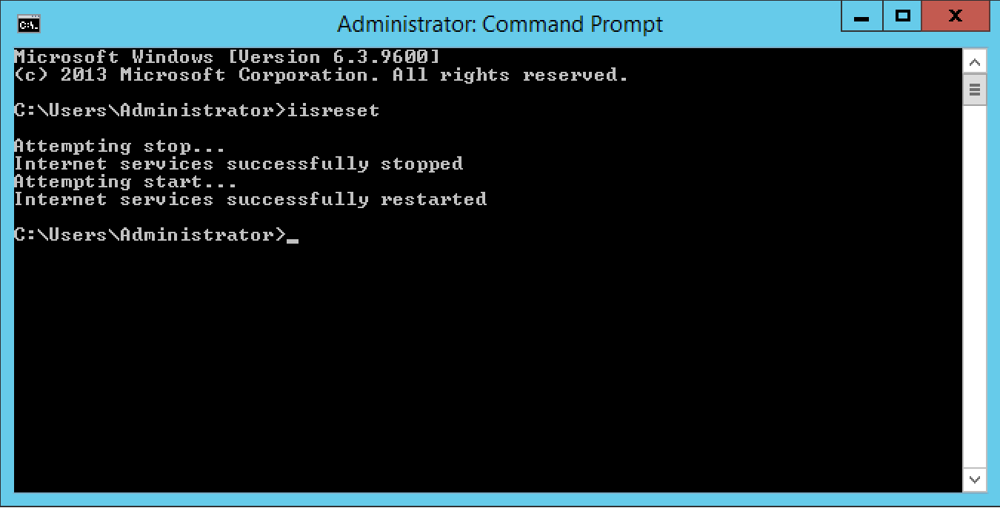

# How to Reset IIS

IIS can sometimes require a restart to apply certain changes or to force-close connections to applications/websites.

* Please note, forcing an IISReset will result in a short period of downtime for any websites on the server in question.

In order to Carry out an IIS Reset, Please follow the below guide

Select Start, type "cmd", right click cmd when it is displayed, and select "Run as Administrator" as below


You will now be presented with a new command prompt with administrator level access as below


Within the command prompt, please type ```iisreset ``` as below, and press enter on your keyboard.


The reset process will now begin,and the words "Attempting stop..." will be printed in the cmd window, the process usually takes 5-10 seconds, however if the server is handling a large volume of connections at the time when you initiate an iisreset, the process can take considerably longer.
Once the process has completed, you will be given access to your command prompt once more as below.



* IIS has now been restarted.

```eval_rst
  .. title:: Resetting IIS | UKFast Documentation
  .. meta::
     :title: Resetting IIS | UKFast Documentation
     :description: A guide to resetting IIS in Windows Server
     :keywords: ukfast, windows, cloud, iis, web, site, reset, tutorial, guide
