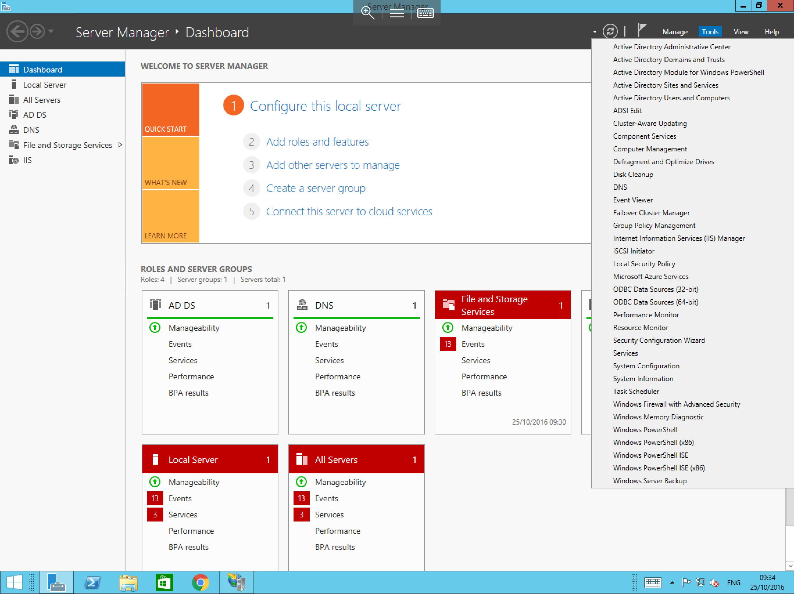
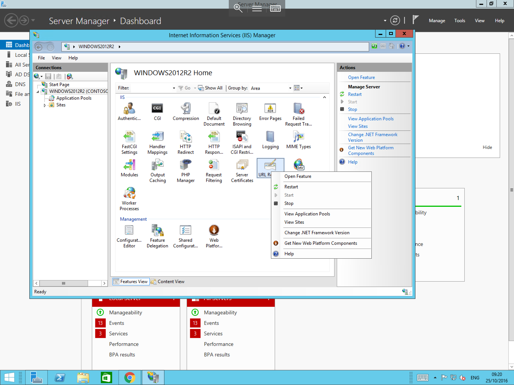

# IIS URL Rewrite module

## Installing the URL rewrite module

The IIS URL Rewrite module is an add-in component for IIS that allows an administrator to create rules which can be used to rewrite a url along with several other functions.

* To Install the URL Rewrite module on your server, please follow the below guide(This guide assumes that you already have IIS installed, if you do not, and are unsure how to do this, please follow our guide "installing IIS")

Firstly, you will need to obtain the URL Rewrite module for IIS, this can be downloaded for free from the link below

[IIS URL Rewrite Module](https://www.iis.net/downloads/microsoft/url-rewrite)

Once you have obtained the module, please select it from the location which you downloaded it to, once opened, you should be presented with a licence agreement, Please tick the Accept box as below


Once you have selected the Accept box, please select the install button, the installation of the module will begin immediately as below, and will confirm once it has completed


## Accessing the URL rewrite module

* To Access the URL rewrite module, please follow the below guide (This guide assumes that you have completed the installation steps above, if not, please do so before attempting this stage)

Select server manager, you can do this by selecting start and then selecting server manager from the list of available applications, or by selecting the server manager taskbar shortcut.
Once the server manager has opened, please select tools, and select "Internet Information Services (IIS)" from the resulting menu as below



You will now be presented with the IIS window, pop out the server instance, and then pop out the Sites option from the connections pane,
Select the site which you wish to configure URL rewrites for, once you have done so, locate the URL rewrite module in the central feature view, right click on it as below and select open feature from the resulting context menu.



You will now be presented with the URL rewrite module as below, over to the right hand side of the pane, you will see the Actions section, from here you can carry out a number of different functions.


* The URL Rewrite module requires rules to be written for each function you wish to carry out, a guide on how to write these rules can be found at the link below which explains the various different functions and how to implement them.
[How to Write URL Rewrite Rules](https://www.iis.net/learn/extensions/url-rewrite-module/creating-rewrite-rules-for-the-url-rewrite-module)

```eval_rst
  .. title:: The IIS URL Rewrite module
  .. meta::
     :title: The IIS URL Rewrite module | UKFast Documentation
     :description: A guide to installing and using the IIS URL rewrite module on Windows Server
     :keywords: ukfast, windows, iis, web, module, rewrite, install, tutorial, guide
