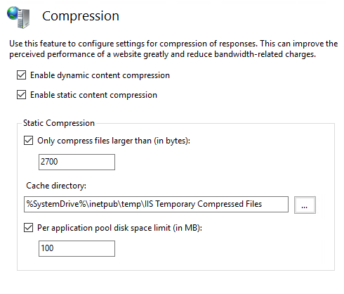
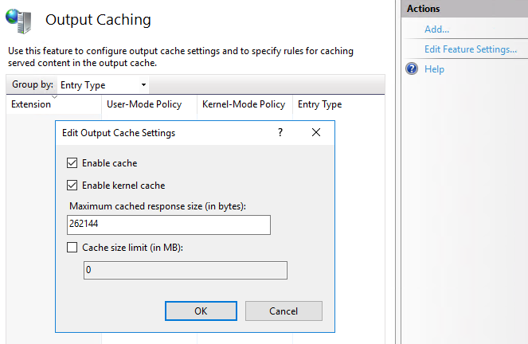
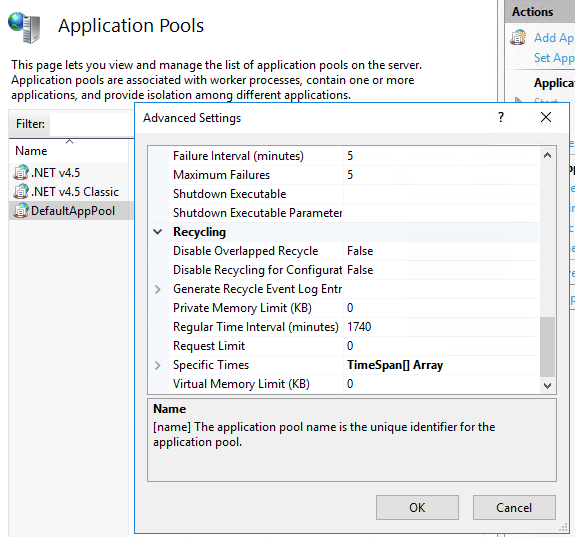

# IIS tuning

## Compression

An effective method to reduce page load times is to compress the content. Enabling IIS compression will reduce the size of the files that are sent from the server which increases the speed content is returned to the browser. Compression can be disabled or enabled at a site level, and modern versions of IIS offer advanced global compression options.

Within `IIS` click on the server name and double-click the `Compression` icon.

The compression window provides the option to:
* `Enable dynamic content compression`
  * Tick this option to compress dynamic files
* `Enable static content compression`
  * Tick this option to compress all static files
* `Only compress files larger than (in bytes)`
  * Because compression causes a slight overhead, compressing a small file may take longer to perform and transfer than not compressing the file at all.
* `Cache directory`
  * This location is where the compressed static files will be stored.
* `Per application pool disk space limit (in MB)`
  * Servers with many application pools and limited disk space should adjust the default value as necessary. For 100 application pools and the default 100MB limit, 10GB can be utilized to store cache the static compressed files.

Click on `Apply` on the right-hand side to enable compression.



```eval_rst
.. seealso::.. Dynamic content compression can be a CPU intensive task, please ensure the server or virtual machine is able to handle the additional workload.
```

CPU limits have been introduced to avoid a situation where CPU is under contention due to enabling compression.

Within `IIS` click on the server name and double-click the `Configuration Editor` icon and search for `system.webServer/httpCompression`

This file provided the options available above and some additional parameters
* `dynamicCompressionEnableCpuUsage="90"`
  *  CPU utilization is calculated every 30 seconds, when the CPU utilization raises above this value, dynamic compression will be disabled. Reduce this value accordingly.

Click on `Apply` on the right-hand side to commit the change.

## Caching

Within `IIS` click on the server name and double-click the `Output Caching` icon and click `Edit Feature Settings`.

* `Enable cache`
  * Tick to enable user-mode IIS cache.
* `Enable Kernel Cache`
  *	Tick to enable kernel-mode caching.
* `Maximum cached response size (in bytes)`
  *	Limits the IIS user-mode cache size in bytes. IIS will adjust the default depending on the servers available memory.
* `Cache size limit (in MB)`
  *	Caches files up to the specified size. Storing frequently requested large files can improve the websites performance.

Click on `Apply` on the right-hand side to commit the change.



## Application Pool Recycling

To help prevent application pool memory bloat and have better control over when the application pools start, the application pools can be set to restart at a specific time.

Within `IIS` click on the server name then click on `Application Pools`. Right click the desired application pool, select `Advanced settings`.

Under the parameters for recycling :

* `Regular Time Interval (Minutes)`
  * Default is 1740, set this to 0
* `Specific Times`
  * Click the three dots to add a time in which to automatically restart the application pool

Click on `OK` to commit the change.



```eval_rst
  .. title:: IIS Tuning
  .. meta::
     :title: IIS Tuning | UKFast Documentation
     :description: A guide to Tuning IIS for optimal performance that benefit your application.
     :keywords: ukfast, windows, iis, web, site, guide, performance, compression, caching, application, faster
