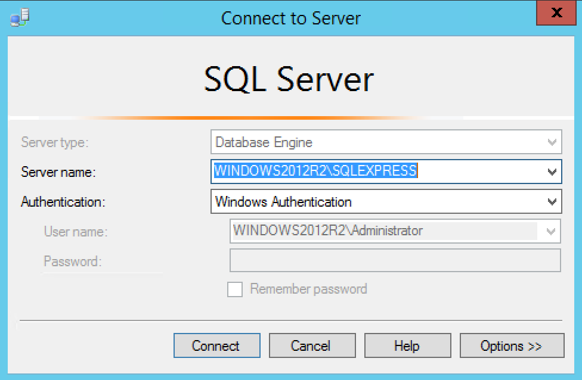
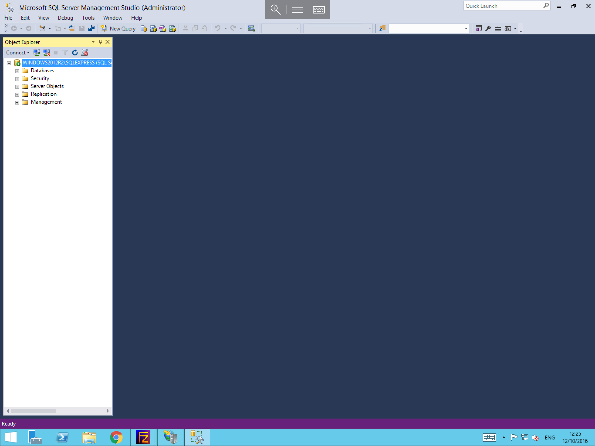
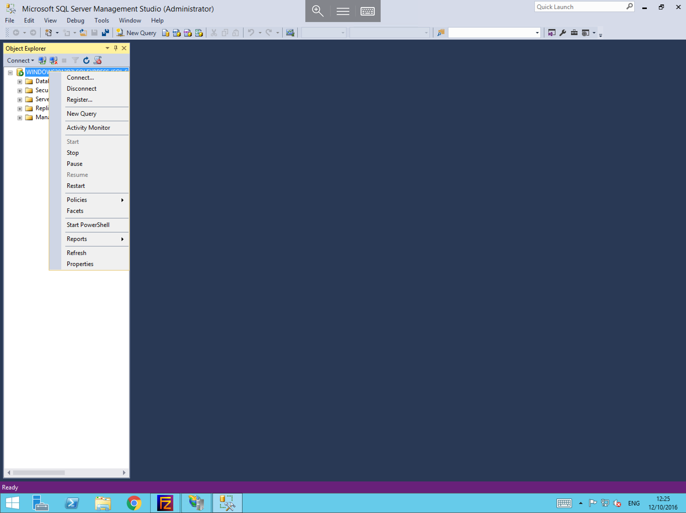
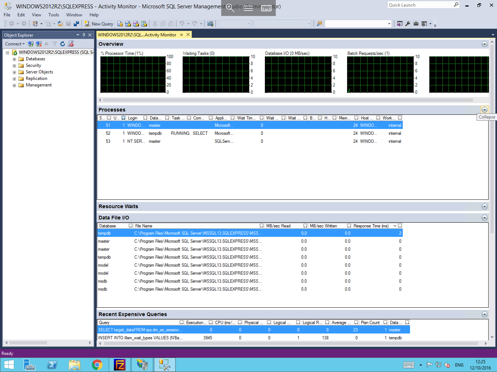

# Viewing Microsoft SQL Activity Monitor

Should you be facing performance issues with your database, the Activity Monitor can be a useful tool to help diagnose the root cause of the issue. To access it, follow the below guide.

* Firstly, you will need to log in to the `Microsoft SQL Management Studio`. To do this, please select `Start`, then `All Programs`, and finally select `Microsoft SQL Server Management Studio` from the list of available applications.


You will now be presented with a login box. You will need to enter the appropriate details to gain access to your MSSQL instance. Once you have entered the correct details, click the `Connect` button



Once logged in, you should be able to view your MSSQL instance in the Object Explorer to the left hand side of the window, as below



From this view, please select your instance (in this case named `WINDOWS2012R2\SQLEXPRESS`) and right click it. You should now see additional options for your instance including `Activity Monitor`, as below. Please select this from the list.



You will now be presented with the `SQL Server Activity Monitor`, which will provide you with a selection of performance related information. You can use this to identify any performance issues and find the root cause of those issues.



```eval_rst
  .. title:: Microsoft SQL Server Activity Monitor
  .. meta::
     :title: Microsoft SQL Server Activity Monitor | ANS Documentation
     :description: Viewing the Microsoft SQL Server activity monitor
     :keywords: ukfast, windows, mssql, sql server, microsoft, database, activity, monitor, tutorial, cloud, server
```
