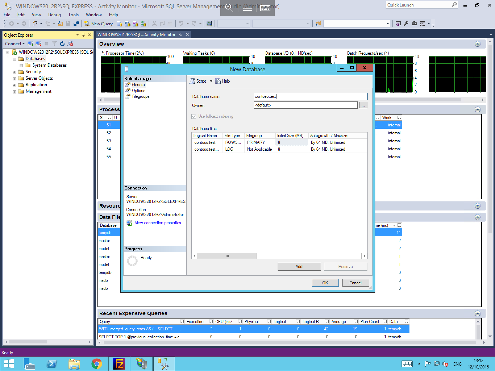

# Creating a new database in Microsoft SQL Server

In order to create a new database, please follow the below steps.

```eval_rst
.. note::
  This guide assumes that you already have MSSQL Management studio installed, and that you are connected to your database. If this is not the case, and you are unsure of how to go about this, please follow our respective guides on those subjects
```

* From MSSQL Management Studio, please select "Databases" from the object explorer and right click, and select "New Database".


* You will now be presented with the "New Database" pane. By default you will land on the options page of this pane. Within this window, please provide a name for your database, and select the database owner as.
* In the Database files section, you will be able to see information about the new database. You will be able to set the databases initial size, and also its `autogrowth` / `maxsize` options, which denote how large the database can become if necessary.
* Once you have entered details to your requirements, please select options for the "select a page" menu on the left hand side of the pane.



* Within the Options page, you will be presented with a large number of options which you can change for your new database as below. Once you are happy with your choices, please select Ok to create your database.
* A thorough explanation of the options and their functions can be found by visiting the following site

  [Database Options](https://msdn.microsoft.com/en-gb/library/ms188124.aspx)


* Your new database should now be visible in the "Databases" section of the Object explorer.

```eval_rst
  .. title:: Creating a new database in Microsoft SQL Server
  .. meta::
     :title: Creating a new database in Microsoft SQL Server | ANS Documentation
     :description: A guide to creating a new database in Microsoft SQL Server
     :keywords: ukfast, mssql, database, sql, create, server, microsoft, windows, cloud, server
```
