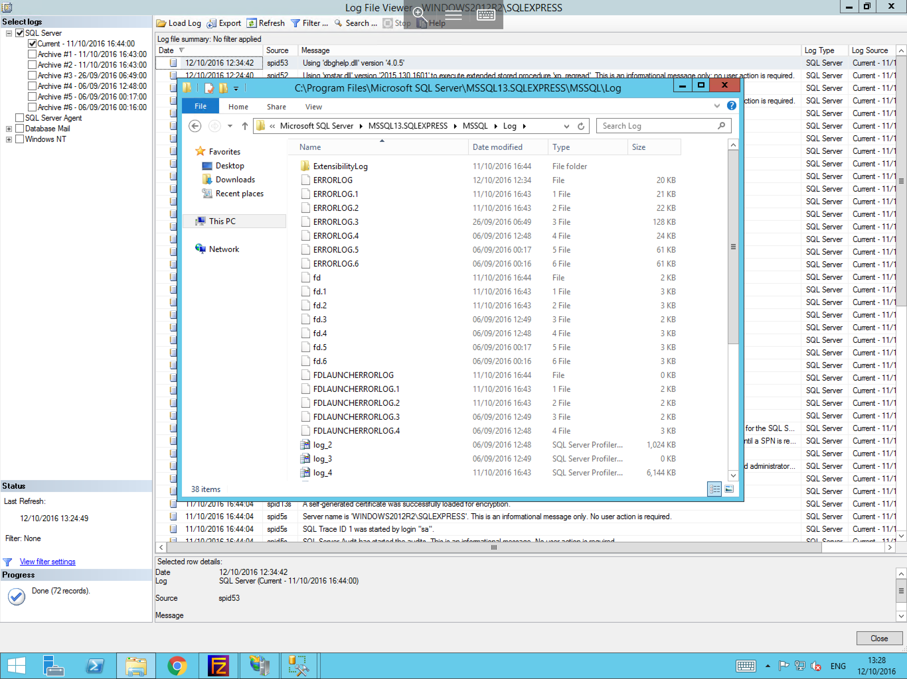

# Reviewing SQL Error Logs

In order to Review MSSQL Error logs, please follow the below steps.(Please note, this guide assumes that you already have MSSQL Management studio installed, and that you are connected to your database,
if this is not the case, and you are unsure of how to go about this, please follow our respective guides on those subjects.)

The MSSQL Error logs can provide information to help diagnose problems with your databases and surrounding functions within the SQL environment.
To access the MSSQL Error Logs, please pop out the "Management" section within the object explorer, then pop out the "SQL Server Logs" Section. You will now be presented with a brief list of available logs and their date and timestamps as below


To Open these logs, please double click on the required file, (Do not worry if you select the wrong file, as you will be able to navigate through all log files in the next window).
You will now be presented with the "Log File Viewer" Window as below, to the left of the window is the "Select Logs" pane, this pane allows you to include and to exclude different log files from your field of view
(for our example, we have selected the current log only, however including the archive logs, can help when attempting to diagnose historical issues and to establish a pattern)


If you wish to access the logs directly rather than through the MSSQL Management studio log viewer, you can do so by navigating to the installation directory of MSSQL and entering the "Log" file as below



* The majority of the files stored in this directory can be viewed by using a standard text editor such as notepad

```eval_rst
  .. title:: Reviewing Microsoft SQL Server Error Logs
  .. meta::
     :title: Reviewing Microsoft SQL Server Error Logs | UKFast Documentation
     :description: A guide to reviewing Microsoft SQL Server error logs
     :keywords: ukfast, mssql, windows, sql server, error, log, review, database, cloud, server
