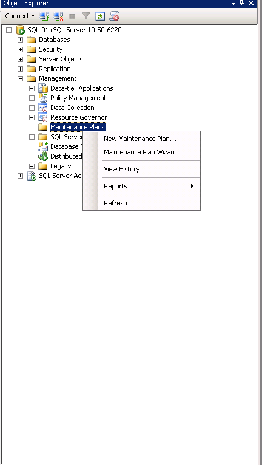
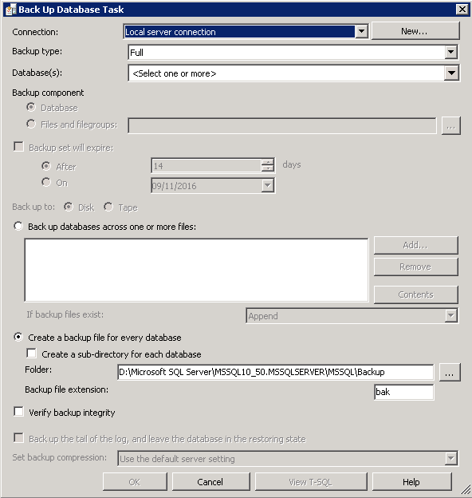

# Creating an MSSQL Maintenance Plan

* Maintenance Plans are a form of task scheduling in MSSQL, they can be used to periodically carry out tasks such as database backups, rebuilding of indexes, database shrinking etc.
  (This guide assumes that you already have a database instance which you are looking to configure maintenance plans on)

To configure a maintenance plan, please follow the below steps

Select start, now select Microsoft SQL server management studio from the list of avialable applications. Once the management studio opens, please log in to your database as normal.

Once logged in, please pop out the management node within object explorer and right click "Maintenance Plans" as below



From the context menu, select "New maintenance plan", You will now be presented with a "New Maintenance Plan dialogue box, please enter a name for your new plan in the Name field as below, then select "OK"


You will now be presented with the maintenance plan window as below, on the lower portion of the object explorer, you will see a section named "Toolbox", within the toolbox section, you will see a number of different options
These are the different maintenance tasks which can be carried out, for this demonstration, please select "Back up Database Task" 


In the central view, you will now see an entry named "Back Up Database Task", right click the entry and select "Edit" from the resulting context menu as below


The "Back Up Database Task" pane will now be displayed, this pane displays several options which you will need to configure to your requirements as below



Once you have configured the options to your requirements as we have below, please select "OK"


You will now be returned to the maintenance plan window, from the "Sub plan" menu at the top of the central field, please select the calendar icon, You will now be presented with the Job Schedule Properties window as below
This window denotes how frequently your maintenance plan will run. please configure this window to your requirements and select "OK" 


* Your mainenance plan is now complete, to view a full list of possible tasks which you can carry out with the maintenance plan in MSSQL, please view the following link

[Maintenance Plans in MSSQL](https://msdn.microsoft.com/en-gb/library/hh710041.aspx)

```eval_rst
  .. title:: Microsoft SQL Server maintenance planning
  .. meta::
     :title: Microsoft SQL Server maintenance planning | UKFast Documentation
     :description: A guide to creating a Microsoft SQL Server maintenance plan
     :keywords: ukfast, mssql, sql server, database, create, maintenance, plan, tutorial, guide, cloud, server
