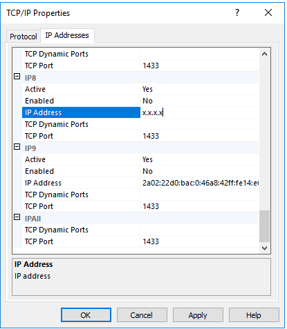
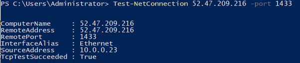
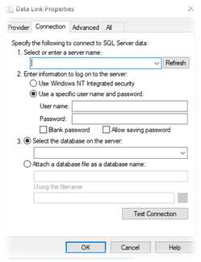
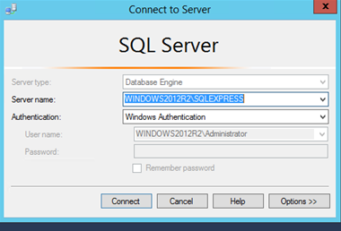

# MSSQL Remote Access
## Connecting to MSSQL Instance remotely

In order to connect to a MSSQL instance from a remote source, The following is required:

- Check the port in which MSSQL is currently listening on. This is typically port `1433/tcp`
- Outbound connectivity from the originating source to the destination server over the MSSQL port
- Firewall rules to allow inbound connectivity over the MSSQL port
- SQL Server Management Services (SSMS) To be installed on the remote client.

## How to check your servers MSSQL port

To check the port in which the SQL Server is configured to listen on, you would need to:

* Establish an RDP connection to the MSSQL server
* Open MSSQL Server Configuration manager
  * Open `Start` > `Microsoft SQL Server {Version}` > `SQL Server {Version} Configuration Manager`
* Expand `SQL Server Network Configuration` > Click `Protocols for MSSQLSERVER` > Right click `TCP/IP` > `Properties` > `IP Addresses` > scroll down until you see your internal server IP and check `TCP port`



## Opening the MSSQL Ports on your Firewall

Dependent upon on whether or not your server resides behind a dedicated or shared firewall, the following documentation will guide you through securely opening the MSSQL ports.

* [Dedicated Firewall](https://docs.ukfast.co.uk/network/firewalls/dedi_lockdown.html)
* [Shared Firewall](https://docs.ukfast.co.uk/network/firewalls/shared_lockdown.html)

## Troubleshooting connectivity to your MSSQL Server

To check if you're able to communicate from your workstation network over the required MSSQL port, you can use the `Test-NetConnection` PowerShell `cmdlet`:

```powershell
Test-Netconnection {RemoteServerAddress} -port {MSSQLPORT}
```

Please note, the `TcpTestSucceeded` message indicates if the port is accessible.

### Example



To further test connectivity to your instance, the following method can be used:

On your remote client, go to `Start` > `Notepad.exe` > `File` > `Save As`, enter the filename as `ConnectionTest.udl`, then set `Save As type` to `All Files (*.*)`



Open the UDL File and enter the following information:

- **Server name**: The server IP
- **Use a specific username...**: Enter the SQL Server Credentials
- **Select the database on the server**: Select the DB you would like to connect to
- Test connection.

## Installing SSMS and connecting to your instance

The latest SSMS client can be downloaded here: [https://docs.microsoft.com/en-us/sql/ssms/download-sql-server-management-studio-ssms?view=sql-server-ver15](https://docs.microsoft.com/en-us/sql/ssms/download-sql-server-management-studio-ssms?view=sql-server-ver15)



In order to connect to the instance, you will need to enter the correct connection details in to the "Connect to Server" pane, as demonstrated above.

Please note that Windows Authentication may not be enabled on your instance. If this is the case, you will need to use the `sa` Credentials to authenticate instead. In order to do this, you simply need to select the arrow next to the `Authentication` field, select `SQL Server Authentication`, then enter your `sa` credentials in the username and password fields below.

```eval_rst
  .. title:: Setup Remote Access to MSSQL
  .. meta::
    :title: Setup Remote Access to MSSQL | UKFast Documentation
    :description: How to access an MSSQL instance between a client device and a MSSQL server
    :keywords: ukfast, mssql, windows, db, sql, remote, connection
```
