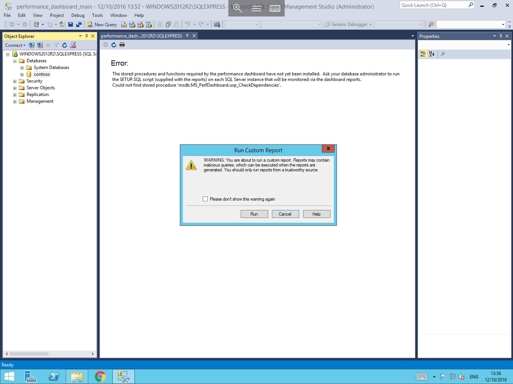

# Microsoft SQL Performance Dashboard

In order to view the MSSQL Performance Dashboard, please follow the below steps.

```eval_rst
.. note::
  This guide assumes that you already have MSSQL Management studio installed, and that you are connected to your database. If this is not the case, and you are unsure of how to go about this, please follow our respective guides on those subjects
```

The Performance Dashboard is a Custom Report which is written by Microsoft specifically for use with Microsoft SQL. It advises on performance improvements and best practice changes that could be made to your the databases.

The Performance Dashboard is not installed by default, however you can obtain it for free by visiting the following link:

[MSSQL Performance Dashboard](http://www.microsoft.com/en-gb/download/details.aspx?id=29063)

Once the performance dashboard has been installed, before it can be used, you will need to run the setup script located in the Performance dashboard installation directory. By default this is located in `C:\Program Files (x86)\Microsoft SQL Server\110\Tools\Performance Dashboard`. Navigate to the directory and select `setup.exe`. This will initialise the Performance Dashboard on your SQL instance.

Now that the setup process for the performance dashboard has been completed, you will need to access it via MSSQL Management Studio. To do so, pop out the `Databases` tab in the `Object Explorer`, then right click on the database which you wish to run the performance dashboard for (as below). Select `Report`, and `Custom Reports`.


You will now be presented with an `Open File` context box. Navigate to the location where Performance Dashboard has been installed. By default this is `C:\Program Files(x86)\Microsoft SQL Server\110\Tools\Performance Dashboard`. Then select the `performance_dashboard_main.rdl`, as shown


Once you have selected the `performance_dashboard_main.rdl` file, you will be presented with a context box named `Run Custom Report`. This box will contain a warning, like shown. In this instance, select `Run`



The Performance Dashboard report will generate, and once complete should be presented in your main field of view


```eval_rst
.. seealso::
  You can navigate the performance dashboard to review different pieces of information. Generally, any information which is underlined can be selected to provide further details specifically related to that title.
```

```eval_rst
  .. title:: Microsoft SQL Server performance dashboard
  .. meta::
     :title: Microsoft SQL Server performance dashboard | ANS Documentation
     :description: A guide to the Microsoft SQL Server performance dashboard
     :keywords: ukfast, windows, sql, sql server, microsoft, mssql, database, performance, dashboard, cloud, server
```
