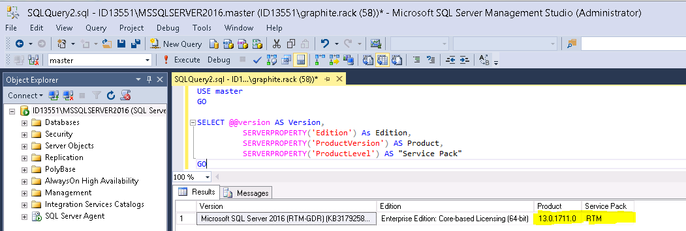

# Finding the version of Microsoft SQL you are running

If you want to find which version of Microsoft SQL and what Service Pack you are running easily, the below query can be utilised.

## Microsoft SQL Server Management Studio

You will need to open up and connect into Microsoft SQL Server Management Studio. The easiest way in Windows 2012 is to click on `Start` and to start free-typing SSMS. Then click on `New Query` and paste the below query which will then present a results window supplying the relevant information:-


```sql
USE master
GO

SELECT @@version AS Version,
          SERVERPROPERTY('Edition') As Edition,
          SERVERPROPERTY('ProductVersion') AS Product,
          SERVERPROPERTY('ProductLevel') AS "Service Pack"
GO
```

You can parse the query to check syntax via the green tick highlighted in the above screenshot, or just click on `Execute`



Take a copy of the product results in the query. In this case, when searching `13.0.1771.0`, go to the link below using either `CTRL + F` and search for the build number, or manually scroll and search.

### MSSQL build numbers explained

<https://buildnumbers.wordpress.com/sqlserver/>

- `Build 13` is the edition, which in this case is `MSSQL 2016`
- `00` or `0` indicates that it is a non-R2 build
- `17710` is the patch version

In this example I have a patch installed:

```console
13.00.1711.0	2015.130.1711.0	3179258 Processing a partition causes data loss on other partitions after the database is restored in SQL Server 2016 (1200) August 17, 2016
```

```eval_rst
  .. title:: Which Microsoft SQL Server version am I on?
  .. meta::
     :title: Which Microsoft SQL Server version am I on? | UKFast Documentation
     :description: How to find which version of Microsoft SQL Server you're running
     :keywords: ukfast, guide, database, mssql, sql, sql server, server, version, find, microsoft
```
