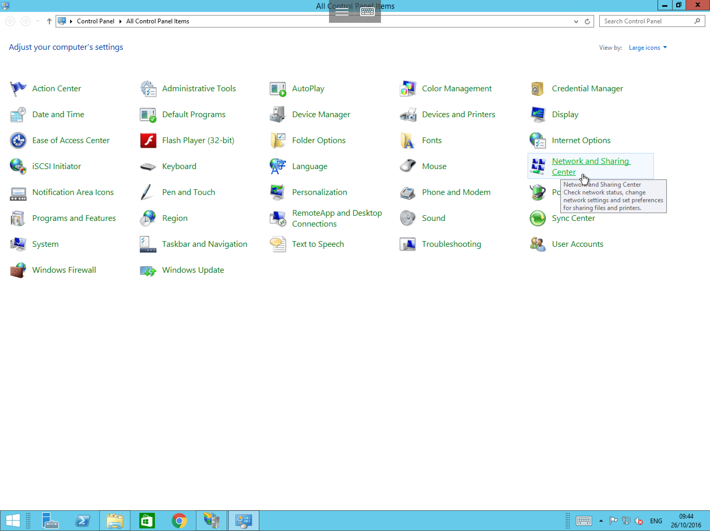
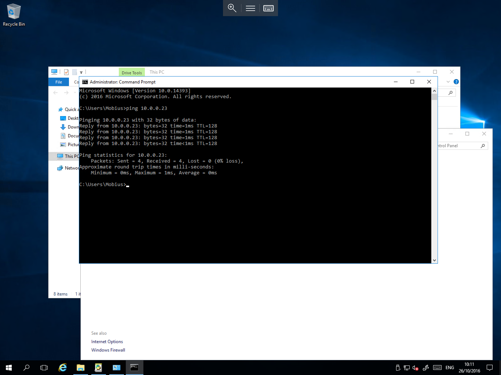

# Using a Crossover connection

* If you have a requirement to frequently transfer large volumes of data between 2 servers in your solution, It is recommended that you make use of a crossover connection.
  Doing so alleviates any latency and throughput issues which can arise from transferring large volumes of data over the server's primary NIC, which can ultimately cause slower response to business critical functions such as web services.

If your Solution is hosted with UKFast, please contact your account manager or service manager, who will be able to arrange for this work to be carried out.

If you host your own solution and wish to configure a crossover connection, please follow the below guide


 <H3>Prerequisites</H3>

 1. Ensure you have an available NIC on both servers
 2. Connect both servers using a crossover cable
 3. Ensure you have administrator privileges available to you


## Configuration

### Server 1

select start, then select control panel from the list of available applications, then within control panel, select "Network and Sharing Centre" as below



You will now be presented with the network and sharing centre, from this window, please select "Change adapter settings" as below


Right click on your second adapter, and select properties, you will now be presented with the NIC properties as below, from this window, select "Internet Protocol Version 4 (<nospell>IPv4</nospell>) from the list, and select the "Properties" button


The <nospell>IPv4</nospell> properties will now be displayed, in this pane, you will see a section relating to the IP address and a section relating to the DNS address as below


Select the radio button named "Use the following IP address", once selected, you will see that the 3 fields below it become editable, at this point, you will need to enter the following information

* An internal IP address of your choosing (in this case we have used `10.0.0.23`)
* The correct subnet mask for the address (in this case we have used `255.255.255.0`)
* And the default gateway suitable for your chosen IP (Which in this case we have used `10.0.0.1`
* Finally, make a note of these details, a you will need to ensure that the subnet mask and default gateway match when configuring the connection on the second server.
(You may use the details which we have used, as these addresses are internal only) please configure the DNS entry with your normal DNS entries

Once you have entered the required information, please select "OK"

### Server 2

Navigate to the Control panel as done for Server 1, select "Network and Sharing Centre", and select "Change adapter settings", you will now be presented with the connections which are enabled on your server as below


Again, right click on the second adapter and select Properties, within the resulting NIC properties window, select "Internet Protocol Version 4 (<nospell>IPv4</nospell>) from the list, and select the "Properties" button.

The <nospell>IPv4</nospell> properties will now be displayed, again as with server 1, you will now see a section relating to the IP address and a section relating to the DNS address as below.


As Before, select the radio button named "Use the following IP address", once selected, you will see the 3 fields below it become editable, at this point please enter the following information

* An Internal IP address of your choosing (This will need to be in the same range as on Server 1, for this example we have used `10.0.0.24`)
* The Identical subnet mask which you used on server 1 (For this example, the subnet mask is `255.255.255.0`)
* The Identical default gateway which you used on server 1 (For this example, the default gateway is `10.0.0.1`)
(Again, you may use these details if you wish when configuring your own connection)

Once you have entered the required information, please select "OK".

## Testing

To test the connection, you can carry out a simple reachability test from each machine to the other using the IP addresses which you assigned, to carry out this test, please follow the brief guide below

### Server 1

* Select start, type `cmd` and select the resulting `cmd.exe` icon, this will will open a Command Prompt
* In the Command Prompt, type `ping 10.0.0.24` and press enter
* The Command Prompt should now display 4 ping responses with each line stating `Reply from 10.0.0.24: bytes=32 time=1ms TTL=128` as below


If you receive the above, this test is successful

### Server 2

* select start, type `cmd` and select the resulting `cmd.exe` icon, this will open a Command Prompt
* In the Command Prompt, type `ping 10.0.0.23` and press enter
* The Command Prompt should now display 4 ping responses with each line stating `Reply from 10.0.0.23: bytes=32 time=1ms TTL=128` as below



If you receive the above, this test is successful

* You can now reconfigure your application to use the IP addresses of the crossover connection to transfer your data via this link

```eval_rst
  .. title:: Using a crossover connection on Windows
  .. meta::
     :title: Using a crossover connection on Windows | ANS Documentation
     :description: An in-depth guide to using a crossover connection on Windows
     :keywords: ukfast, network, crossover, connection, configure, tutorial, guide, server, cloud
```
