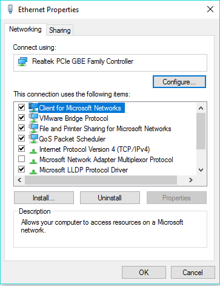

# How to Enable Jumbo Frames

## Configuration

* To enable Jumbo Frames, please follow the guide below. (Before carrying out these changes, please ensure that your drivers are up to date, if they are not, you may experience performance issues)

Select Start,and select control panel, within control panel, please select "Network and sharing Centre", now select "Change adapter settings" from the left hand side of the window

Right click on the NIC on which you wish to enable Jumbo Frames and select 'Properties'.

You will now be presented with the NIC properties as below



from the NIC properties, please select "Configure", You will now be presented with the controller properties, this pane will contain several tabs, please select the "Advanced" tab

Within the Advanced section, you will see several options in the "property" field, scroll down until you can see "Jumbo Frame" as below


Select the "Value" button which is set to Disabled in the above example, and Select from 2KB MTU - 9KB MTU, NIC properties vary depending on model and manufacturer, in other NIC's the value may need to be entered manually, in this case, please enter up to 9000 Bytes.

Select 'OK'

## Testing

Open Command Prompt

On `10.10.10.1`

```powershell
ping 10.10.10.2 -f -l 8000
```

On `10.10.10.2`

```powershell
ping 10.10.10.2 -f -l 8000
```


You should see the following, this is successful:

```console
Reply from 10.10.10.2: bytes=8000 time<1ms TTL=128
Reply from 10.10.10.1: bytes=8000 time<1ms TTL=128
```

This is what you'll see if the packet size you are attempting to transmit is too large::

```console
Packet needs to be fragmented but DF set.
```

```eval_rst
  .. title:: How to enable jumbo frames on Windows
  .. meta::
     :title: How to enable jumbo frames on Windows | ANS Documentation
     :description: Guidance for enabling and configuring jumbo frames on Windows
     :keywords: ukfast, enable, jumbo, frames, tutorial, configuration, guide, server, cloud
```
