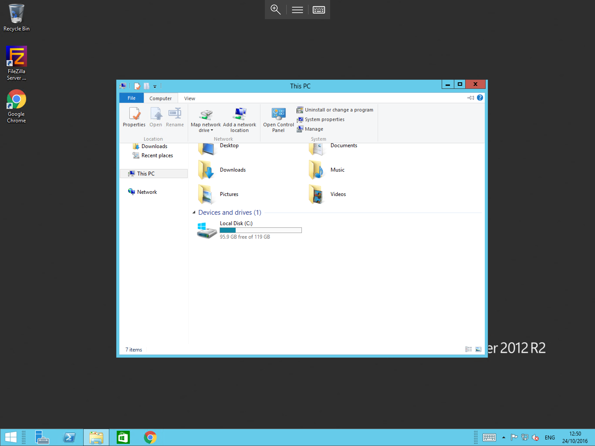
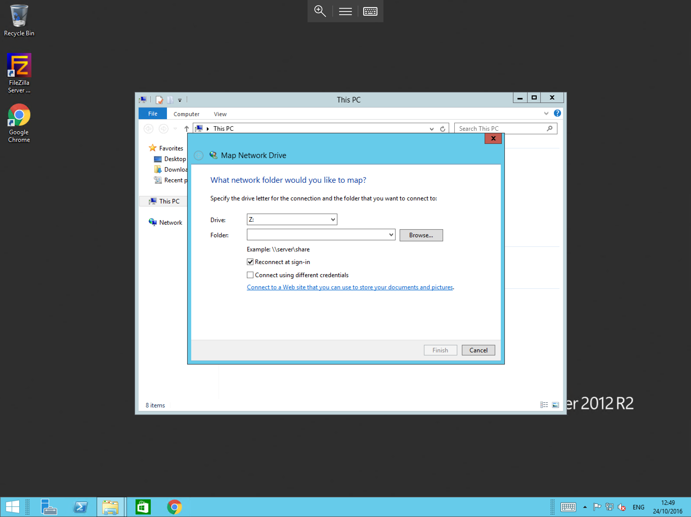

# How to Map a Network Drive

* To Map a Network Drive, please follow the below steps,(This guide assumes that you have already configured a drive for sharing)

Select start, and then select "This-PC" or "My Computer" depending on the version of windows which you are using. Once the window opens, please select "Computer" from the menu
and select "Map Network Drive" as below



You will now be presented with the Map Network Drive wizard, select a drive letter which you would like the Network drive to occupy on your workstation once mapped
then enter the location of the shared drive for example `\\server1\contoso shared drive` in the blank field next to "Folder" as below. If you are unsure of the address of the shared drive
Please select Browse.
* (Please Note, in a domain environment, drives cannot be viewed this way by default, and need to be mounted by group policy)



Once you have entered the required information, please select "Finish"

You should now be presented with the shared drive in "This-PC" or "My Computer", under the drive letter chosen when mapping the drive (in this case A) as below.


```eval_rst
  .. title:: Mapping a network drive  on Windows| ANS Documentation
  .. meta::
     :title: Mapping a network drive  on Windows| ANS Documentation
     :description: A simple guide to mapping a network drive on Windows
     :keywords: ukfast, windows, network, mapping, drive, share, cloud, server, microsoft
