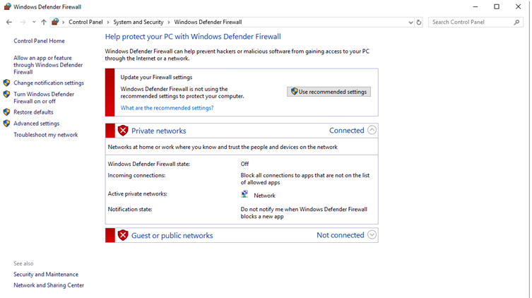
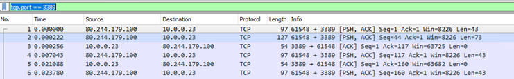

# Checking Inbound/Outbound server connectivity

What is covered within this guide?

* Testing outbound connectivity from your server
* Testing inbound connectivity to your server
* Troubleshooting inbound connectivity issues

## Testing Outbound connectivity from your server

To test general outbound connectivity from your server over a specific port. The following PowerShell command is extremely useful:

```powershell
Test-NetConnection {Hostname/IP} -port {Port}
```

This command provides us with the following information:

* The name of the remote computer (If a DNS name has been used)
* The IP of the remote computer
* The port used
* The network adapter used for the connection
* The source IP used within the connection test
* Whether or not the remote address is accessible via ping
* The Round-Trip Time in MS it took for the ping to complete
* Whether or not the remote address is accessible via the specified port

This example output from the command:

```text
PS C:\Users\Administrator\> Test-NetConnection portquiz.net -port 80

ComputerName: portquiz.net
RemoteAddress: 52.47.209.216
RemotePort: 80
InterfaceAlias: Ethernet
SourceAddress: 10.0.0.23
PingSucceeded: True
PingReplyDetails (RTT): 6 ms
TcpTestSucceeded: True
```

The service which we are attempting to connect to, `portquiz.net`, is a service which is publicly accessible on all ports. This is useful for checking whether a specific port is allowed outbound through the firewall, and helps indicate whether the connection is blocked by the Firewall and/or the remote endpoint

```powershell
Test-Netconnection portquiz.net -port 80
```

## Testing inbound connectivity to your server

The above PowerShell command is also quite powerful when testing inbound connectivity to your server. As this helps determine as to whether or not your source device is able to communicate over the required ports.

Things to note here are:

* The server must be listening on the required port for the connection to be accepted
* The relevant ports must be open on the firewall
* If Windows firewall is enabled, the ports must be opened here.

### Checking if a server is listening on a specific port

The following command can be ran in Command Prompt to determine if a server is listening on a specific port:

```text
netstat -ano | find ":PORT"
```

This example output from the command:

```text
C:\Users\Administrator\>netstat -ano | find ":3389"

TCP 0.0.0.0:3389 0.0.0.0:0 LISTENING 320
TCP 10.0.0.23:3389 80.244.179.100:61548 ESTABLISHED 320
TCP [::]:3389 [::]:0 LISTENING 320
UDP 0.0.0.0:3389 \*:\* 320
UDP [::]:3389 \*:\* 320
```

Alternatively, the following PowerShell command can be used:

```powershell
Get-NetTCPConnection -State Listen -localport 3389
```

This example output from the command:

```text
Get-NetTCPConnection -State Listen -localport 3389

LocalAddress                        LocalPort RemoteAddress                       RemotePort State       AppliedSetting
------------                        --------- -------------                       ---------- -----       --------------
::                                  3389      ::                                  0          Listen
0.0.0.0                             3389      0.0.0.0                             0          Listen
```

### Checking if the port is open on your firewall

Dependant upon the type of firewall your server resides behind (i.e, dedicated or shared), the following documentation will guide you through securely opening ports via the ANS Portal:

* [Dedicated Firewall](/network/firewalls/dedi_lockdown)
* [Shared Firewall](/network/firewalls/shared_lockdown)

### How to check if Windows firewall is enabled

To check if Windows firewall is enabled you must:

* Open the `Control Panel`
* Click on `System and Security`
* Then `Windows Defender Firewall`

Here is an example of a Windows firewall configuration which is not enabled



It is worth noting that, typically, Windows Firewall does not need to be enabled as usually ports and traffic will be filtered via your external firewall. This essentially reduces the load on the server as it does not need to analyse and permit / reject traffic.

## Troubleshooting inbound connectivity issues

There are a wide variety of methods and tools in which you are able to troubleshoot network connectivity issues. Here are a few examples:

### Wireshark

Wireshark can be used to monitor and capture traffic on a specific network interface. Filters can be applied when monitoring the traffic to help with troubleshooting. For example, the following filter would filter the results for traffic being transmitted over TCP port 3389:

```text
tcp.port == 3389
```



Wireshark is free to use and can be downloaded here: <https://www.wireshark.org/download.html>

### PowerShell

PowerShell can be used to create a temporary listener on Windows to assist when testing connectivity to the server over a specific port.

The commands to create a listener on Windows via PowerShell is as follows:

```powershell
$Listener = [System.Net.Sockets.TcpListener]1234;
$Listener.Start();
```

The command to stop the listener would be:

```powershell
$Listener.Stop();
```

Example output before running the command:

```text
PS C:\Users\Administrator> Get-NetTCPConnection -State Listen -localport 1234
Get-NetTCPConnection : No matching MSFT_NetTCPConnection objects
```

Example output after running the command:

```text
PS C:\Users\Administrator\> $Listener = [System.Net.Sockets.TcpListener]1234;
PS C:\Users\Administrator\? $Listener.Start();


Get-NetTCPConnection -State Listen -localport 1234
LocalAddress                        LocalPort RemoteAddress                       RemotePort State       AppliedSetting
------------                        --------- -------------                       ---------- -----       --------------
0.0.0.0                             1234      0.0.0.0                             0          Listen
```

To stop the listener run:

```powershell
PS C:\Users\Administrator> $Listener.Stop();
```

```eval_rst
  .. title:: Troubleshooting inbound and outbound connectivity on Windows
  .. meta::
     :title: Troubleshooting inbound and outbound connectivity on Windows | UKFast Documentation
     :description: An in-depth guide on troubleshooting network connectivity issues on Windows
     :keywords: ukfast, network, tcp, connection, configure, tutorial, guide, server
```