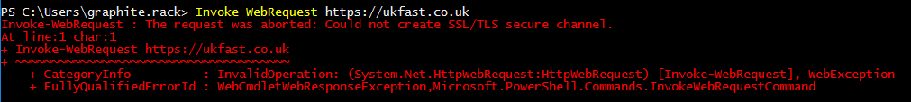

# TLS 1.2 in PowerShell

By default, PowerShell will use SSL3.0 and TLS1.0. This can prove problematic when performing web requests to sites that have disabled these insecure protocols, and you may see an error such as:



In order to allow a connection to be established, we can force PowerShell to use a more secure protocol, like TLS 1.2, using this command:

```console
[Net.ServicePointManager]::SecurityProtocol = [Net.SecurityProtocolType]::Tls12
```

You can use this command to see what protocols will be used:

```console
[Net.ServicePointManager]::SecurityProtocol
```

Voila! You can now establish a connection to the site over a secure protocol.

```eval_rst
.. note:: This will only change this for the current session. If you want this change to be persistent, you'll need to apply this change in your PowerShell profile
```

```eval_rst
  .. title:: TLS connections in PowerShell
  .. meta::
     :title: TLS connections in PowerShell | ANS Documentation
     :description: Information and Instructions about Windows PowerShell TLS options
     :keywords: ukfast, windows, powershell, tls, ssl, secure, transport, layer, connection
```
