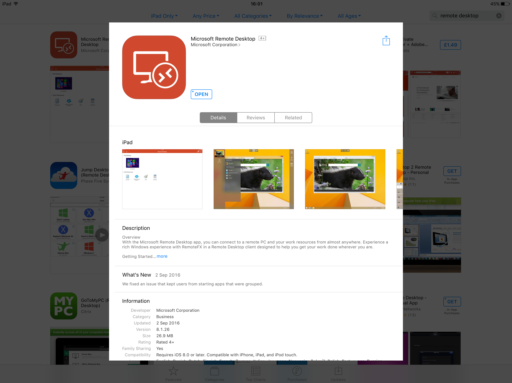
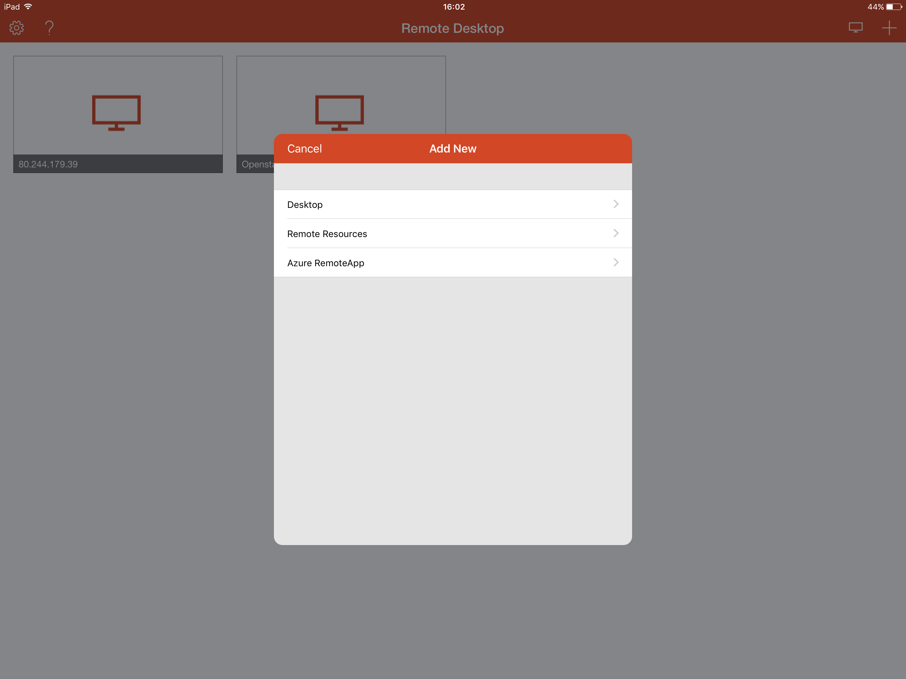
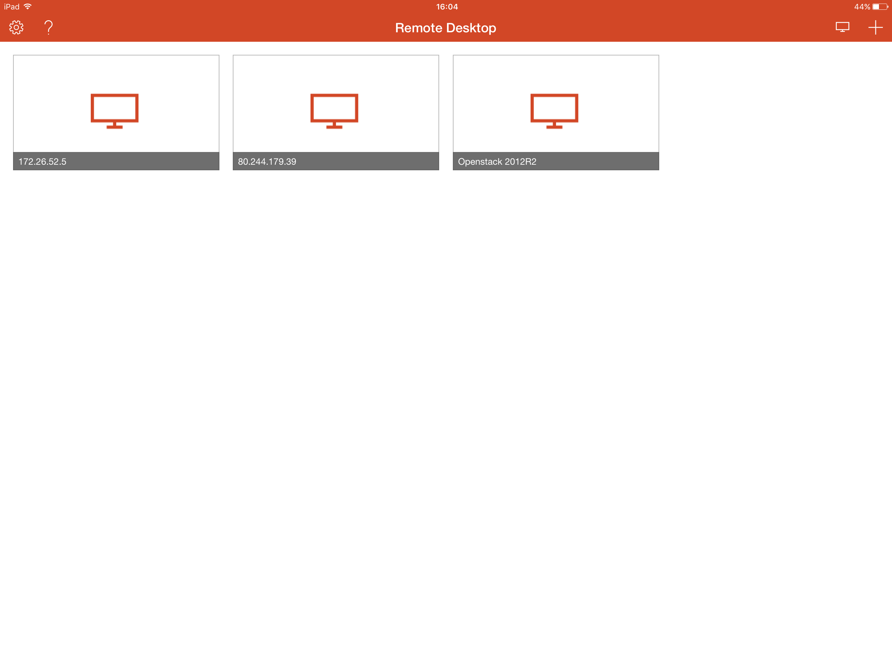
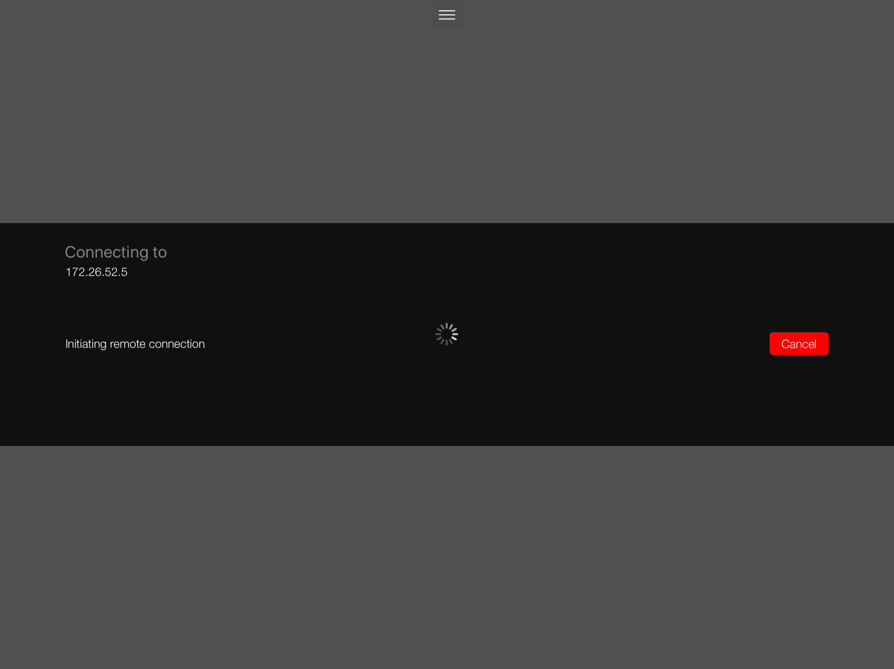
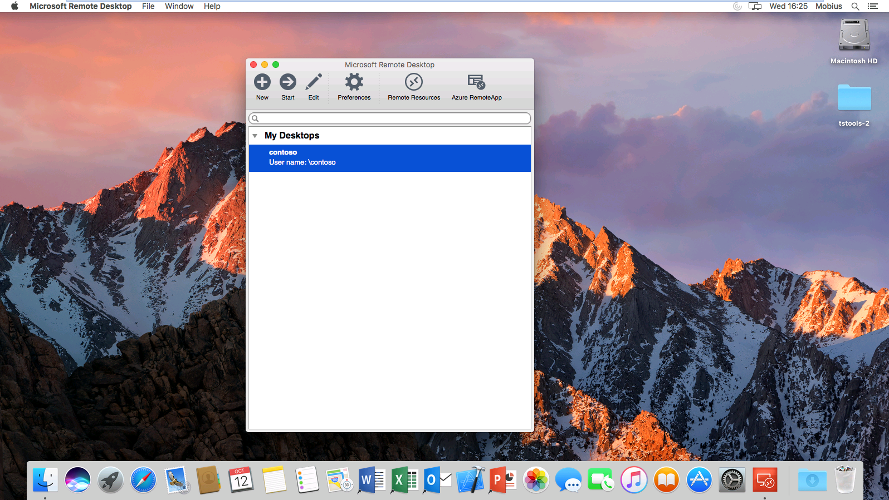

# Connecting to a server via Remote Desktop

It is most likely that Remote Desktop Protocol, or RDP, will be the primary way in which you interact with your windows server. Using an RDP client of some sort, you'll be able to get access to the full GUI of the remote server, as if you were sat in front of it with a screen plugged in.

```eval_rst
.. note::
   The ability to connect via RDP should already be enabled on your windows server, but if you're having any problems with a UKFast server, it's worth contacting support_ for assistance.

   .. _support: http://www.ukfast.co.uk/support.html

```

## Client software

### Windows Clients

Presuming you're using Windows, head to one of the following locations to access the `Remote Desktop Connection` utility, which is the standard RDP client.

On Windows 10:

```console
  Start > All Apps > Windows Accessories > Remote Desktop Connection
```

On previous versions of Windows:

```console
  Start > All Programs > Accessories > Remote Desktop Connection
```

The appearance of the RDP client is the same in all in use, Versions of Microsoft Windows.

Once you have opened the client, you will be presented with the connection panel as below, within this panel, you will need to enter the IP address of the server that you wish to connect to. Once you have entered the IP address of the server which you wish to connect to, please select connect. You will now be asked to enter a user name and password for the server which you are connecting to, once you have entered the correct details, please confirm to establish the connection.


Alternatively, you can enter the user name and password for the remote server before you attempt to form the connection, to do this, on the RDP client, click the options button. you will now be presented with a number of extra options, including the ability to enter the user name and password as below.


### Mobile Devices

Microsoft have recently developed an RDP Client for both Apple IOS and Android platforms, we will demonstrate how to connect using the IOS version of the app in this guide, however the process is the same for the android version of the app.

Firstly, you will need to install the Microsoft Remote Desktop app from the app store as below



Once the app is installed, Open it to access the Dashboard, from the Dashboard, you will need to select the + symbol in the top right hand corner of the app, this will present the "Add New" window. as below



The "add new" window will present 3 options to you, for the purposes of this guide, please select Desktop. You will now be presented with a new Desktop configuration panel as below, this panel will ask you for the IP address of the computer which you wish to access, as well as the user account that you wish to use.


Once you have entered the correct details, your screen should look like the below example,now select save.


You will now be able to see the profile which you have just built on the RDP client dashboard, as below.



Once you are ready to connect to your server via Remote desktop, you simply need to touch the profile, and the connection will be initialised.



* Please note, the Desktop option can be misleading, this option will form a connection to a Desktop Computer and also to a Server Computer.


### MacOS

Microsoft have also developed an RDP client for Apple MacOS,to form a connection using this tool, Please follow the below steps.

Firstly, as with the IOS version of the App, you will need to download the App from the App store as below


Once the App has been installed, you will need to launch it, to do this, open launchpad, and select it from the list of applications as below


You will now be presented with the RDP client as below


From the above window, please select the + "New" button, and you will be presented with the Edit Remote Desktops window as below, you will need to enter the details for the server which you are attempting to connect to as demonstrated below.


Once you have entered the correct details, close the window by selecting the red close button in the top left hand corner of the window. you will now be taken back to the Microsoft Remote Desktop main window, where you will see the profile that you have just configured as below



The last step is to now launch your remote desktop session, there are two ways that you can do this,

* 1. By double clicking the profile which you have configured
  2. By single clicking the profile and selecting the "Start" button from the menu in the Remote Desktop App.

Once you have carried out one of the above actions, your Remote Desktop session will be initialised as below


* Your connection should now be formed, and you should be presented with the desktop of your server, if you are not, please check that you have entered the correct settings for your remote server.

```eval_rst
  .. title:: Connecting to a Windows server using Remote Desktop
  .. meta::
     :title: Connecting to a Windows server using Remote Desktop | UKFast Documentation
     :description: A guide on connecting to a Windows server using Remote Desktop
     :keywords: ukfast, windows, connect, rdp, remote, desktop, connection, server, cloud
