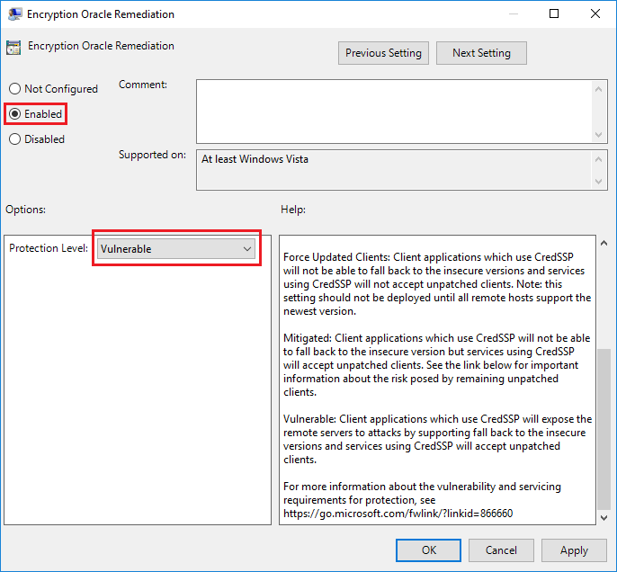

# KB4103716: CredSSP Updates - An authentication error has occurred

On May 8th 2018 Microsoft released an update to the Remote Desktop service that patches vulnerabilities in CredSSP, an authentication mechanism used by the service.

The patch specifically addresses [CVE-2018-0886](https://portal.msrc.microsoft.com/en-us/security-guidance/advisory/CVE-2018-0886) and full details are available on the Microsoft support website: [CredSSP updates for CVE-2018-0886](https://support.microsoft.com/en-us/help/4093492/credssp-updates-for-cve-2018-0886-march-13-2018).

Following this update, some UKFast customers may find they are unable to access their servers with us, and receive the following error message when attempting to connect via Remote Desktop:

```
An authentication error has occurred.

The function requested is not supported.

Remote computer: <hostname>

This could be due to CredSSP encryption oracle remediation.

For more information, see https://go.microsoft.com/fwlink/?linkid=866660
```

Additionally, an event with Event ID 6041 will be logged in the client's System Log with the following message text:

```
A CredSSP authentication to <hostname> failed to negotiate a common protocol version.
The remote host offered version <Protocol Version> which is not permitted by Encryption Oracle Remediation.
```

## Why this error occurs

In almost all cases, this error will occur because the above update has been applied on your client computer but *not* the server you are attempting to connect to.

A new Group Policy is introduced by this update on Windows Desktops entitled `Encryption Oracle Remediation`.

This policy has a number of possible 'Protection Levels' - `Vulnerable`, `Mitigated` or `Force Updated Clients`. Prior to May 8th 2018 the default when this policy was unconfigured was `Vulnerable`, however this has now been switched to `Mitigated` which will prevent connectivity to unpatched Windows servers. Enabling this and setting the 'Protection Level' to either `Mitigated` or `Force Updated Clients` will also prevent connectivity.

The same policy is present on patched Windows servers, and connections from *unpatched* clients will also be prevented if the server's 'Protection Level' is set to `Force Updated Clients`. In this instance, the following error will be presented on the client computer:

```
An authentication error has occurred.

The token supplied to the function is invalid
```

## Resolution

Ideally, the inaccessible server should have the latest updates installed and a reboot performed, so that CredSSP is patched against the vulnerability and updated clients are able to connect.

If an interim workaround is required, the `Encryption Oracle Remediation` policy on the client computer should be 'Enabled' and the 'Protection Level' set to `Vulnerable`. However, as the name suggests, this will leave you at risk of compromise from the man-in-the-middle attack detailed in the CVE-2018-0886. This policy is only visible if the updates have been installed.

The policy can be accessed via the `Edit Group Policy` Windows Start Menu item or by pressing `Win + R` and typing `gpedit.msc` > OK and then navigating through the tree on the left-hand-side to:

```
Computer Configuration -> Administrative Templates -> System -> Credentials Delegation > Encryption Oracle Remediation
```
Enable the policy, set the `Protection Level` to `Vulnerable` and click OK:



N.B. Changes to this policy require a reboot to take effect.

### Domain Environments

In Active Directory Domain environments, the above can be applied via GPOs, if appropriate, but will still require workstation reboots to apply.

Additionally, the Policy can be created and applied prior to installation of any of the above updates by pre-populating a DC's SYSVOL with the updated .admx/.adml files and configuring as above.

The following files will need to be replaced with their updated counterparts on a Domain Controller in the environment. The updated files can be pulled from a server that has already received the update:

```
C:\Windows\PolicyDefinitions\CredSsp.admx
C:\Windows\PolicyDefinitions\en-US\CredSsp.adml
```
Once updated versions of both of the above are in place, the policy will be available in the path referenced above.

If you don't have access to the updated policy (.admx) or resource (.amdl) files and would like to utilise these in a UKFast environment, please contact UKFast support by [raising a ticket in MyUKFast](https://my.ukfast.co.uk/pss/add.php) or calling 0800 230 0032.


```eval_rst
   .. title:: KB4103716 - An authentication error has occurred - CredSSP Updates
   .. meta::
      :title: KB4103716 - An authentication error has occurred - CredSSP Updates | UKFast Documentation
      :description: Guidance on necessary server configuration following Microsoft updates to CredSSP
      :keywords: microsoft, windows, credssp, rdp, authentication, CVE-2018-0886, ukfast, hosting, server
```
