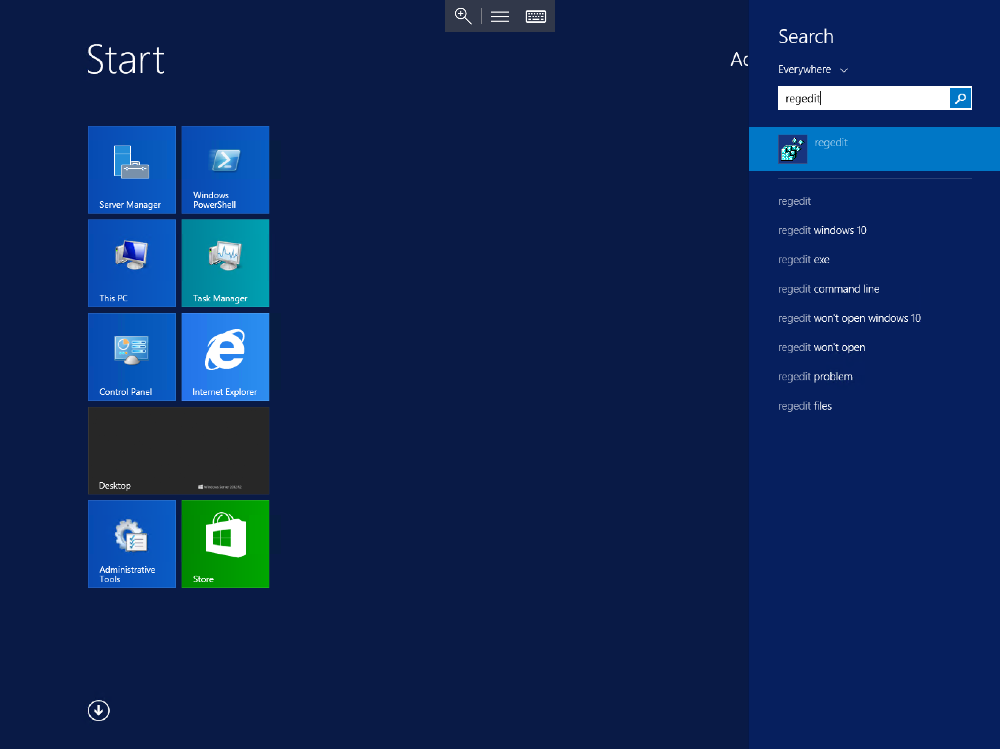
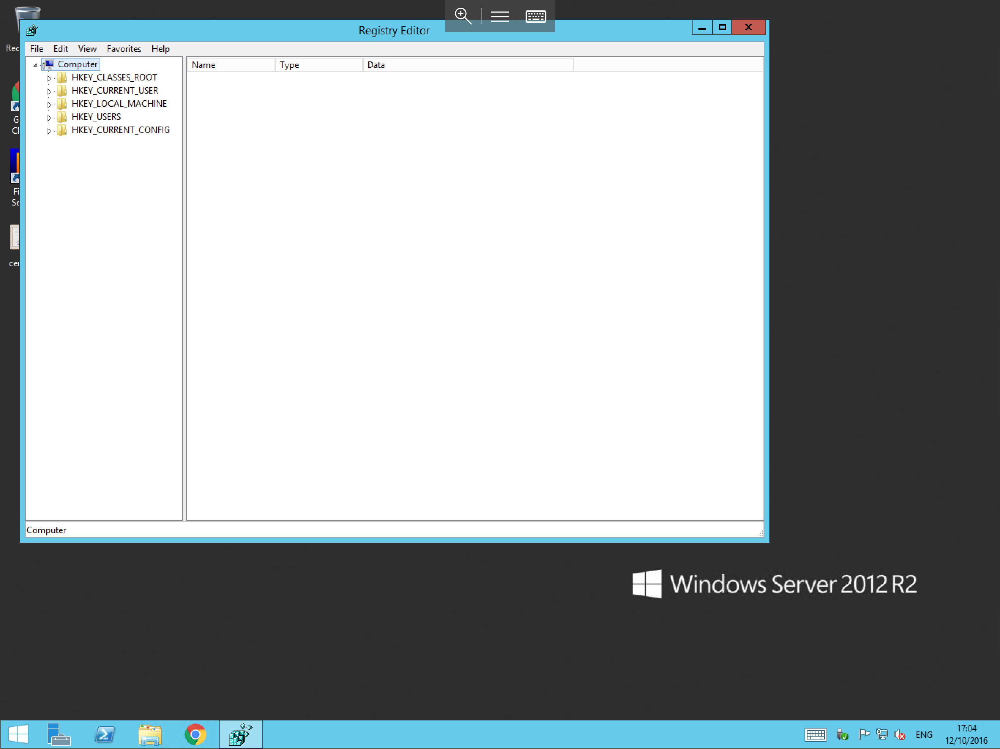
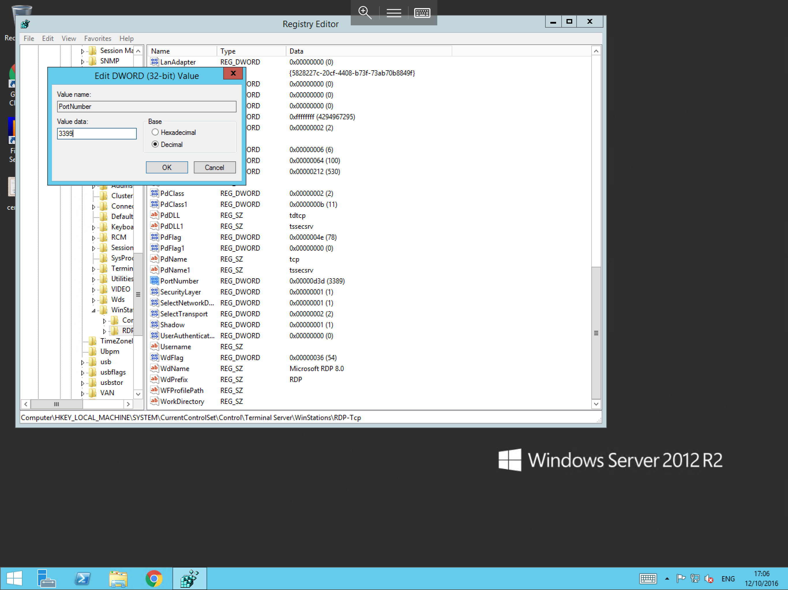
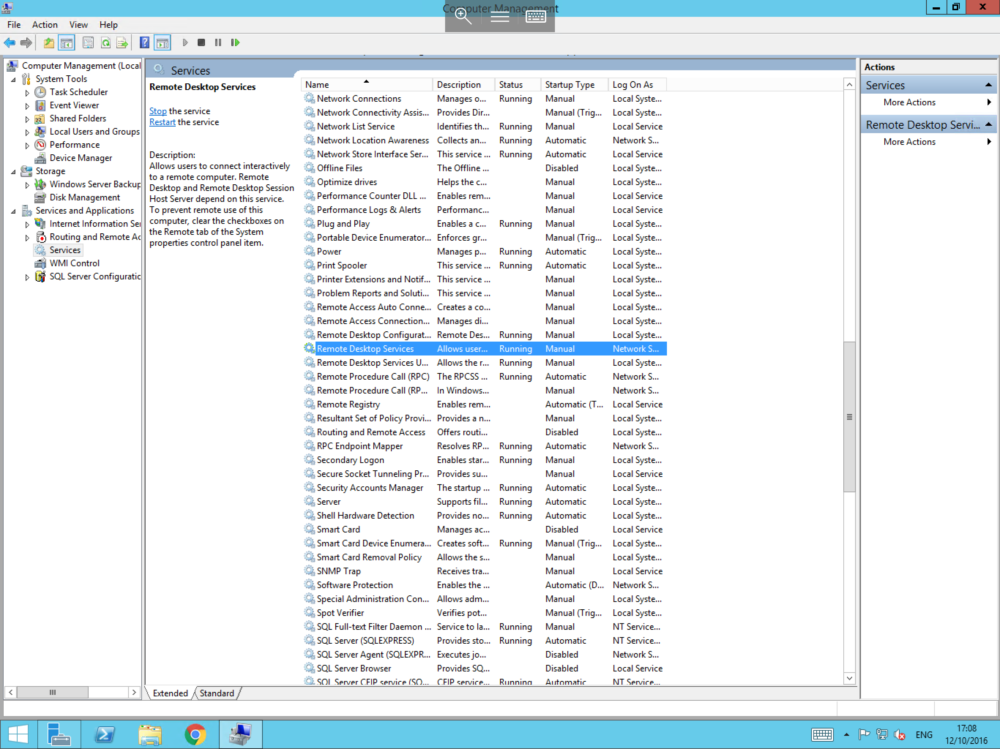

# How to change the Remote Desktop Port


The remote desktop port may be changed for security reasons. You may notice the event with ID 4625 in the security logs,
which is a failed login for a generic username, such as administrator. If you notice a large volume of these entries in the security log, this may be indicative of a brute force attack to the remote desktop service on your server.
One of the ways to mitigate this, is to change the listening port from the default port of 3389

* An important part of this process is to ensure that the new port is first opened on the firewall,
  if it is not open, you will not be able to connect via RDP once the change has been made.

In order to change the RDP Port, you will first need to access the registry editor, please select start, and type regedit, select the regedit application from the list as below



You will now be presented with the Registry Editor as below, Navigate through the Hive until you reach the RDP-Tcp node, this node is located in the following registry path

`HKEY_LOCAL_MACHINE\System\CurrentControlSet\Control\TerminalServer\WinStations\`



Now select the RDP-Tcp node, and you will see a number of registry keys in the centre field, scroll through these keys until you find "PortNumber", right click the PortNumber key, and select modify.
You will now be presented with the "Edit DWORD (32-bit) Value as below



Select the radio button next to "Decimal" in the base section, then in the "Value Data" field, enter the new port which you would like to use for Remote Desktop Services, select "OK" and close the Registry Editor

* Now that you have changed the Rdp port, you will need to reset the Remote Desktop service, to do so, please follow the steps below

Select the Server Manager, this can be done by either selecting the Server Manager Icon on the Taskbar, or by selecting start, and selecting Server manager from the list of available applications.

Select "Tools", then select "Computer Management" as below


You will now be presented with the computer management console, select "Services and Applications" and then select the Services option.
The centre view will now be populated with the Services which run on your Server, scroll down the list and select "Remote Desktop Services" as below



Right click on Remote Desktop Services and select "Restart" from the context menu as below


* At this point, All Remote Desktop Sessions to the server will be terminated while the service restarts. Once the service restarts, you will be able to form your new connection by adding the new port number to the connection string as demonstrated below


* If you have followed all of the above steps correctly, You should now be logged back in to your server. if you are experiencing trouble connecting to your server after this point, please confirm that you have allowed the new port in your firewall configuration.


```eval_rst
  .. title:: Changing the Remote Desktop port on Windows
  .. meta::
     :title: Changing the Remote Desktop port on Windows | UKFast Documentation
     :description: A guide to changing the Remote Desktop port on Windows
     :keywords: ukfast, windows, change, remote, desktop, port, connection, cloud, server
