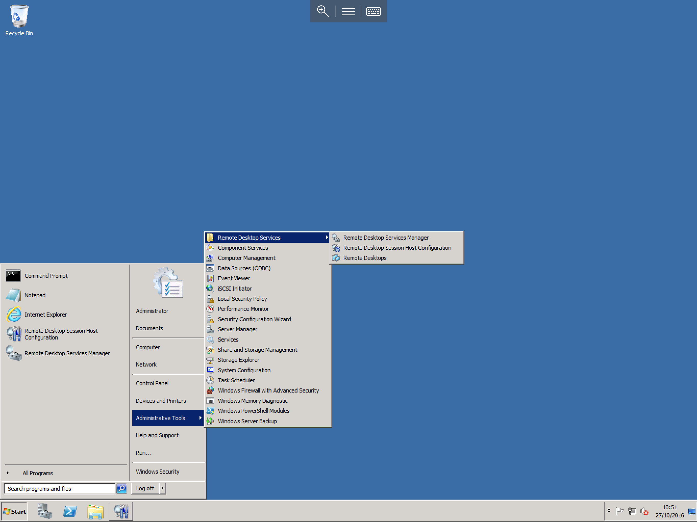
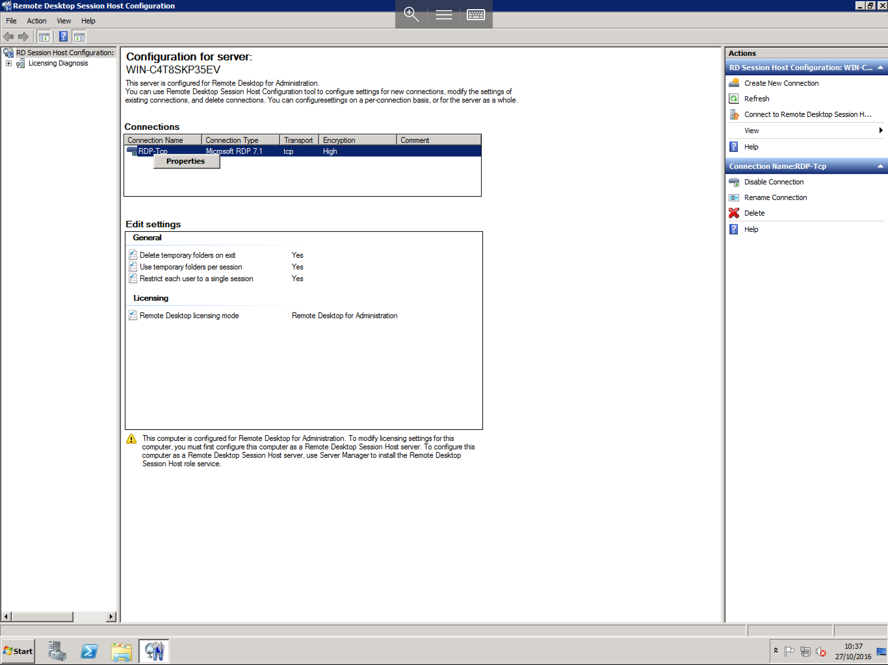
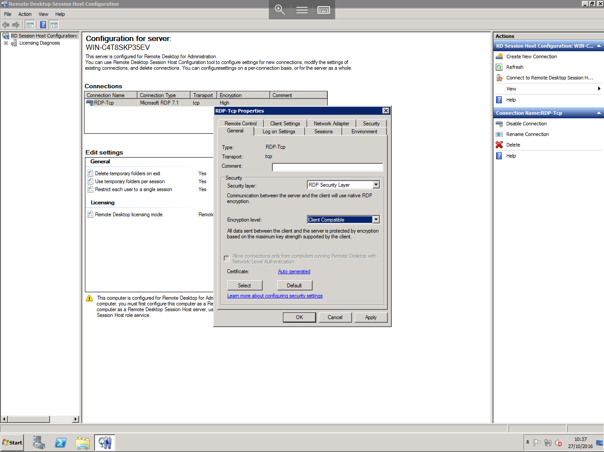
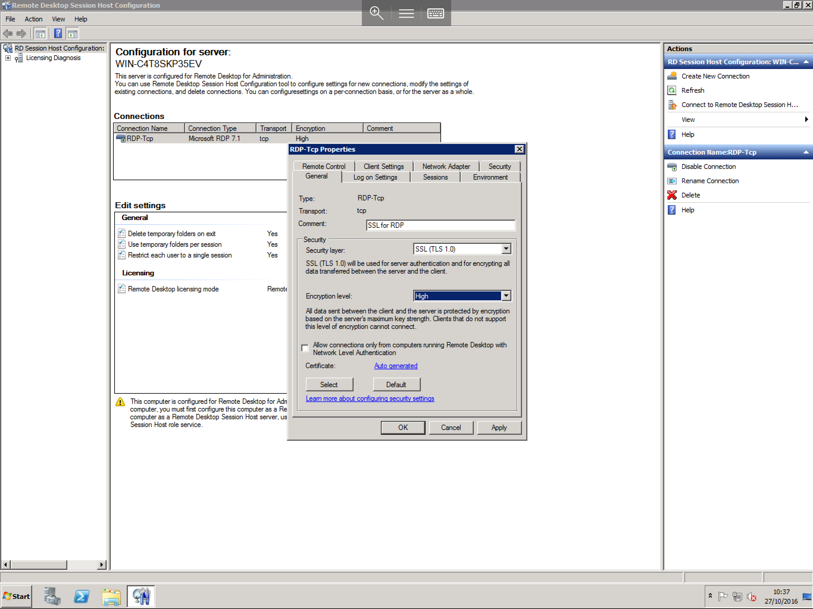
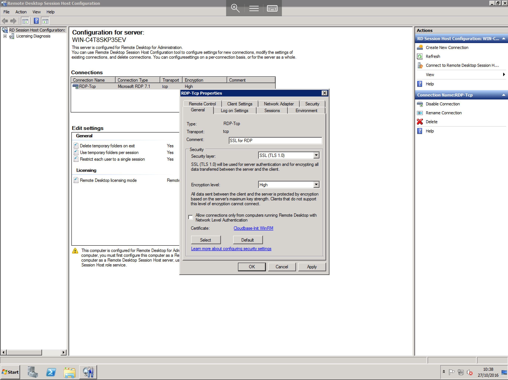
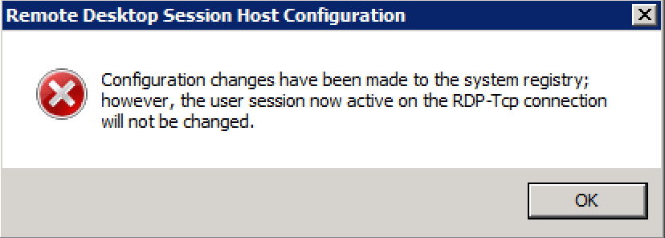
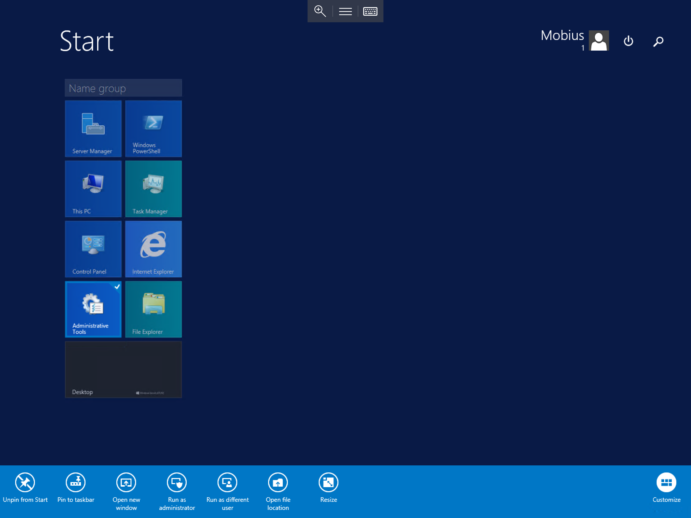
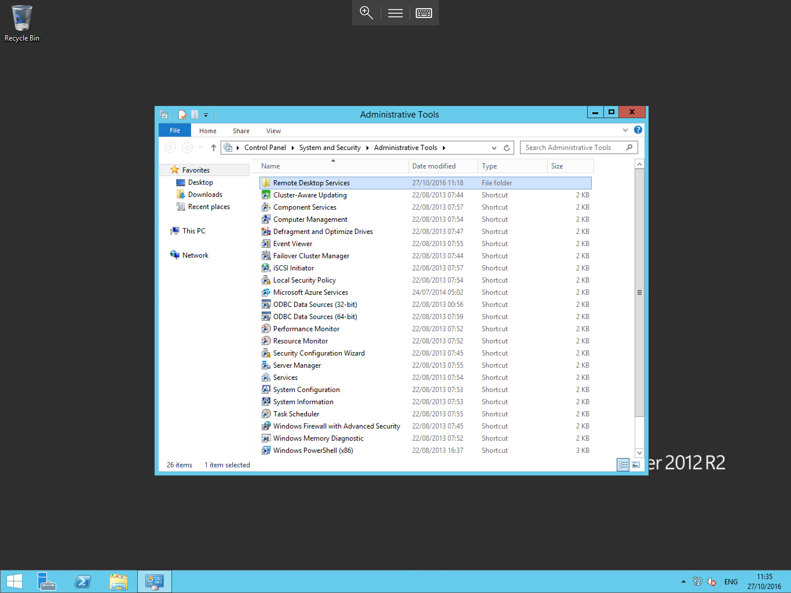
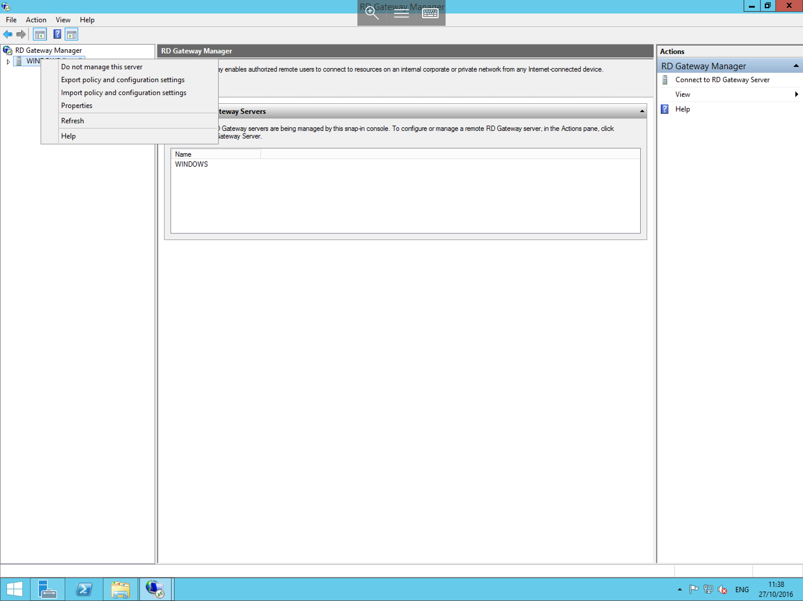

# Encrypt RDP traffic using an SSL certificate

* To Configure SSL for RDP, different Steps are required for different versions of windows server, please view the most suitable section of the guide to meet your needs.

## Windows Server 2008R2

Select start, then select "Administrative Tools" from the right side of the start menu, now select "Remote Desktop Services". From the 3 available options, please select "Remote Desktop Session Host Configuration" as below



You will now be presented with the session host configuration window, as below


Within the central field you will see the "Connections" section, within this section, you should have an entry named "RDP-Tcp", right click on this and select properties as below



You will now be presented with the Properties for the RDP-Tcp connection, within the general tab, you will see a number of options in their default state as below



Select the Drop down box next to "Security Layer" and select SSL (TLS 1.0), then select the drop down box next to "Encryption Level" and select High as below



Near the bottom of the pane, you will see a small section named "Certificate" and it will display "Auto Generated" next to it, click on the "Select" box underneath, you will now be asked to select the SSL which you wish to use as below


Select the SSL that you wish to use, and select "OK", you will now be returned to the RDP-Tcp properties window as below, you will see that "Auto generated" has now been replaced with your certificate name



Select "OK" and you will now be presented with a confirmation message as below, This message is a notice that the changes have been made, but they will not apply to any currently logged in sessions.



* To force any active connections to disconnect, you can ask current users to log off and back on again, or you can simply restart the Remote Desktop Service, any new connections will now be formed using the new security settings which you have just made.


## Windows Server 2012/2012R2

* The process for Windows Server 2012/2012R2 is somewhat different, it is a pre-requisite of this section that you have installed the remote desktop services role, if you are unsure how to do this, please see our guide on installing roles in the windows administration section.

Select start, then select "Administrative tools" from the list of available applications as below



From the list of Administrative tools, please select the remote desktop services icon as below



In the following window, please select the "Remote Desktop Gateway Manager"  icon from the list as below (if this is not present, then you have not installed the remote desktop gateway role, and you will need to do so)


You will now be presented with the Gateway Manager window as below


From this window, please right click on the server name from the left hand menu as below, and select properties



the "Server Name" Properties (in this case "WINDOWS") will now be displayed, select the "SSL Certificates" tab as below


You will see that the "Select an existing certificate from the RD Gateway" option is selected, select the import certificate button, you will now be presented with the "Import Certificate" pane as below, select the required certificate from the list and select "import"


The Properties window will now be displayed once more, and you will be able to see your certificate selected in the top portion of the pane as below, Select "OK" to complete the process


* As with the previous guide, current sessions will now use the new configuration, to ensure users are using the correct connection parameters, please ask them to log off and back on again, alternatively restart the remote desktop service.

## Window Server 2016

* The process for Windows Server 2016 is identical to that of Windows Server 2012/2012R2, and as such the above guide can be followed,

The start menu has been re-designed in Windows Server 2016, please view the below screenshot which shows where you will be able to locate the "Windows Administrative tools"


```eval_rst
  .. title:: Encrypting Remote Desktop traffic using SSL | UKFast Documentation
  .. meta::
     :title: Encrypting Remote Desktop traffic using SSL | UKFast Documentation
     :description: Instructions on how to encrypt RDP traffic using an SSL certificate
     :keywords: ukfast, remote, desktop, windows, encrypt, ssl, securuty, cloud, server
