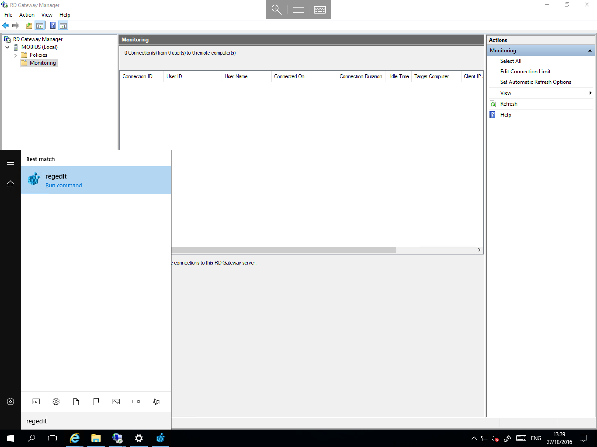
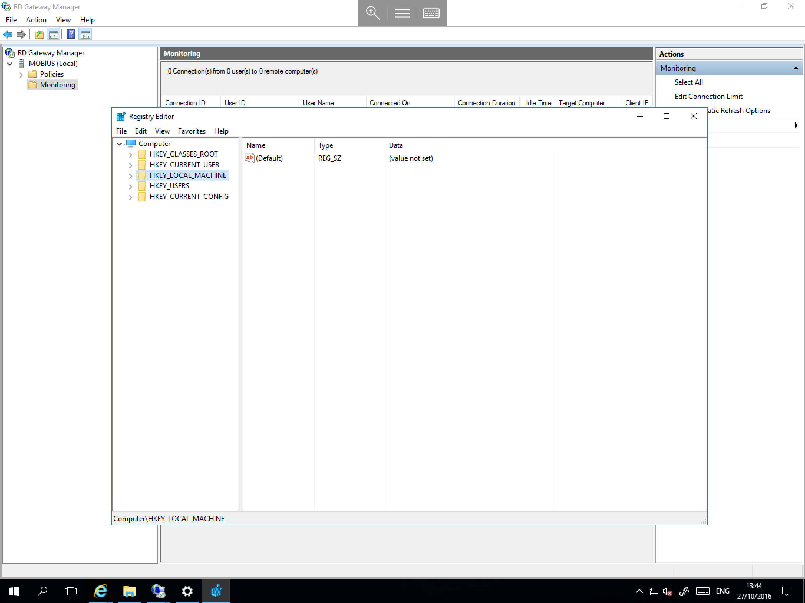
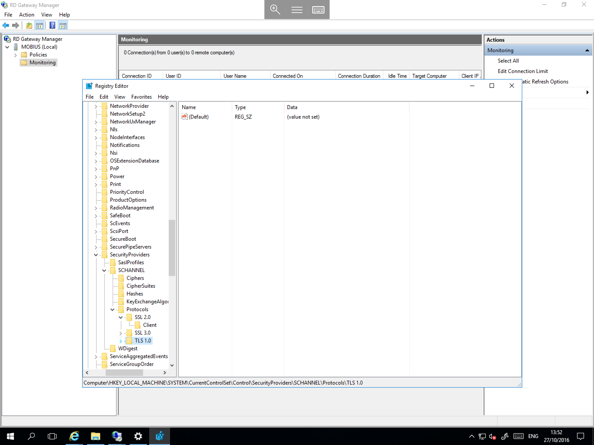
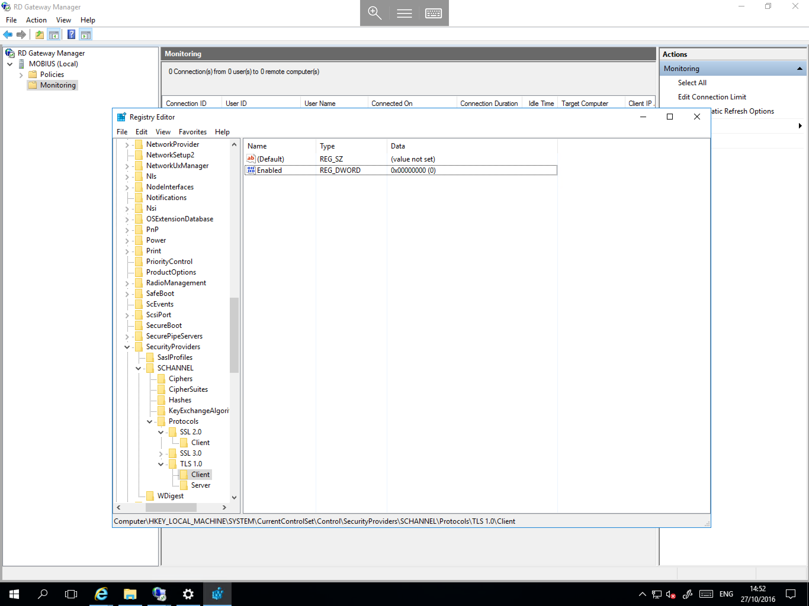

# Disabling TLS 1.0 for RDP

* TLS 1.0 is no longer considered to be a secure version of the TLS protocol, and as such, many compliance standards require that it is disabled in favour of more secure versions such as TLS 1.1.

* It is advised that before carrying out this guide, that you review any other services such as IIS and MSSQL to ensure that they too are configured to operate with TLS 1.0 disabled. Failing to do so may result in loss of reachability, until resolved.

## Windows Server 2008 R2 Considerations

Remote Desktop Services (RDS) on Windows server 2008 R2 does not support TLS 1.1 out of the box. However, there is a hotfix which Microsoft have written to add support for TLS 1.1 and TLS 1.2. This must be installed before disabling TLS 1.0 otherwise you will lose access to Remote Desktop Services until rectified.
The hotfix can be obtained from the link below

[Remote Desktop Services TLS 1.1 and TLS 1.2 Support patch (KB3080079)](https://support.microsoft.com/en-us/kb/3080079)

## Windows Server 2012 & 2012 R2 Considerations

Windows server 2012 & 2012 R2 support TLS 1.1 and TLS 1.2 for Remote Desktop Services out of the box.
Once the you have disabled TLS 1.0, any new connections will automatically be formed with the next version available.

## Windows Server 2016 Considerations

Window server 2016, as with Windows server 2012 & 2012 R2, supports TLS 1.1 and TLS 1.2 for Remote Desktop Services out of the box.
Again, once TLS 1.0 has been disabled, any new connections will automatically be formed with the next version available.

## How To Disable the TLS 1.0 Protocol

* This process is identical on Windows Server 200R 2, Windows Server 2012 & 2012 R2, and Windows Server 2016.

Select `Start`, type `regedit`, and select the `regedit.exe` icon which is presented as below



You will now be presented with the `regedit` window as below



Starting at `HKEY_LOCAL_MACHINE` on the left hand side of the window, please navigate through the hive to the location `\SYSTEM\CurrentcontrolSet\Control\SecurityProviders\SCHANNEL\Protocols\TLS 1.0` in the registry, as below



* If the TLS 1.0 key is not present, you will need to create it. To do so, please follow the below numbered steps

1. Right click on the "`Protocols`" key, and select `New` then select `Key`
2. Name the new key `TLS 1.0`
3. Right click the `TLS 1.0` key, select `New` then select `Key`
4. Name the new key `Server`
5. Right click the `TLS 1.0` key, select `New` then select `Key`
6. Name the new key `Client`

* The above steps will create the structure as depicted in this guide.

Select the `Server` key, right click and select `New`, then select `DWORD (32-bit) Value`. A new value will now be created in the main field of the `regedit` window. In the `Name` field, type `Enabled` and click away from the key.

Now right click the `Enabled` value, and select `Modify...`. The `Edit DWORD` pane will now be displayed. Select `Decimal` from the `Base` selector, and in the `Value data` field, enter `0`, then select `OK`

You should now be able to see your new key as below


* We now need to carry out the same steps for the `Client` key, as follows:

Select the `Client` key, right click and select `New`, then select `DWORD (32-bit) Value`. As before, a new value will be created in the main field of the `regedit` window. In the `Name` field, please type `Enabled` and click away from the key.

Now right click the `Enabled` value, select `Modify...`, the `Edit DWORD` panel will now be displayed. Select `Decimal` from the `Base` selector, and in the `Value data` field, enter `0`, then select `OK`

You should now be able to see your new `Client` key as below



* The keys to disable TLS 1.0 from the server side and also to refuse client connections using TLS 1.0 are now set. In order for the keys to take effect, your server must now be restarted.

```eval_rst
  .. title:: Disabling TLS 1.0 for Remote Desktop
  .. meta::
     :title: Disabling TLS 1.0 for Remote Desktop | ANS Documentation
     :description: Instructions on how to disable TLS 1.0 for Remote Desktop on Windows
     :keywords: ukfast, windows, rdp, tls, disable, server, security, secure, cloud, tutorial
```
