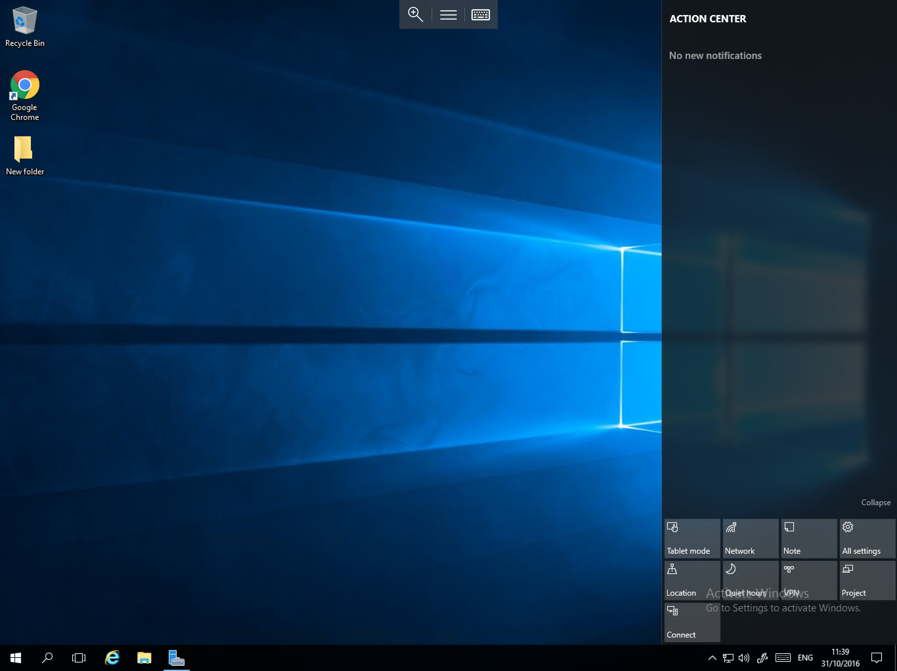
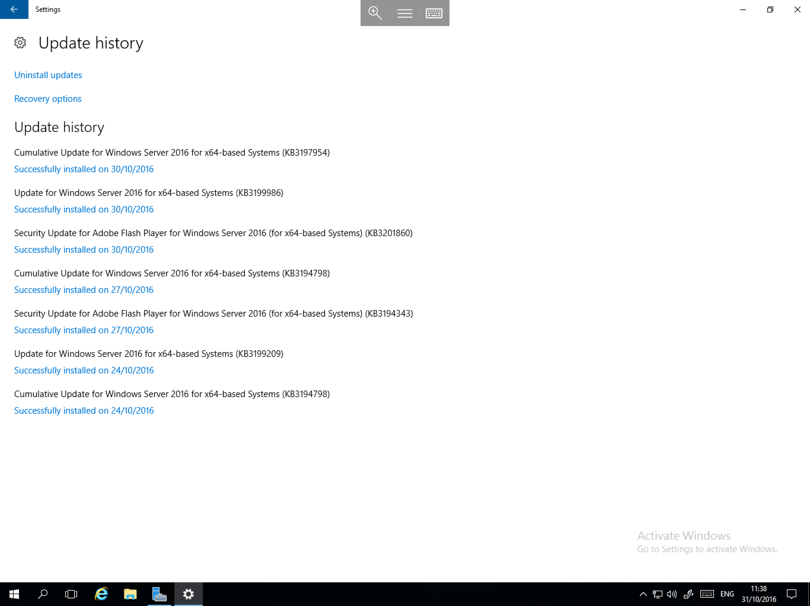

# Action Center

* Windows Server 2016, like previous versions of Windows Server, includes an Action Center which contains recommended actions and notifications.

In Windows Server 2016, the Action Center has been integrated in to the Taskbar and has been revamped to include Several Action buttons as below, to access it, simply select the speech bubble in the bottom right hand corner of the desktop



The Action Center also Logs all notifications, for example a windows update installation notification as below, Notifications aswell as Quick actions can be customised for the Action Center by visiting the System section of the Settings App and selecting "Notifications & actions"


If you wish to view more information about a notification, simply select it, and you will be presented with the appropriate window which contains further information as below



```eval_rst
  .. title:: Action Centre in Windows Server 2016 | UKFast Documentation
  .. meta::
     :title: Action Centre in Windows Server 2016 | UKFast Documentation
     :description: Information on the new Action Centre in Windows Server 2016
     :keywords: ukfast, windows, windows server 2016, new, action, centre, notification, cloud, tutorial
