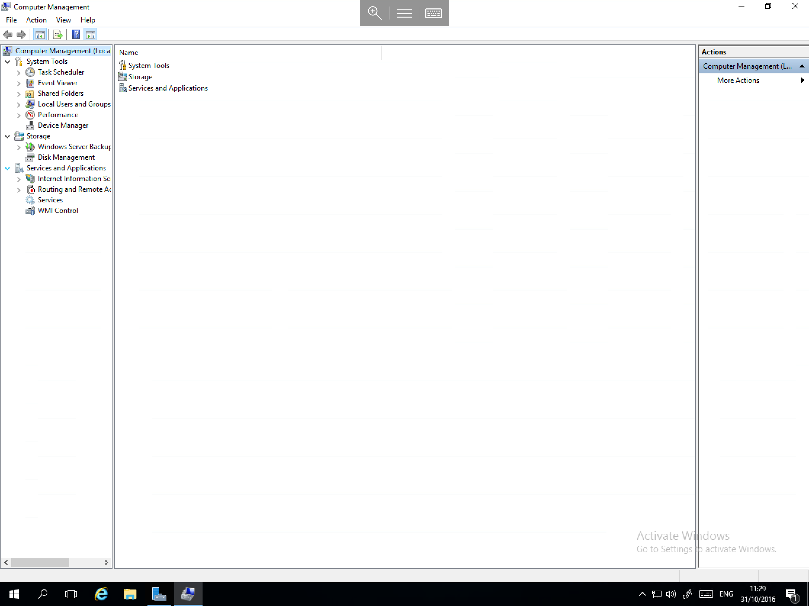

# Computer Management

* The Computer Management Console in Windows Server 2016 is extremely similar to previous versions.
  Please follow the below quick guide to access the Computer Management console in Windows Server 2016.

Right click on the start button, you will be presented with a context box as below

Select "Computer management" from the context box and you will now be presented with the familiar Computer management console as below

