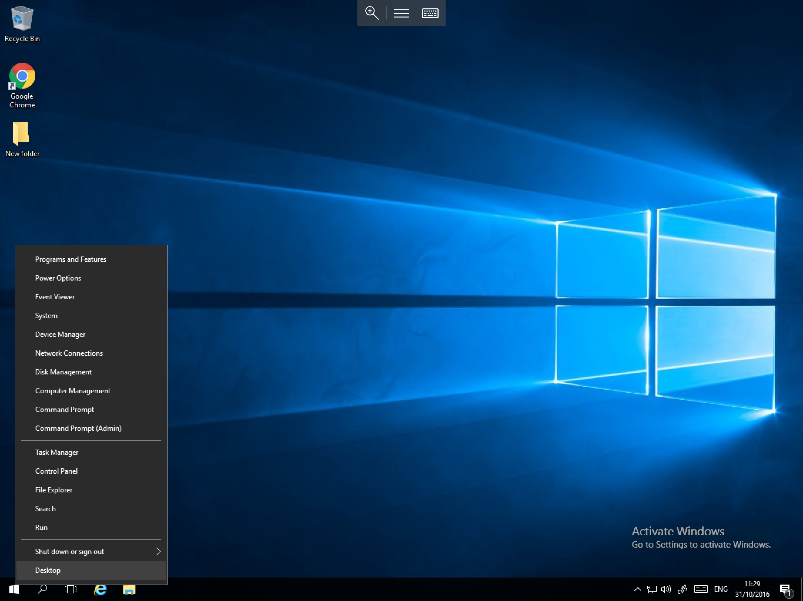
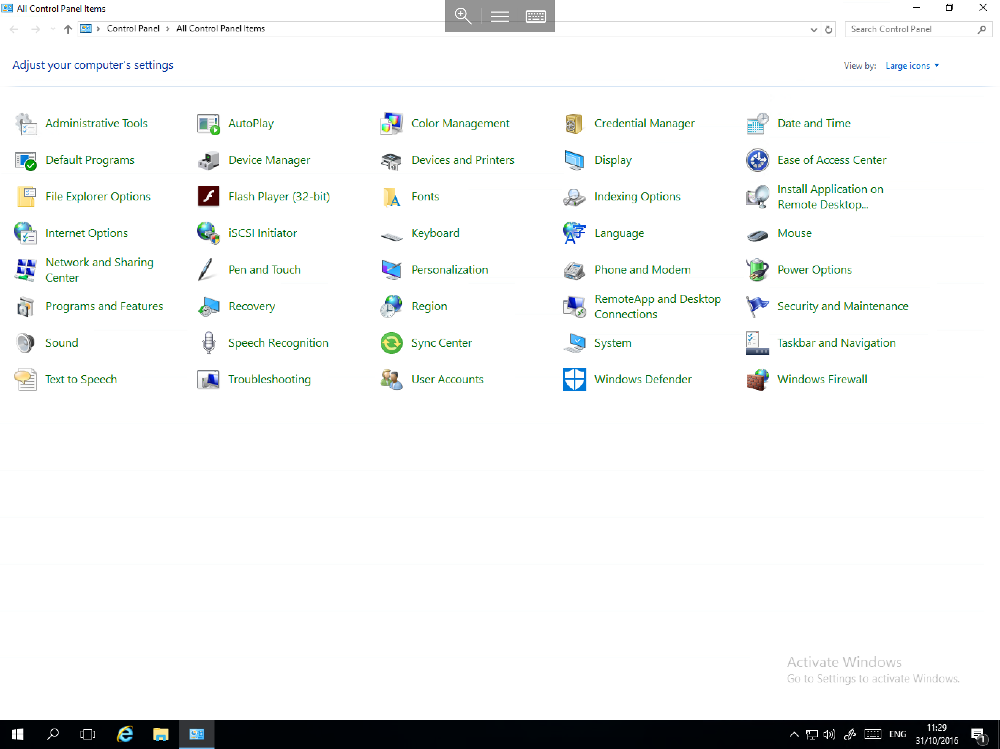

# Accessing The Control Panel

* To access the control Panel in Windows Server 2016, please follow the below quick guide


Right click on the start menu, you will now be presented with a context menu with several options as below



From the menu, please select "Control Panel", you will now be presented with the control panel window as below



* You will notice that there are some differences in the control panel, and that some modules are not present, this is by design, all of the missing modules which you used to find in the control panel are now located in the new "Settings App"
  If you are not familiar with the settings app, please follow our overview which aims to provide you with an introduction to it.

```eval_rst
  .. title:: Control Panel in Windows Server 2016
  .. meta::
     :title: Control Panel in Windows Server 2016 | UKFast Documentation
     :description: A guide to accessing and using the Control Panel in Windows Server 2016
     :keywords: ukfast, control, panel, windows, 2016, server, cloud, tutorial
