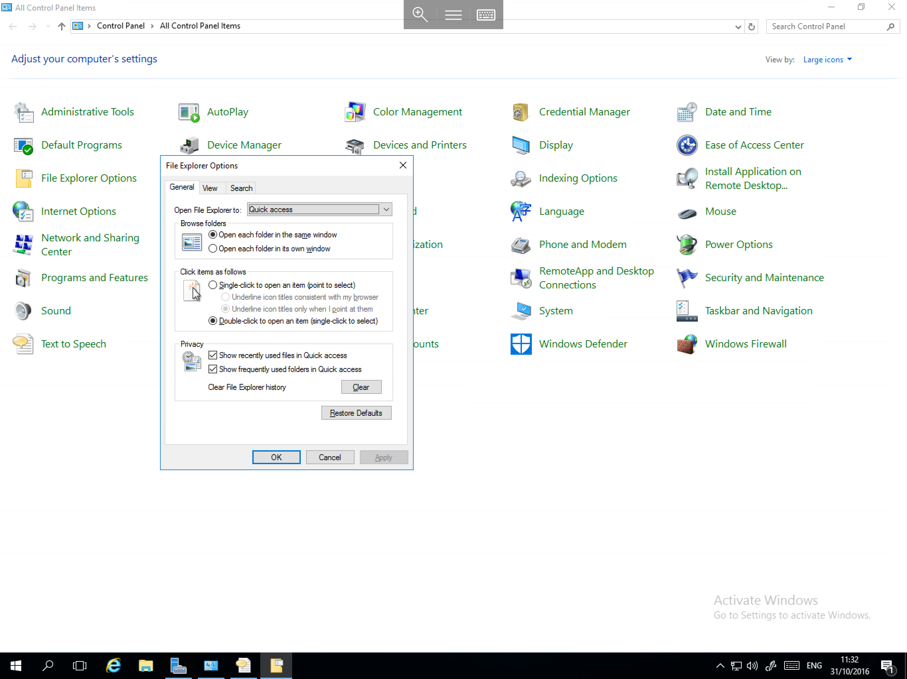
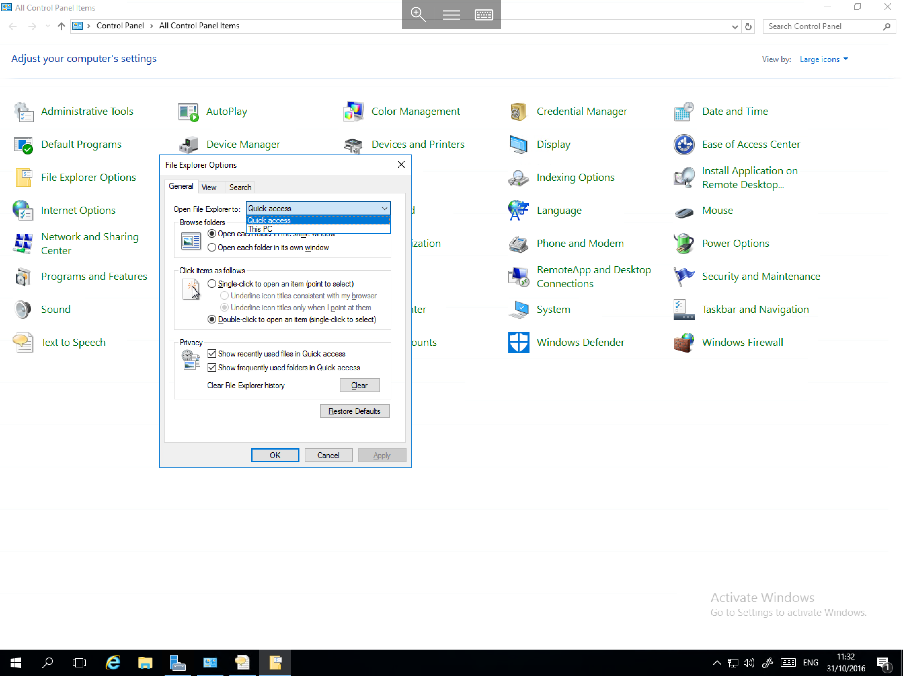

# How to Set "This-PC" as the Default Explorer Location

* In Windows Server 2016, When opening the File Explorer, you will be taken by default to the "Quick Access" window.
  If this is an inconvenience to you, it can be changed to open "This-PC" instead. In order to configure the file explorer to open This-PC by default, please follow the below guide.

Right click the start button, and select control panel, now select "File Explorer Options" from the list of available modules. You will now be presented with the File Explorer Options menu as below



Within this pane, the first option `Open File Explorer to:` needs to be changed, please select the drop down box which contains quick access, and select "This-PC" from the list as below, and select OK.



Now Launch a new instance of File Explorer by selecting the Explorer (Folder) icon from the taskbar, and you will find that the familiar "This-PC" window will now be launched as below


```eval_rst
  .. title:: Default File Explorer location in Windows Server 2016
  .. meta::
     :title: Default File Explorer location in Windows Server 2016 | UKFast Documentation
     :description: Instructions on how to set "This-PC" as the default File Explorer location in Windows Server 2016
     :keywords: ukfast, file, explorer, change, default, location, windows, tutorial, cloud, server, 2016
```
