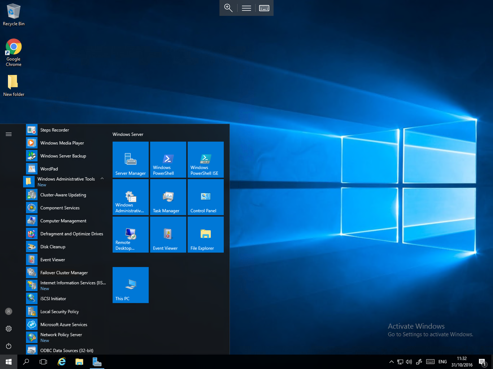
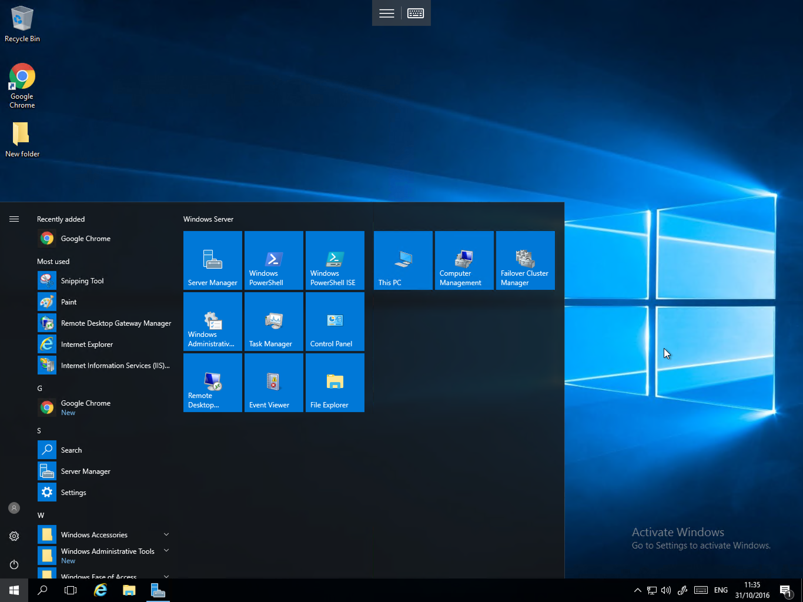
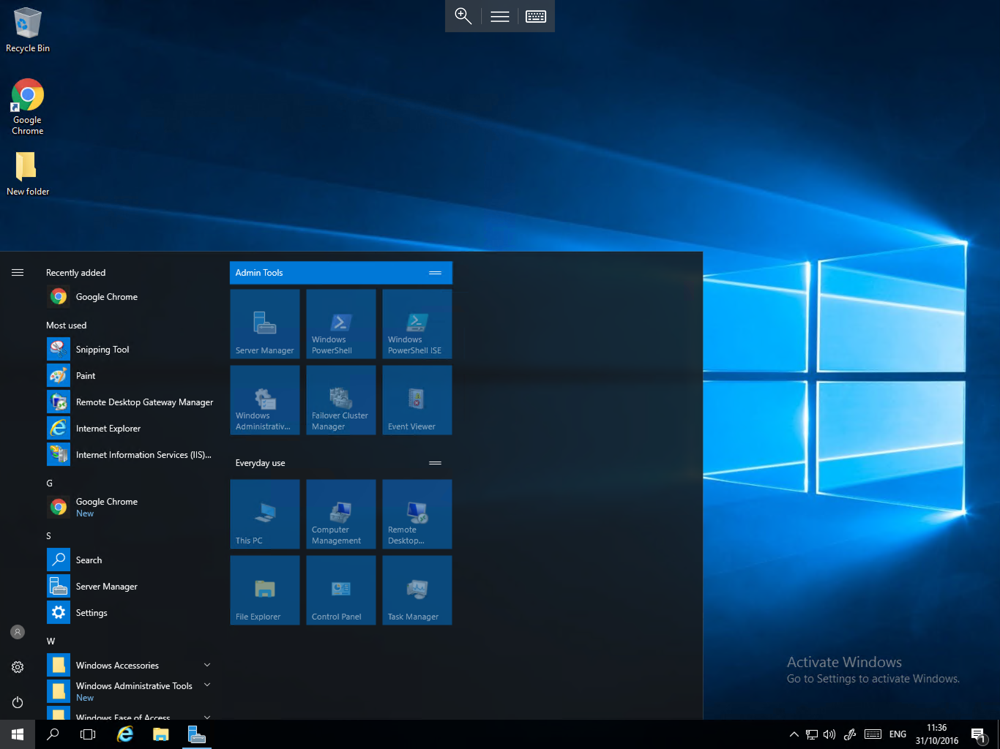
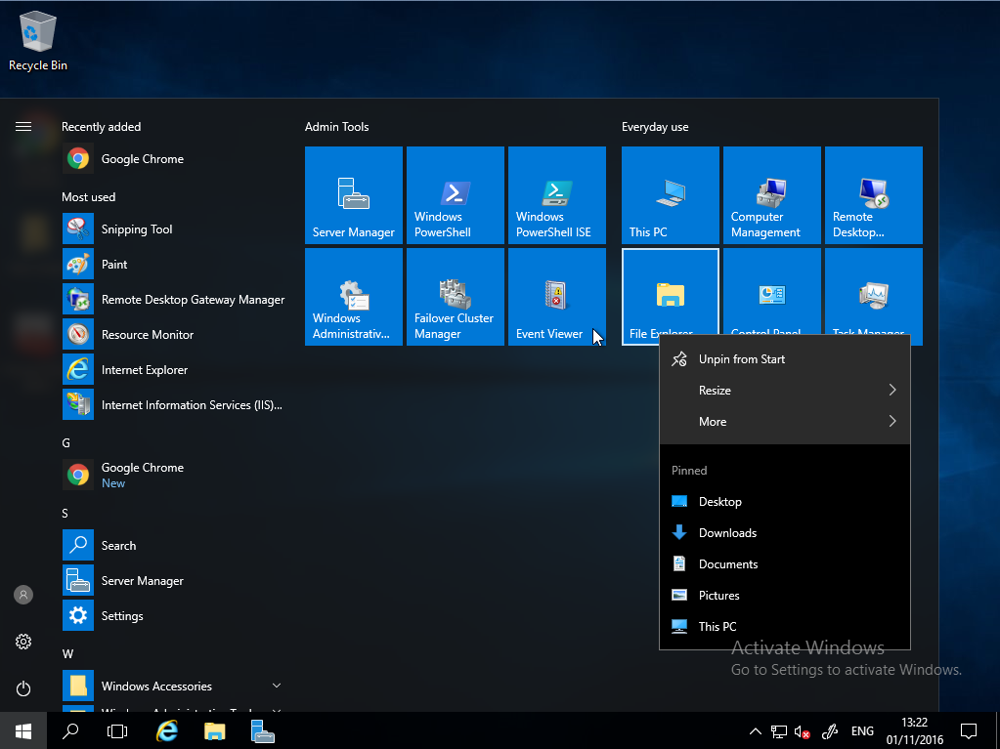

# How to Customise the Start Menu Tile Pad

* The appearance of the start menu in Windows Server 2016 has returned to a more traditional form, and also makes use of the Tiles which you may be familiar with from Windows Server 2012 by default, The tiles can be customised to your requirements or completely removed should you wish.
  If you wish to customise the tiles, or indeed remove them, please follow the guide below.

## Adding New Tiles

Select the Start icon, and you will be presented with the new start menu, the left hand side of the menu is a traditional application list, and the right hand side is a tile pad. Applications from the list, can be moved over to the Tile pad for easy selection.
To move an application from the list to the Tile pad, click and hold on your choice of application and while holding, drag the application over to the tile pad as demonstrated below

* Adding This-PC



* Adding Computer Management


* Adding Failover Cluster Manager


## Expanding the Tile Pad

As you can see from the above examples, by default, you can only create 6 extra Tiles before the available room is used. However if you would like to add more Tiles, it is possible to expand the Tile pad, to do so, move your cursor over the right hand edge of the tile pad until the cursor changes to an horizonal double arrow as below


Once the cursor has changed in to the horizonal arrow, click and hold, then move the cursor to the right by around a quarter of the screen's width and you will see that the Tile pad expands as below



## Naming Sections of the Tile Pad
As you can see above, a section of tiles moves over to the new Tile space, You can assign a Title to this new section aswell as the original section, to do so, please select the black area just above either block and enter a name as below


## Arranging Tiles

In order to re-arrange Tiles on the Tile Pad, you simply need to drag and drop the required tiles by selecting your chosen tile, holding and moving the tile to the required location.
You can also use the same process to move sections of tiles, to do so, select the title bar of the section you wish to move, hold, and move the bar to the required location as below



## Change Tile Size

The size of Tiles can be set to Medium (default) or Small, changing the Tile size to Small allows for more Tiles to be added to the Tile pad, however the Tile name will be hidden as a result, leaving just the Icon.
To change the size of a Tile, Right click on the tile in question, and select Resize, then select small as below.


## Removing Tiles

In order to remove a Tile from the Tile pad, please right click on the required tile, and select "Unpin from Start" as below




## Removing the Tile Pad

To remove the Tile Pad, you simply need to unpin all of the tiles from the pad, move the cursor to the right hand edge of the pad until it becomes a horizontal double arrow, single click and hold, and move the cursor toward the application list until the Pad section has been removed as below


```eval_rst
  .. title:: Start Menu in Windows Server 2016
  .. meta::
     :title: Start Menu in Windows Server 2016 | UKFast Documentation
     :description: A guide to customising the Start Menu tile pad in Windows Server 2016
     :keywords: ukfast, windows, start, customise, tile, pad, cloud, tutorial, server, 2016
