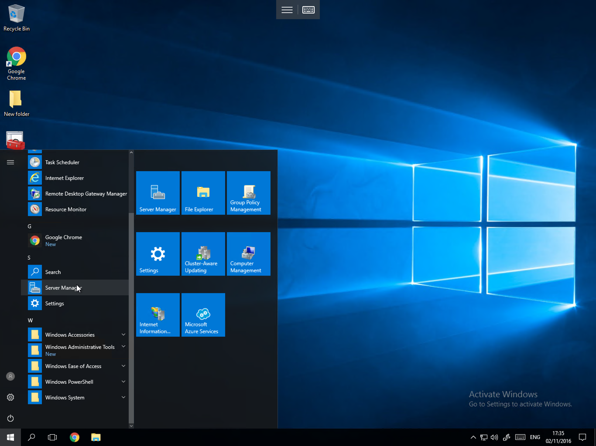
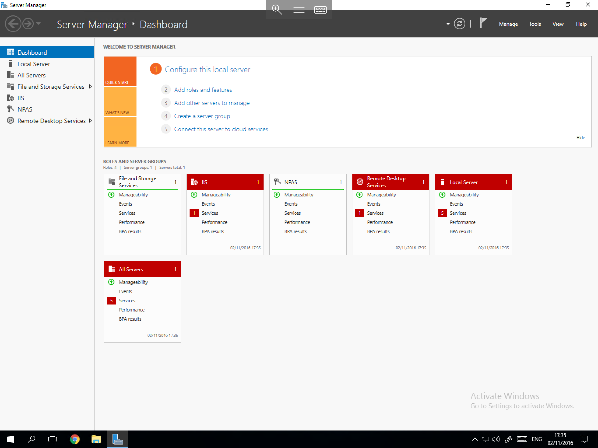
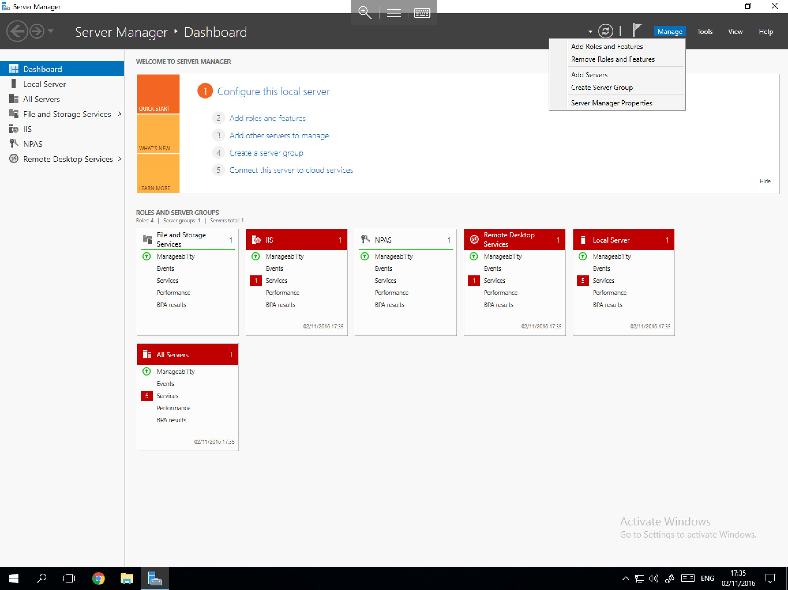
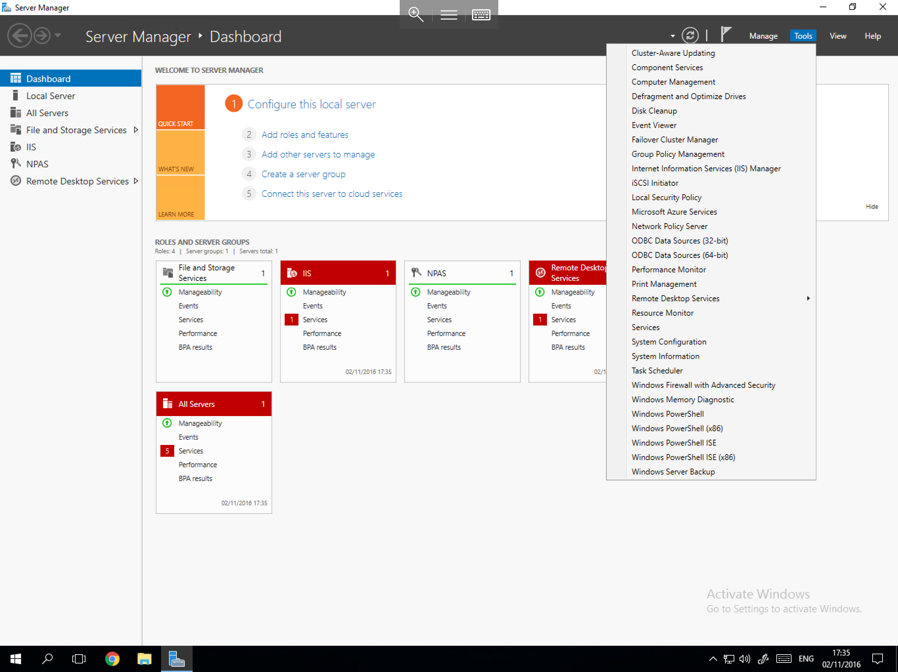

# How to Access Server Manager

* The Server Manager in Windows Server 2016 is no longer located on the taskbar by default, to access the Server Manager, please follow the below brief guide.

Select the start button, and select the Server Manager icon from the Tile Section as below


If you have disabled the tile section of the start menu, the icon is also available from the application list as below



You will now be presented with the Server Manager interface, this interface is exactly the same as in Windows server 2012 with identical sections as shown below







```eval_rst
  .. title:: Server Manager in Windows Server 2016
  .. meta::
     :title: Server Manager in Windows Server 2016 | UKFast Documentation
     :description: A guide to accessing Windows Server Manager in Windows Server 2016
     :keywords: ukfast, windows, server, manager, access, tutorial, cloud, 2016
