# The New Settings App

  In Windows Server 2016, the way in which you configure options for windows has changed dramatically. 
  In previous versions of Windows, the vast majority of basic changes to system options were made in the control panel, however in Windows Server 2016, these changes are now mostly made in the Settings App

* If you are not yet familiar with Windows Server 2016, please use the below overview to familiarise yourself with the Settings App

In order to access the Settings App, you simply need to select the start button, and select the small cog icon on the left hand side of the start menu as below


You will now be presented with the Settings App "Windows Settings" window, in this window, you will see 9 different categories as below


## System

The System Category contains the following important sections

* Display (Used to change icon size, screen orientation and access advanced display settings)

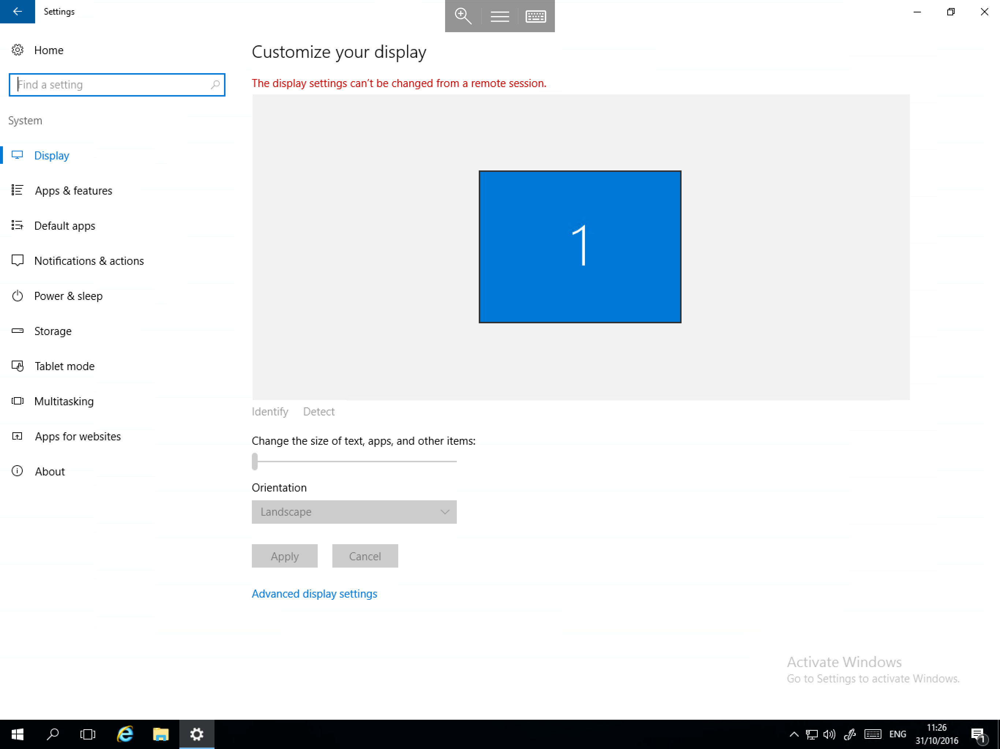

* Apps and Features (Used to Modify or Remove an installed application, aswell as add optional features and access Programs and Features)


* Default Apps (Used to Set or change Default applications such as internet browsers for web pages and links, email clients for e-mail links etc)

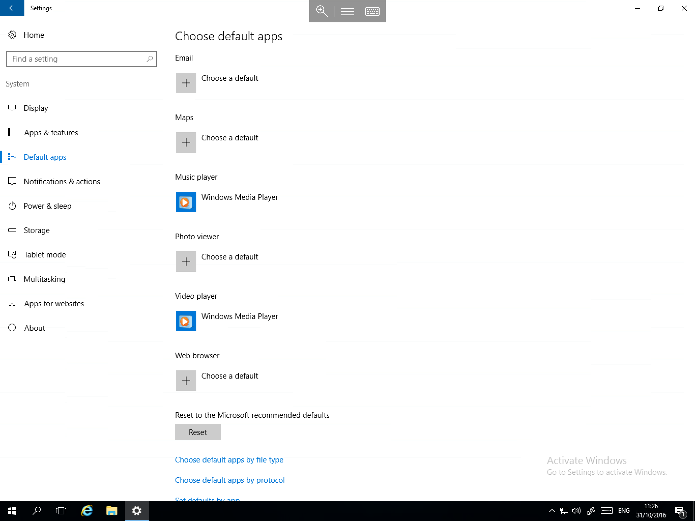

* Power and Sleep (To change the screen off timeout, and access Advanced power settings.)


* Storage (To view Storage use, as well as to select Default Save location when downloading files or installing new applications.)


* Multitasking (To set Window Snap behavior and choose Virtual desktop identification options)

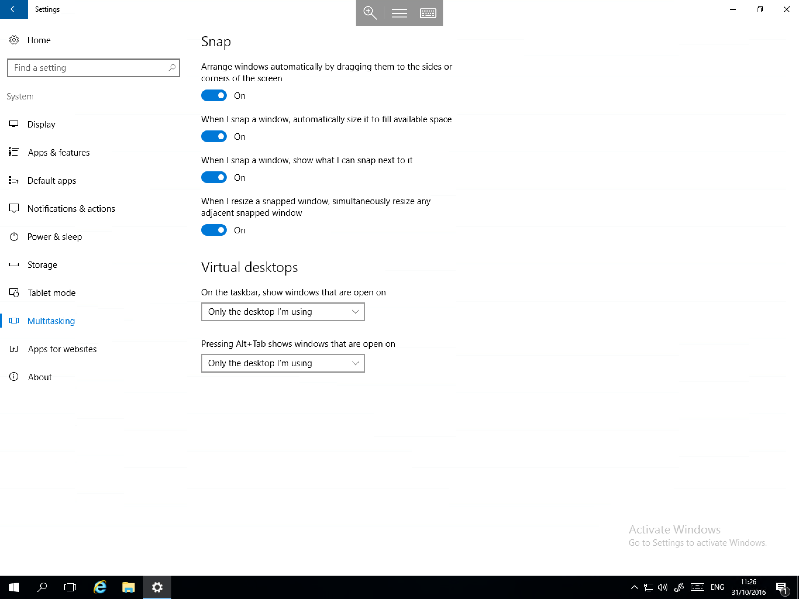

* About (Displays basic information about the Server, allows domain connection, Renaming of the Server, aswell as several other options such as administrative tools, bitlocker settings and device manager.)

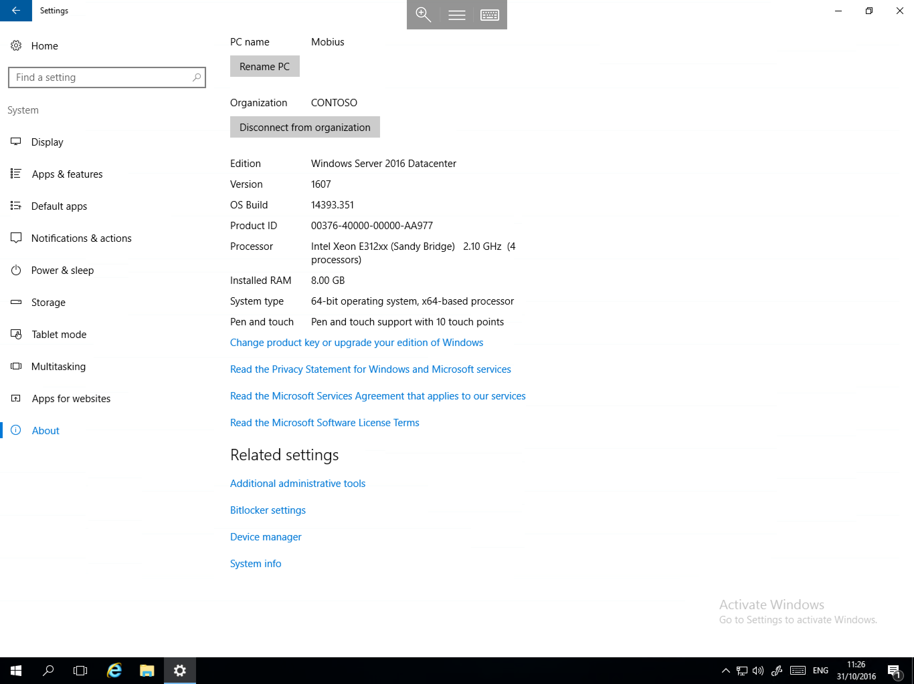


## Devices

The Devices category contains the following important sections

* Printers & scanners (Used to add new printers or scanners, and to access Devices and printers)


* Connected Devices (Displays information about Currently connected Peripheral Devices aswell as providing the option to add a device)


* USB (Provides an option to receive notifications if an issue occurs while connecting usb devices)


## Network & Internet

The Network & Internet category contains the following important sections.

* Status (Provides an overview of current network connections, and allows you to configure options such as Windows firewall, adapter settings, and carry out a network reset)

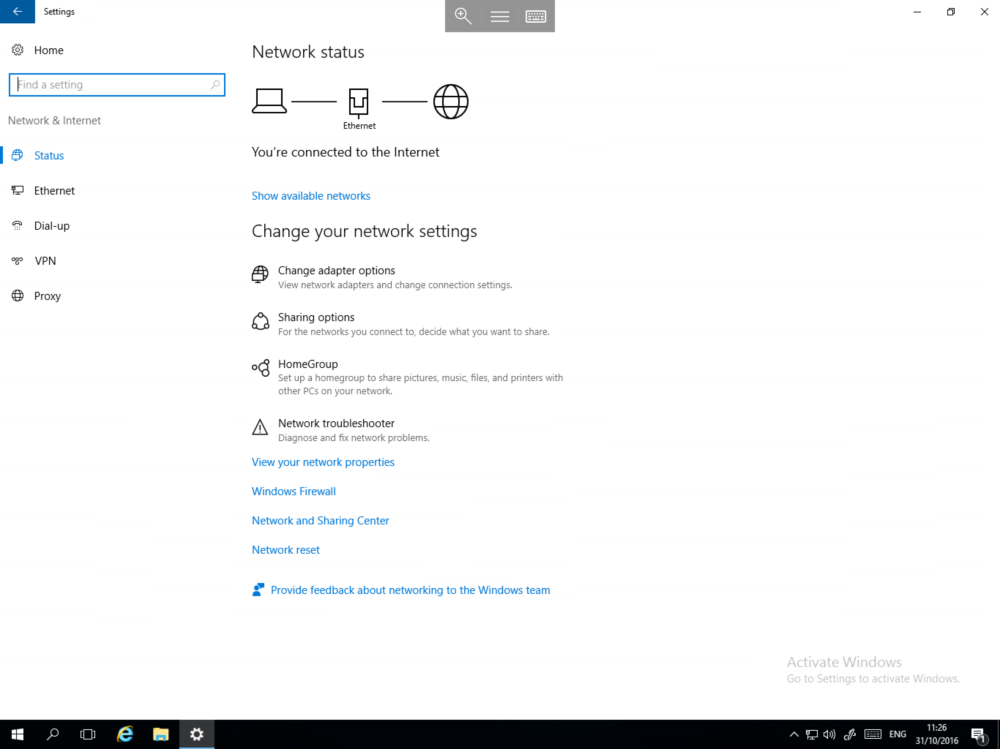

* Ethernet (Displays active network connections and displays their ip address, mac address and driver version, aswell as providing access to homegroup, network and sharing center and advanced sharing options)


* VPN (Allows you to add a VPN connection)

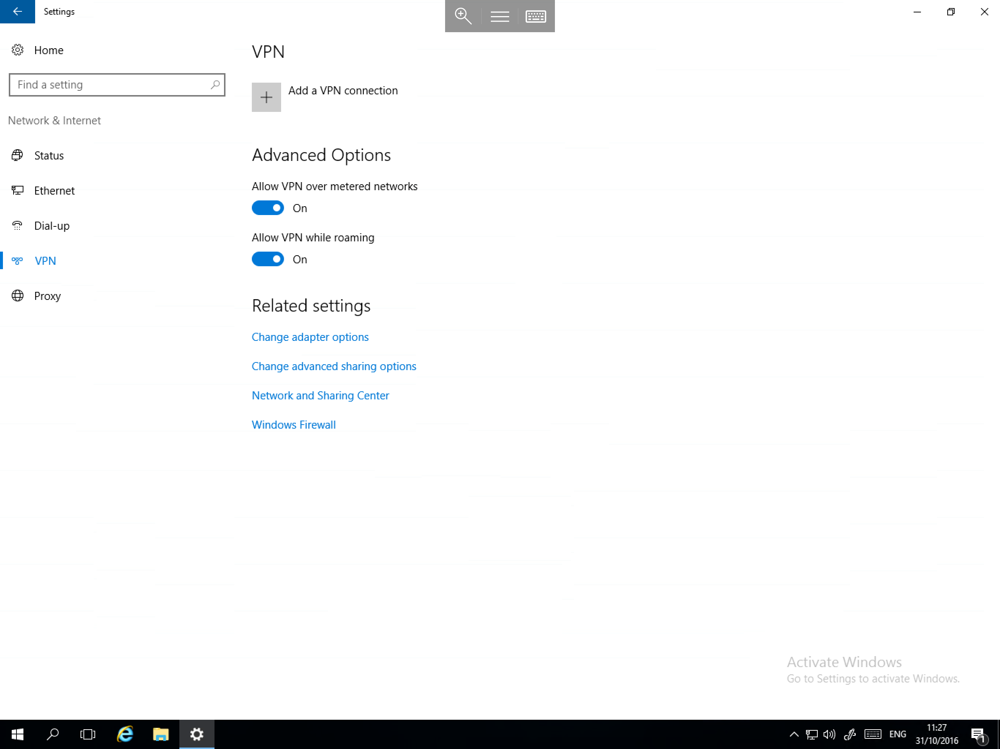

* Proxy (Allows you to configure a proxy connection, and change automatic proxy options)


## Personalisation

* The personalisation section allows you to change appearance settings for Windows Server 2016 such as Wallpaper, Colour hue, lock screen options, themes, and start/taskbar options

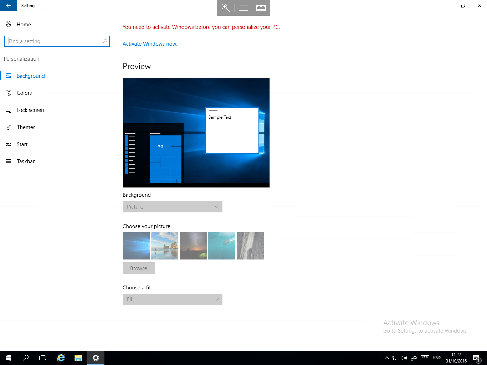

## Accounts
The Accounts category contains the following sections

* Your info (provides information about your user account, and allows you to assign a profile picture


* Sign-in Options (Allows you to change several options surrounding your login such as Password and Privacy, and to access the Lock Screen options)

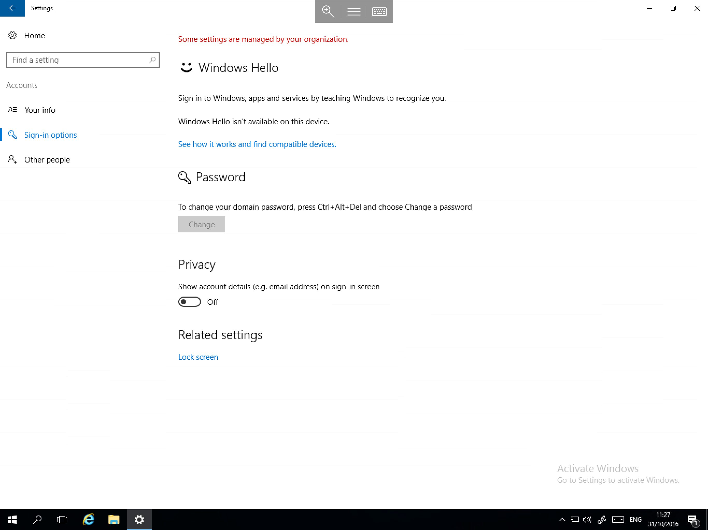

* Other People (Provides options to create new user accounts and to configure unsigned access)

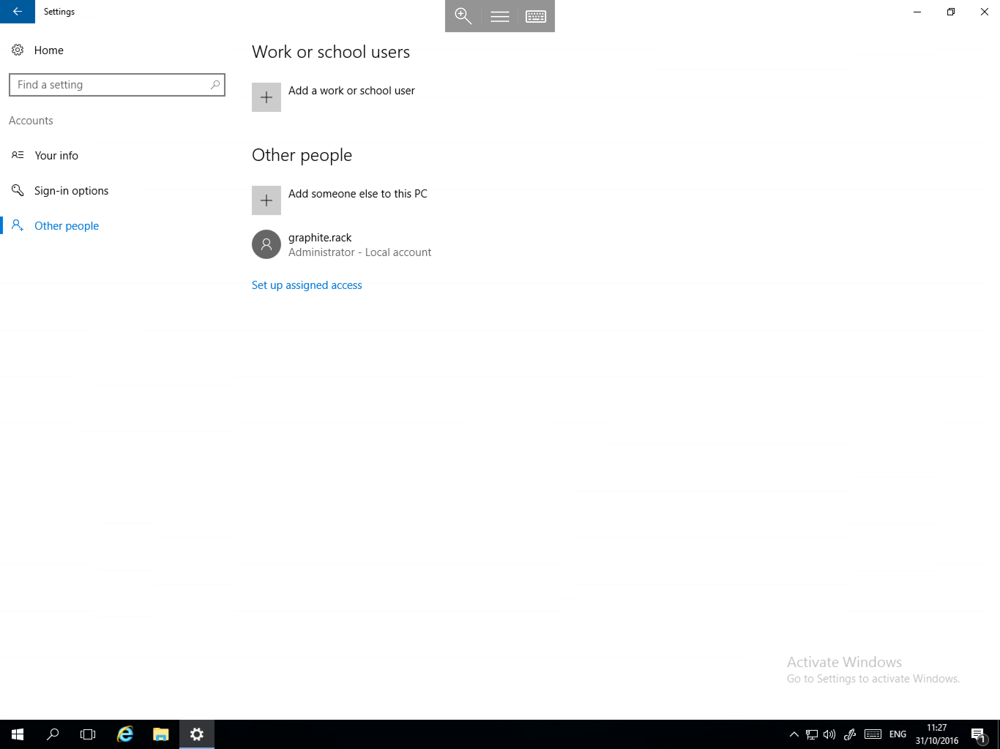

## Time & Language

The Time and Language category contains the following sections

* Date & Time (Provide options to change Time and date settings aswell as to adjust formats and regional settings)


* Region & Language (Provides the ability to select Different Languages and set the Locale)


* Speech (Allows you to set speech Settings to be used in conjunction with Ease of Access features and speech recognition)


## Ease of Access

The Ease of Access category contains a multitude of Settings designed to improve ease of use for those with visual/hearing impairment or physical disability.


## Privacy

The Privacy Category contains several sections which allow you to customise your privacy in a multitude of different scenarios

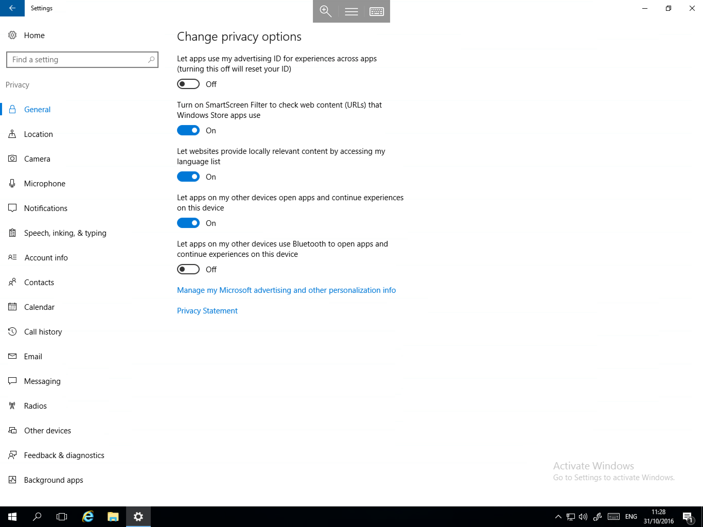

## Update and Security

The Update and Security Category contains the following important sections

* Windows Update (This section allows you to install available updates, aswell as set Active hours, restart options and update options)


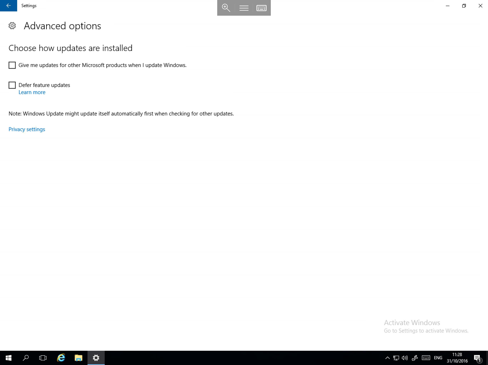

* Windows Defender ( Allows you to launch Windows Defender aswell as set protection options and make exclusions)


```eval_rst
  .. title:: Settings in Windows Server 2016
  .. meta::
     :title: Settings in Windows Server 2016 | UKFast Documentation
     :description: An in-depth guide to using Settings in Windows Server 2016
     :keywords: ukfast, windows, settings, app, new, server, administration, tutorial, guide, 2016
