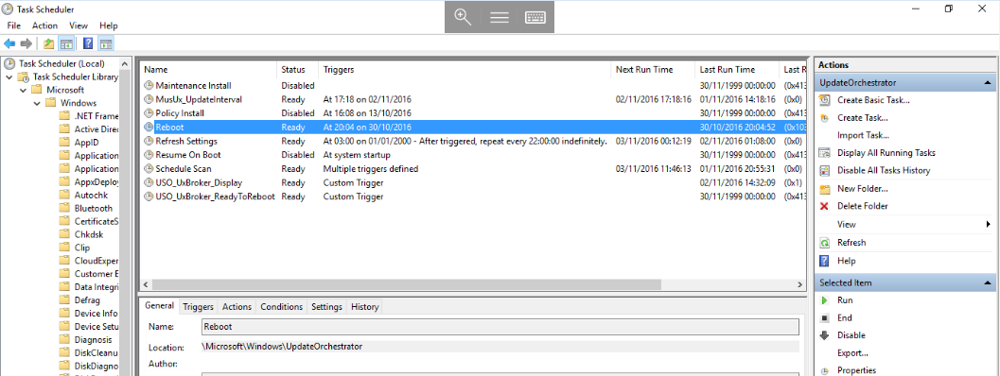

# Automatic Updates in Windows Server 2016


In Windows server 2016, windows updates are partially controlled by a new update orchestrator service aswell as by the windows update service. 
The orchestrator service uses a series of scheduled tasks to check for new updates being installed by windows updates, and schedules a reboot at any time outside of the 12 hour “active hours” window if the service detects that an update has been installed. The orchestrator provides no control over the day, or specific time within the 12 hour window at present.

There is no official resolution at the time of writing, beyond controlling update release via WSUS, once the update is released however, a random reboot will occur when the update has been installed.

ADMX Policy templates for Windows Server 2016 group policy do not appear to have any control over update reboots at the moment.

There is however a manual workaround to stop the auto reboot via orchestrator, while still allowing updates to be installed until Microsoft releases controls with more granularity.

* If your Windows Server 2016 Server is with UKFast, The below steps have already been taken to prevent automatic reboots of your server.

To Disable Auto Restart for updates

* Open task scheduler by selecting start and typing `task scheduler`, then select the resulting task scheduler icon.
* Navigate through the task library to Microsoft > Windows > UpdateOrchestrator, once you have reached "UpdateOrchestrator, you will be able to see a series of tasks in the central window

* Disable the “Reboot” task by right clicking on the `Reboot` task as below, and selecting Disable from the context menu.
* Once the "Reboot" task has a status of Disabled, you can close the task scheduler.



* Open Explorer by selecting the Folder icon from the task bar, and navigate to C:\Windows\System32\Tasks\Microsoft\Windows\UpdateOrchestrator
* Right click On the reboot file, and select "Properties", you will now be presented with the "Reboot Properties" window, select the "Security" tab, and select the Edit button. 
* Set file security to Deny for all types of access for SYSTEM, LOCAL SERVICE, NETWORK SERVICE. you can do this by selecting each of the mentioned users in turn, and selecting the Deny box for "Full Control" as below (This prevents Windows from re-enabling the task)


```eval_rst
  .. title:: {title goes here}
  .. meta::
     :title: Automatic updates in Windows Server 2016 | UKFast Documentation
     :description: Information on the automatic updates feature in Windows Server 2016
     :keywords: ukfast, automatic, windows, updates, 2016, server, tutorial, restart, cloud
