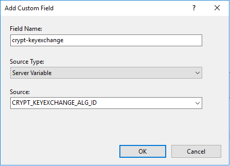

# Logging TLS cipher usage

It is possible to enable cipher usage logging as a custom logging option in many popular web platforms. Here we will discuss configuring this in IIS.

This can help an administrator determine the quantity of vistor connections that use legacy protocols and ciphers.

## IIS TLS logging

The Microsoft Secure team announced in a [blog post](https://cloudblogs.microsoft.com/microsoftsecure/2017/09/07/new-iis-functionality-to-help-identify-weak-tls-usage/) that Windows Server 2012 R2 and Server 2016 will have the ability to enable custom logging in IIS to log negotiated TLS protocols and ciphers to the access log.

To enable the new functionality, you will need to add the following custom log fields at either the site or server level.

```eval_rst
+-------------------+--------------------------+----------------+
| Field Name        | Source                   | Type           |
+===================+==========================+================+
| crypt-protocol    | CRYPT_PROTOCOL           | ServerVariable |
+-------------------+--------------------------+----------------+
| crypt-cipher      | CRYPT_CIPHER_ALG_ID      | ServerVariable |
+-------------------+--------------------------+----------------+
| crypt-hash        | CRYPT_HASH_ALG_ID        | ServerVariable |
+-------------------+--------------------------+----------------+
| crypt-keyexchange | CRYPT_KEYEXCHANGE_ALG_ID | ServerVariable |
+-------------------+--------------------------+----------------+
```

This can be done through IIS by adding custom logging fields:



Or you can add them directly to the `applicationHost.config` as custom log fields:

```xml
<logFile>
    <customFields>
        <clear />
        <add logFieldName="crypt-protocol" sourceName="CRYPT_PROTOCOL" sourceType="ServerVariable" />
        <add logFieldName="crypt-cipher" sourceName="CRYPT_CIPHER_ALG_ID" sourceType="ServerVariable" />
        <add logFieldName="crypt-hash" sourceName="CRYPT_HASH_ALG_ID" sourceType="ServerVariable" />
        <add logFieldName="crypt-keyexchange" sourceName="CRYPT_KEYEXCHANGE_ALG_ID" sourceType="ServerVariable" />
    </customFields>
</logFile>
```

When an HTTPS request is processed, the SSL/TLS information will be written to the log file as a hexadecimal value. You can then use the Microsoft documentation for [Protocols](https://docs.microsoft.com/en-gb/windows/desktop/api/schannel/ns-schannel-_secpkgcontext_connectioninfo) and [Ciphers](https://docs.microsoft.com/en-gb/windows/desktop/SecCrypto/alg-id) in order to map the hex values to human-readable names.

```eval_rst
.. note:: 
  Since the log can only be written to after the TLS handshake is successful, you will not be able log HTTPS requests which fail TLS negotiation due to protocol or cipher mismatch. This means that TLS logging is not suitable for troubleshooting purposes. However, it can be used to provide insight into which protocols are being negotiated when users visit the site.
```

```eval_rst
   .. title:: IIS Custom Logging for TLS
   .. meta::
      :title: IIS Custom Logging for TLS | UKFast Documentation
      :description: Setting up custom logging to record TLS version
      :keywords: SSL, TLS, ukfast, Schannel, IIS, security, windows, logging
```