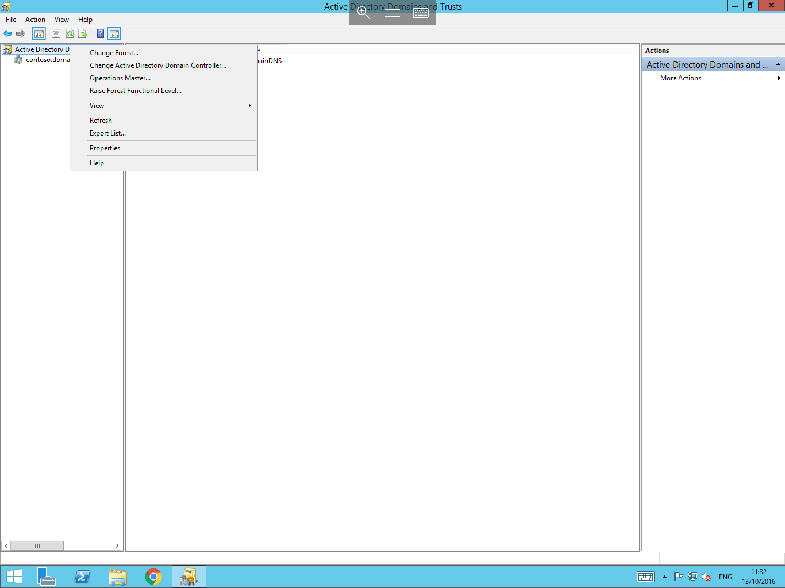
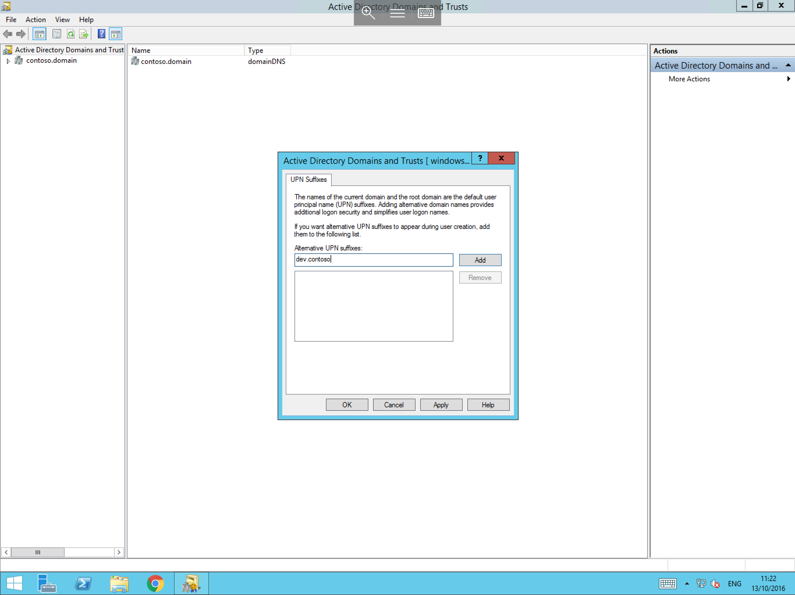

# Adding a UPN Suffix In Active Directory

How to add an alternative UPN suffix (User Principle Name Suffix),the typical reason for making this change, is to allow users to login with an alternate domain name. 
 
In order to add a UPN Suffix to your domain, please follow the below guide.

Log in to your domain controller using your domain administrator credentials, once logged in, select start and select "Active directory Domains and Trusts" as demonstrated below


You will now be presented with the active directory domains and trusts window, from this window, please right click on "Active directory domaions and Trusts" from the left hand side of the window as below,then select properties from the resultant context menu.



You will now be presented with the UPN Suffixes pane, within this pane, you will see a field named "Alternative UPN suffixes", please enter your new UPN Suffix in to this field as below



Now select "Add" from the right hand side of the pane and your new UPN Suffix should now be visible in the bottom field of the pane as below, select ok to close the Pane.


* Now that you have added your additional UPN Suffix, You can carry out the below steps to test that it is visible and usable.

Select start, and select Active directory users and computers as below


You will now be presented with the active directory users and computers window, please select users, right click and select "New User", the "New User" context box will be presented to you.
In the "User Logon name:" field, select the drop down arrow to the right hand side, and you should see that your new UPN Suffix is now visible as below


* The process of adding your new UPN Suffix is now complete, you can repeat the above steps should you wish to add any further UPN Suffix's.

```eval_rst
  .. title:: The UPN suffix in Active Directory
  .. meta::
     :title: The UPN suffix in Active Directory | UKFast Documentation
     :description: A guide to adding a UPN Suffix in Active Directory in Windows
     :keywords: ukfast, windows, active, directory, upn, suffix, add, tutorial, guide, cloud, server
