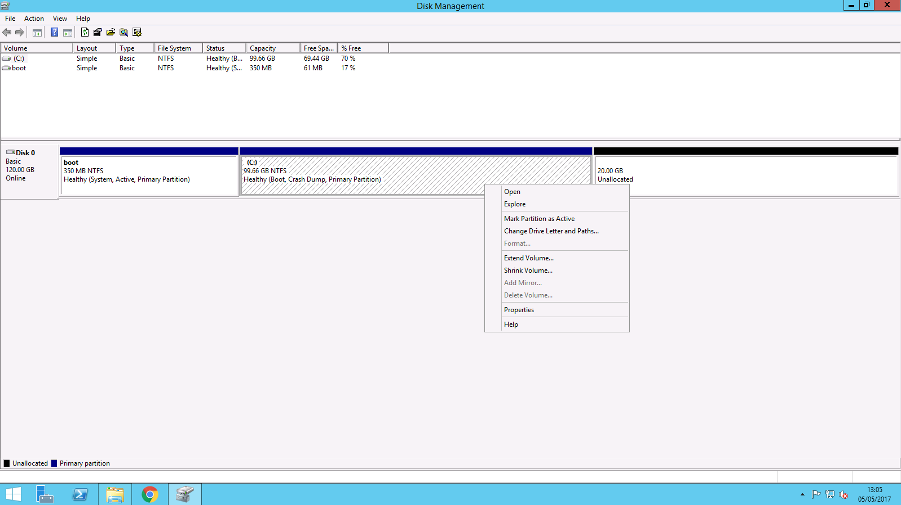

# Windows Disk Management

In Windows you can manage the hard disks within your computer using the Windows Disk Management console.  To access this, please follow the guide below.

Open Server Manager either by selecting the Taskbar shortcut, or by selecting `Start` then `Server Manager` from the list of applications.

Once you have opened Server Manager, select `Tools`, then `Computer Management` from the list of options as below


You will now be presented with the computer management console. On the left hand side of the window, please pop out the storage section of the list, and select `Disk Management`

In the central field of the window, you should now be presented with the Disk Management console after a few seconds as below


This console will provide you with information about your currently installed hard disk drives, and will also allow you to make changes to the partitioning and filesystems of those hard disks, as well as carry out other functions such as extending and shrinking current partitions.

To view this information and make changes, please select the disk of your choice, and right click to view the available options for that drive as below


## Extending A Partition

To extend a partition in order to make use of additional space, follow the steps below

When additional capacity is added to a Windows Server, the space needs to be either added to an existing partition, or used to create a new partition, before it becomes usable. The example below shows how extra capacity will appear in the Disk Management console.


In this example, we would like to extend drive C: to make use of the additional 20GB of available disk space. To do this, right click on the drive C: partition as below and select `Extend Volume` from the context menu.



You will now be presented with the Extend Volume Wizard shown below, please select `Next`


The Select Disks pane will now be displayed as below


This pane will already be configured correctly for you to use the maximum available amount of space on the disk, however 2 options are worth noting.

- Maximum available space in MB : This represents the total amount of extra space available
- Select the amount of space in MB : This section allows you to choose the amount of the extra space that you wish to add to the disk in question, in this case C:

If for example, you only wish to add 10GB of the 20GB available to drive C:, you would need to change the "Select the amount of space in MB" field to 10240. Once you have entered the correct details, please select `Next`.

You will now be presented with the Completing the Extend Volume Wizard pane as below, please review the selected setting in the middle of the pane, and then select `Finish`.


You will be returned to the Disk Management console, where you will see that Partition has been expanded as per the example below


The additional space is now usable.

```eval_rst
  .. title:: Windows Disk Management | UKFast Documentation
  .. meta::
     :title: Windows Disk Management | UKFast Documentation
     :description: Information on managing disks in Windows
     :keywords: ukfast, disk, drive, management, windows, cloud, tutorial, guide, server
