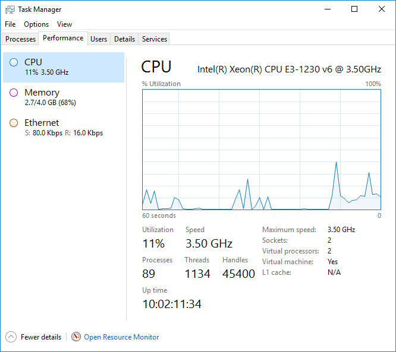
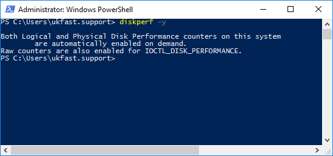
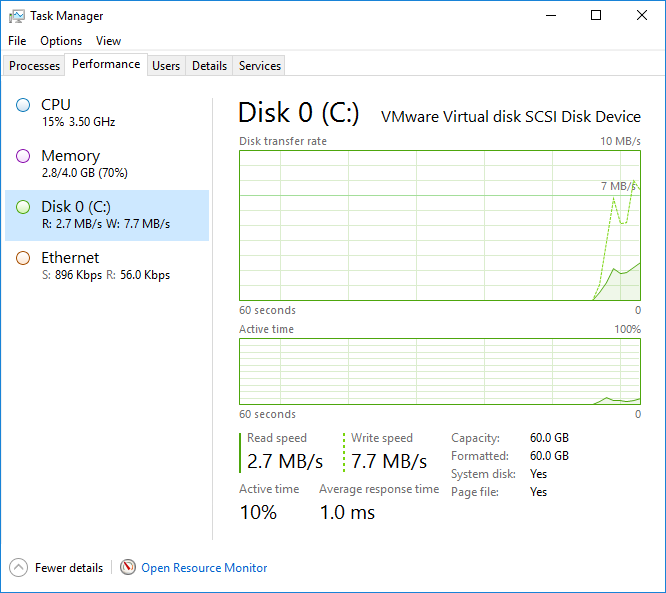

# Enabling Disk Performance Counters

Disk performance counters allow you to see the current disk activity in Task Manager. This is useful if you would like to quickly see how much your disk is being utilized as you would for CPU, memory and network.

Disk performance counters are enabled but not visible in Task Manager by default in Windows Server flavours of the OS:



The steps below can be used to enable visibility in Task Manager:

- Launch a Command Prompt or PowerShell window using the "Run as Administrator" option.
- Enter the following line and press Enter:

```
diskperf -Y
```



- Open Task Manager and select the `Performance` tab:



Disk performance counters can be hidden again if necessary using the `-N` switch:

```
diskperf -N
```

```eval_rst
  .. title:: Enabling Disk Performance Counters
  .. meta::
     :title: Enabling Disk Performance Counters | UKFast Documentation
     :description: A guide to exposing disk performance counters in Windows Task Manager
     :keywords: ukfast, windows, diskperf, task manager
