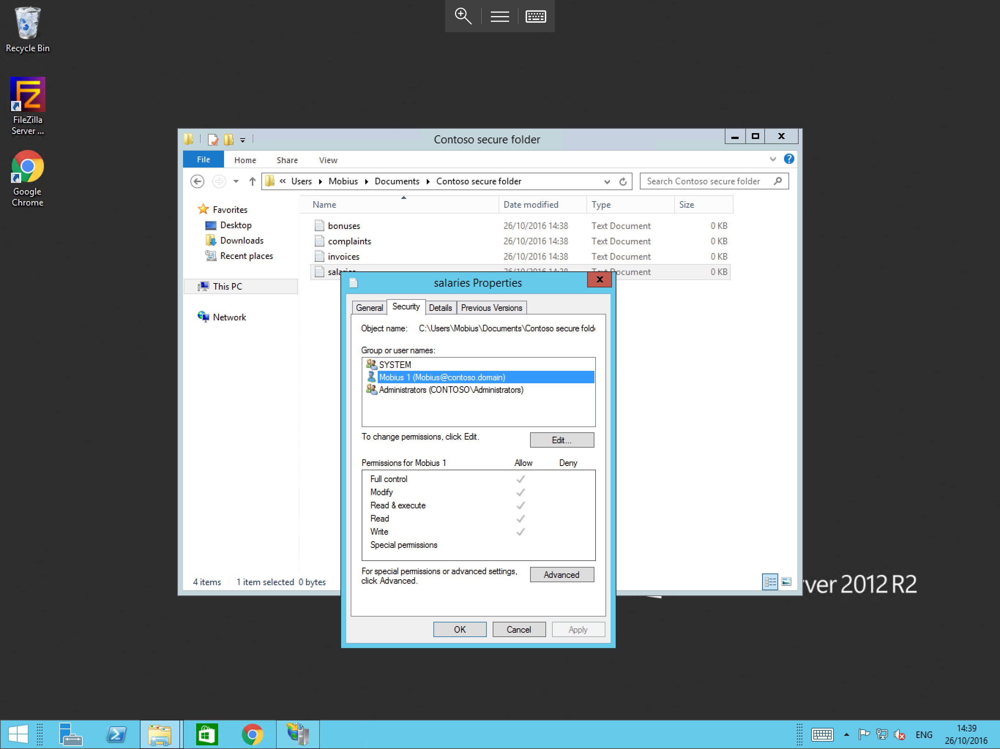
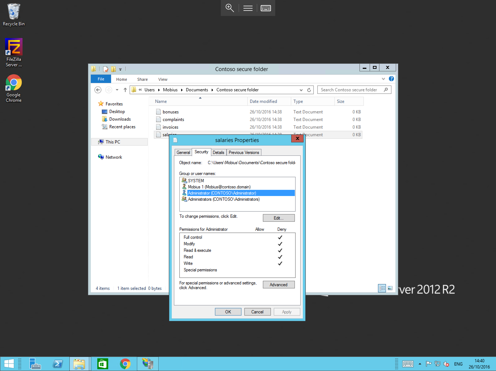
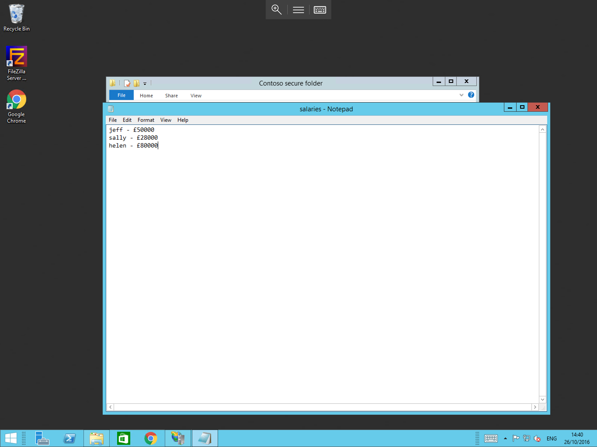
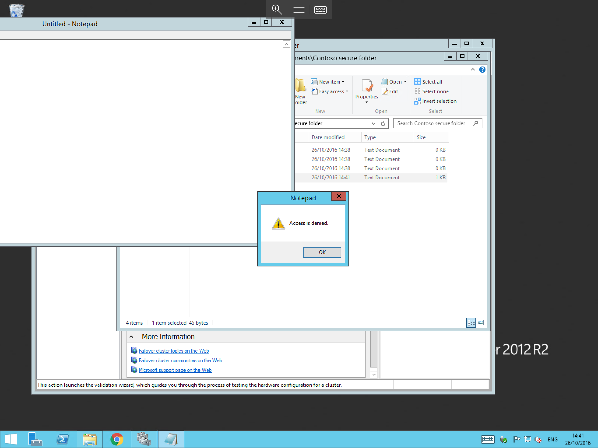

# Creating Appropriate permissions

Creating the Correct file permissions for your data is Crucial to prevent unauthorised access, and/or data loss via intentional deletion or compromise.
A common way for Current Cryptolock malware to gain access to your data, is via file permissions which have been configured incorrectly using the "Everyone" Principle, it is advised that you do not use this as it does leave your server vulnerable

* When configuring permissions, to ensure that your data is as secure as possible, it is considered best practice to apply the Principle of least priviledge,


For this guide, consider that you have a folder which contains sensitive files and you only want specific users to be able to access the files, in order to prevent access to those files, you have 2 options available to you

1. You can create user permissions which explicitly prevent or allow access by specific users (This method will work well if you only have a handful of user accounts to manage, but will be a time consuming task with large volumes of user accounts).
2. You can create a user group which you can then use to assign access to the files (This method uses a group container, to which all authorised users are then added. This method is generally less time consuming when managing large volumes of user accounts)

## Creating Explicit Permissions

In order to create an Explicit permission on a file, please follow the guide below

Locate the file or directory which you wish to secure, right click on it and select "Properties" as below


You will now be presented with the file or folder properties, select the "Security" tab in this pane as below



The security tab will display current security rules for this file or directory, selecting each user or group in the list, will display the corresponding permissions.
Please select Add and you will be presented with a the "Select Users, Computers, Service Accounts, or Groups" pane, as below


In this pane, please type the appropriate user account, in this case "administrator" and select OK.
You will now be returned to the permissions pane, where you will be able to see your newly added user in the list, Select the administrator entry, and then tick the deny box for the full control permission in the bottom section of the window as below
Notice that this fills all other boxes thus denying any form of access to the file, select ok.


You will now be returned to the security pane where you will be able to see the administrator entry and the deny permission for your folder as below, select ok to apply the permission.



Now that the permission has been added, the Mobius account should be able to access the file, however the administrator account will be denied access as below

* Access as user Mobius 1



* Access as user administrator



## Creating Permissions based on user groups

* This section of the guide assumes that you already have already created user groups, if you have not, please follow our guide on creating user groups

To Create Permissions based on user groups

1. Make the required users, members of your user group
2. Follow the steps above until you reach the permissions window
3. Instead of adding an individual user to the permissions tab, add your group using the same method
4. tick the required permissions boxes (remember that we previously ticked the deny box for full control)
5. Select "OK"

Your permissions will now be applied.

```eval_rst
  .. title:: Creating file permissions
  .. meta::
     :title: Creating file permissions | UKFast Documentation
     :description: Guidance on creating appropriate file permissions in Windows
     :keywords: ukfast, windows, file, permissions, appropriate, change, cloud, server, guide, tutorial
