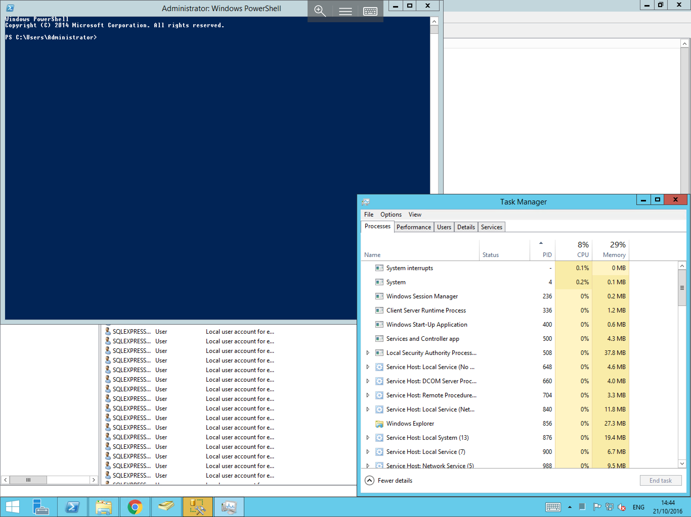
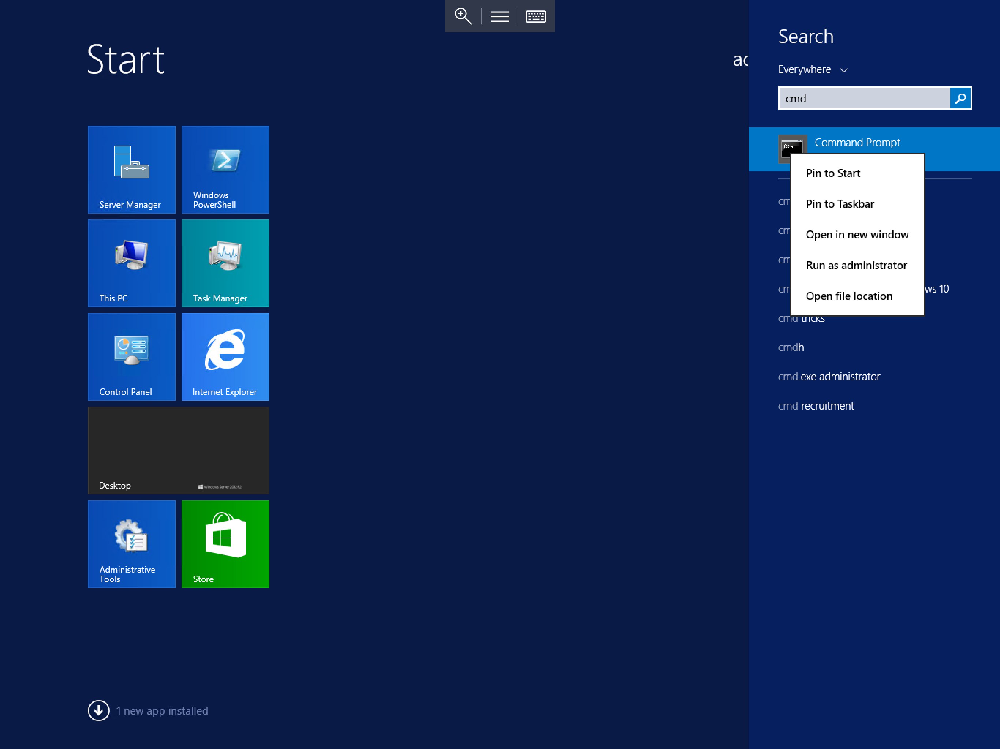
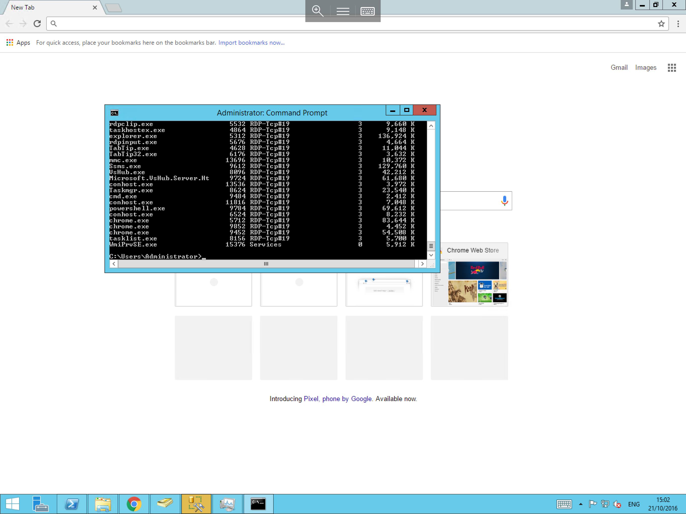
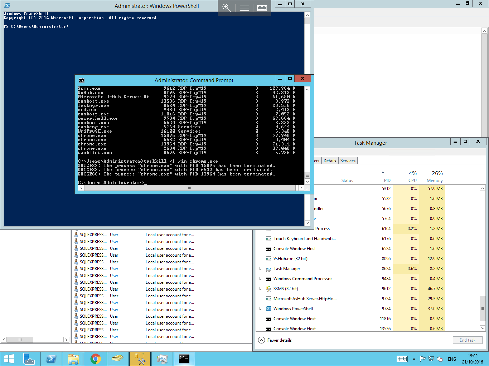

# How to Forcibly end a process in Windows

* In some instances applications and processes can become unresponsive and require manual intervention to forcibly end the process.

In order to forcibly end a process, you have two methods available to you

## End a process using Task Manager

To forcibly end a process using task manager, right click on the start menu, and select task manager as below


You will now be presented with the Task Manager, Select the "Processes" tab from the top line as below



Scroll down the list until you find the process which you wish to end, right click the process, and select "End task" as below


## End a process using the `tasklist` and `taskKill` commands

To Forcibly end a process using the command line, select the start menu, and type `cmd`, right click the resultant `cmd.exe` and select run as administrator as below



In the command prompt, type `tasklist` and press enter, this will display a list of running processes as below, locate the process which you wish to end in the list, and make a note of the name or the PID



Now in the command line, type either `taskkill /f /im <process name>` and press enter to end a process by its name or `taskkill /f /PID <number of pid>` and press enter to end a process by its PID

For example (By Name) `taskkill /f /im chrome.exe` as below or (By PID) `taskkill /f /PID 15896`




* For the full command line syntax of `tasklist` and `taskkill`, please visit the respective link below

[<nospell>Tasklist</nospell>](https://technet.microsoft.com/en-us/library/bb491010.aspx)

[<nospell>Taskkill</nospell>](https://technet.microsoft.com/en-us/library/bb491009.aspx)


```eval_rst
  .. title:: Forcibly ending a process in Windows
  .. meta::
     :title: Forcibly ending a process in Windows | UKFast Documentation
     :description: How to forcibly end a process or application in Windows
     :keywords: ukfast, windows, kill, stop, process, performance, task, cloud, server
```
