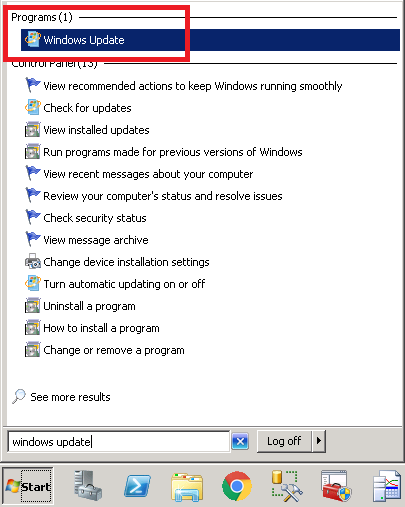
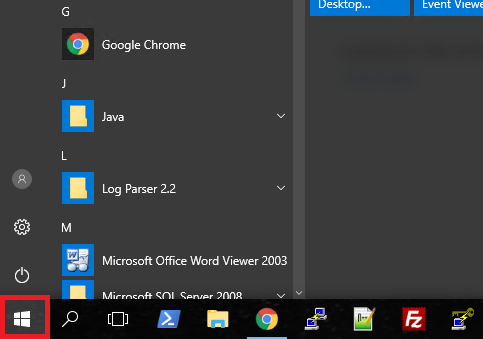
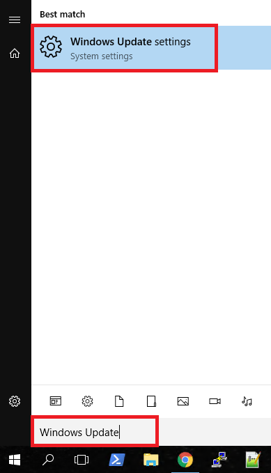

# Protecting against Meltdown and Spectre in Windows

Microsoft have released a security patch to provide protection against the [Meltdown and Spectre vulnerabilities](/security/meltdown) that affect a large number of CPU chipsets.

These updates will be pushed out through the regular Windows Update channels once further testing has been undertaken. If you would like to manually install the patch, you can perform the steps below:

## Manual Installation

The patches for Windows Server 2008 R2, 2012 R2 and 2016 can be downloaded directly from the Microsoft Update Catalog. These links are provided below:

* [Microsoft Windows Server 2016](https://www.catalog.update.microsoft.com/Search.aspx?q=KB4056890)

* [Microsoft Windows Server 2012 R2](https://www.catalog.update.microsoft.com/Search.aspx?q=KB4056898)

* [Microsoft Server 2008 R2](https://www.catalog.update.microsoft.com/Search.aspx?q=KB4056897)

The basic walk-through for manually installing the patch is provided below:
(Screenshots shown are from Windows Server 2012 R2, however the process is similar for Windows Server 2008 R2 and 2016)

* Follow the above link for your specific operating system and click `Download` on the patch relevant to your operating system.


* This will download the patch to your downloads folder by default. You can then browse to your download location and click to install the patch.


* Run through the installation. When complete, you will need to reboot your machine for the patch to take effect.


## Enable the Registry keys

Once the patch has been applied and the updates have been installed, you will need to add two registry keys to enable the mitigations on the server. This is per the [Microsoft documentation](https://support.microsoft.com/en-us/help/4072698/windows-server-guidance-to-protect-against-the-speculative-execution-s).

Open a `CMD Prompt` as Administrator and run the following two commands, one after another. This will add the relevant registry keys to enable the Mitigation.  Always backup the registry before making changes.  If you are a UKFast customer and are not comfortable making these changes, please seek assistance from our support team by raising a support request in [MyUKFast](https://portal.ans.co.uk/pss/add.php).

```console
reg add "HKEY_LOCAL_MACHINE\SYSTEM\CurrentControlSet\Control\Session Manager\Memory Management" /v FeatureSettingsOverride /t REG_DWORD /d 0 /f

reg add "HKEY_LOCAL_MACHINE\SYSTEM\CurrentControlSet\Control\Session Manager\Memory Management" /v FeatureSettingsOverrideMask /t REG_DWORD /d 3 /f
```

For further information, please refer to the [Microsoft documentation](https://support.microsoft.com/en-us/help/4072698/windows-server-guidance-to-protect-against-the-speculative-execution-s)


## Automatic installation

Once testing has been completed, this security patch will be deployed automatically for any UKFast customers who follow our automatic update schedule and have a compatible anti-virus, as per the Microsoft patch requirements. The patch will be pushed out through the standard Windows Update system.

If your anti-virus version is not compatible with the patch, then the update will **not** be made available through Windows Update. Please contact your anti-virus vendor for further information.  If you use McAfee then [this article](https://kc.mcafee.com/corporate/index?page=content&id=KB90167) may help.

## Checking for Windows Updates

If you don't have automatic updates scheduled on your UKFast servers, here's how to check for Windows Server updates manually

### Windows Server 2008 R2

* Click `Start` and type "Windows Update" to search for the Windows Update utility.



* In Windows Updates, you can click on the `Check for Updates` option on the left hand menu to check for any newly released updates


### Windows Server 2012 R2

* Click `Start`, and type "Updates", and then click on `Windows Updates`:


* You can now select the `Check for Updates` button on the left, which will perform an check for any newly released Windows Updates:


### Windows Server 2016

* Click `Start`, and type "Windows Update" in the search bar:





* Click on `Windows Update Settings`, and from here you can check for any new updates:


```eval_rst
  .. title:: Meltdown and Spectre patch for Windows
  .. meta::
     :title: Meltdown and Spectre patch for Windows | ANS Documentation
     :description: A guide to patching against recent CPU vulnerabilities
     :keywords: ukfast, windows, security, updates, meltdown, spectre, cpu, tutorial, guide
```
