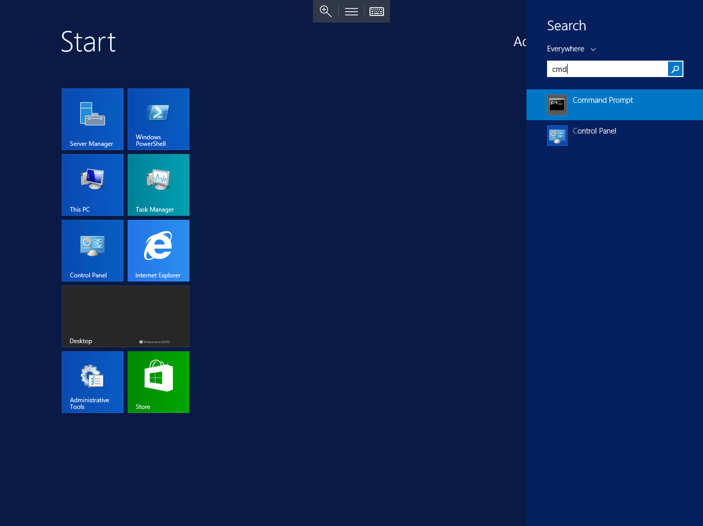
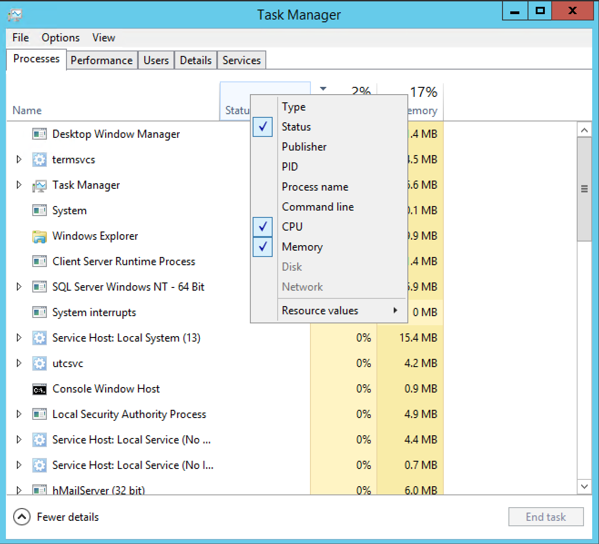

# Using the `netstat` command to find port information

To run the `netstat` command, you will first need to open a Command Prompt as administrator, to do so, please select start, type `cmd`, right click the resultant `cmd.exe` and "Run as Administrator" as below


## Finding processes running on a port

* In order to find what process is running on a specific port in Windows, you need to utilise the `netstat` command

In the Command Prompt, type `netstat -ano | find ":Required port number"`, for example, if you wish to find out what process is listening on port 25, you would type `netstat -ano | find ":25"` and hit Enter

The Command Prompt will now display any processes listening on port 25 as below


At the right hand side of the result, you will see a number, this number is a PID (Process Identifier), this number is assigned to a specific process on your server.

To find out what process is assigned the displayed PID, right click on the task bar, and select "Task Manager", once task manager has presented itself, select the "processes tab" and right click on the status title.

This will now display a context box with a number of options as below, please select "PID" from the list.



now search through the list of <nospell>PID's</nospell> to find the one matching the PID listed by your `netstat` command, in this example 844,which as you can see below is occupied by the hMailServer application.


This means that port 25 is being occupied by hMailServer, which is as expected.

The `netstat` command can be extended to count the number of connections on a specific port, you can do this by adding `/c` to the end of the command. for example

```console
netstat -ano | find ":25"` /c
```

## What port is my service listening on?

* In order to find out what port a specific service is listening on, you simply use the `netstat` command again, but in a slightly different way.

In the Command Prompt, type `netstat -ano` and press enter.

This will present you with a list of all current connections to and from your server as below


Right click on the taskbar, and select task manager, again, select processes, and right click on the title bar, Select "PID" from the resultant list.
Find the the PID of the program for which you are trying to find the corresponding port, now review the connections in Command Prompt to find the Correct PID, look to the left of the Command Prompt on the matching line to see which port that specific PID is using.

```eval_rst
  .. title:: Finding port information with netstat
  .. meta::
     :title: Finding port information with netstat | ANS Documentation
     :description: A guide to using the netstat command to find port informaton in Windows Server
     :keywords: ukfast, windows, network, netstat, port, find, tutorial, cloud, server
```
