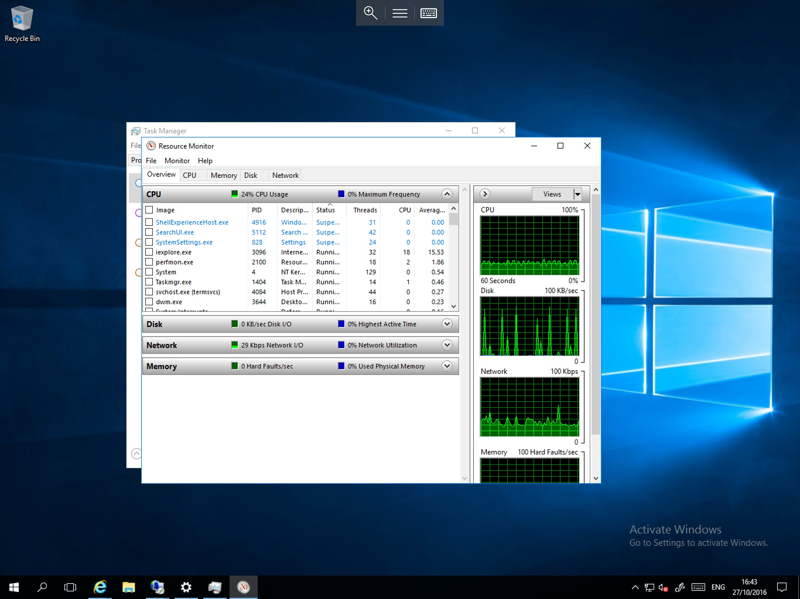
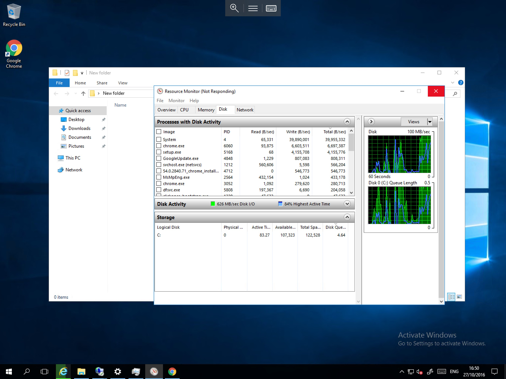

# Using Windows Resource Monitor to inspect working processes

The Windows Resource Monitor can be useful when experiencing and attempting to diagnose performance issues on your server.

To launch the Resource Monitor, open the Task Manager by right clicking on the taskbar and selecting `Task Manager`.


Select the Performance Tab and then select `Open Resource Monitor` from the bottom of the window. You will now be presented with the Resource Monitor Overview which can be used to view current overall resource consumption as below.



In the Overview tab, you can view current usage of CPU, RAM, Disk, and the network. For more detail go to the appropriate tab. For this example, we will demonstrate an inspection of disk resource usage.

Select the Disk tab, and you will be presented with more information on disk usage, including "Processes with Disk Activity", "Disk Activity" and "Storage" as shown below


The above example shows that only the system process is currently using disk resources. In the Storage section you can see that the Disk Queue for drive C: is `0.00`, this means that the disk is under almost no load at present. However, if you are experiencing slow performance / response on the server, it could be due to a high `Disk Queue` as depicted below



Here you can see that the `Disk Queue` for drive C: is `4.64`, this means that the drive has 4.6 times the volume of read / write requests than it can efficiently handle per second. If this figure stays above 2 for a prolonged period of time, it is indicative of an I/O bottleneck and will likely be causing performance issue.

You can also see that the `System` process, `setup.exe` and `Chrome.exe` are causing the largest volume of disk I/O activity. By identifying the responsible processes, you can analyse these to ascertain the root cause of high disk queue. In this example we can see that Windows Updates are being installed, files are being downloaded via `chrome.exe`, and Windows is indexing the new files.

```eval_rst
  .. title::  Windows Resource Monitor
  .. meta::
     :title:  Windows Resource Monitor | UKFast Documentation
     :description: Guidance on using Windows Resource Monitor to inspect working processes
     :keywords: ukfast, windows, resource, monitor, resmon, process, working, inspect, cloud, server
```
