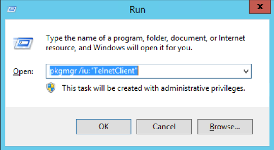

# Testing Basic connectivity Using Telnet

To test basic connectivity of a service on a specific port, please follow the below guide.

* Firstly, if you computer does not have the telnet client installed, you will need to install it before following this guide.

To install Telnet, select start, type `run` and select the resultant `run.exe`, (Alternatively, you can press the `Windows + R` keys on your keyboard simultaneously to bring up a run dialogue box)

Type `pkgmgr /iu:"TelnetClient"` in the run box as below and select "OK"



* The telnet command will now be active and usable via any Command Prompt window, or PowerShell window.

Open a Command Prompt or a PowerShell window by selecting start and selecting your chosen console, once the console has opened, type `telnet <target ip> <target port>`, for example `telnet 10.20.10.20 25`, and press enter on your keyboard.

If the connection is established, you will receive a response from the remote server as demonstrated below


If however, you are presented with a blank window, this could mean that the connection could not be established correctly, at this point, it is advised to review firewall rules etc to ensure that appropriate access is allowed to and from your target IP.

```eval_rst
  .. title:: Testing basic connectivity using Telnet
  .. meta::
     :title: Testing basic connectivity using Telnet | ANS Documentation
     :description: A guide to testing connectivity on Windows using Telnet
     :keywords: ukfast, network, telnet, windows, test, connect, basic, guide, tutorial, cloud
```
