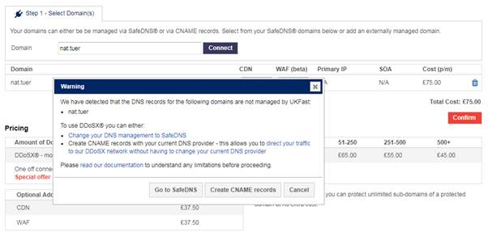
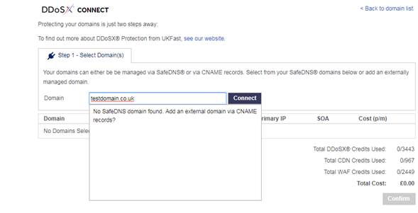
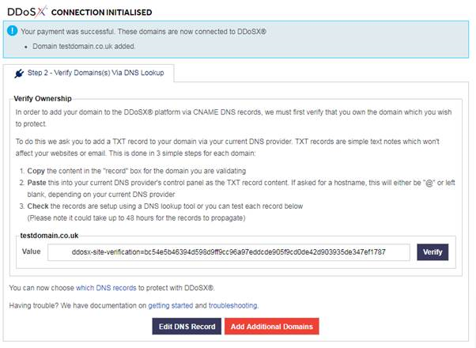

# How to set up an external domain on DDoSX

In order to protect your root domain, for example UKFast.co.uk, you must first check that your DNS provider will support root level forwarding such as; an ALIAS or ANAME. If your DNS provider does not support this we cannot protect the root domain. The root domain will also not be protected by WAF or able to serve CDN. However, for example, www.ukfast.co.uk and all subdomains will be fully protected. For more information read our documentation.

A CNAME record links a domain to the A name record of another domain for ease of redirection.

1. Login to MyUKFast and head to DDoSX Protection in the Products and Services menu.

2. Click Connect Now

3. Type the domain you would like to protect in the domain box.

4. A message will pop up to add a CNAME record. Click Connect.

In order to connect your domain to the DDoSX network you must first verify that this is your domain. To do this follow the on screen instructions. Once this process has been completed and the verification has been confirmed you will proceed to the configure tab within DDoSX. To then complete the set up of your domain on DDoSX read our documentation here.

