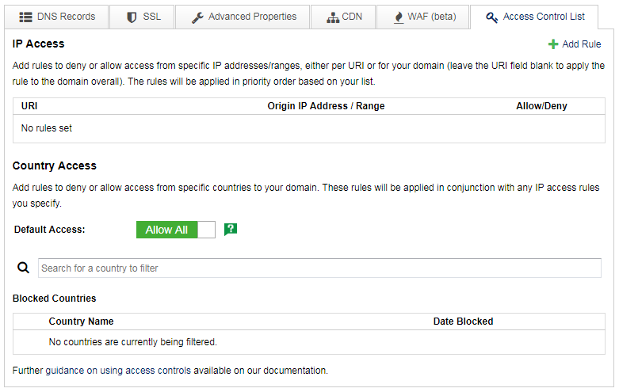
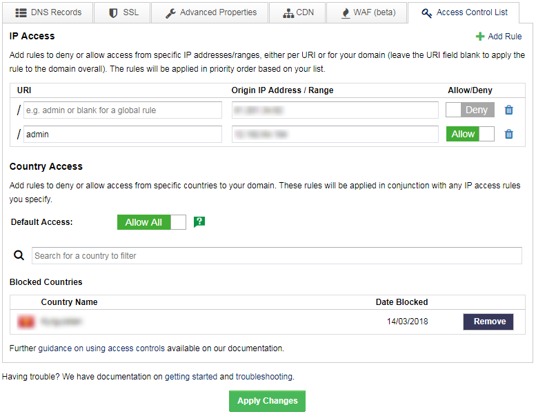

# Access Controls

You can use DDoSX to control access to your domains and individual URIs. A URI is the part of a URL after the `/`. For example, in `yourdomain.com/admin`, `admin` is the URI).

DDoSX enables you to deny or allow incoming requests based on two filters:

- Origin IP address or IP range
- Origin country

This combination allows you to build complex rule sets to meet your individual requirements. Examples of typical rules would be:

```eval_rst
+--------------------------------------------------------------------------------------------------------+------------------------------------------------------------------------------------------------------------------------------------------+
| Example rules                                                                                          | Use Case                                                                                                                                 |
+========================================================================================================+==========================================================================================================================================+
| Deny access to your domain from IP address ``aa.bb.cc.dd``                                             | If you've experienced frequent attacks from this IP                                                                                      |
+--------------------------------------------------------------------------------------------------------+------------------------------------------------------------------------------------------------------------------------------------------+
| Only allow access to your admin control panel at ``yourdomain.com/admin`` from your office IP range(s) | To prevent access from any other location                                                                                                |
+--------------------------------------------------------------------------------------------------------+------------------------------------------------------------------------------------------------------------------------------------------+
| Block all access to your domain from country X                                                         | If you have no genuine traffic or users in this country and are concerned about malicious threats                                        |
+--------------------------------------------------------------------------------------------------------+------------------------------------------------------------------------------------------------------------------------------------------+
| Block all access to your domain from country X, but allow access from IP address ``dd.ee.ff.gg``       | If you want to block traffic from this country, but have an employee located there who still needs access from their specific IP address |
+--------------------------------------------------------------------------------------------------------+------------------------------------------------------------------------------------------------------------------------------------------+
```

## Setting access controls

To set access controls, go to the domain in question within the [DDoSX area of MyUKFast](https://my.ukfast.co.uk/ddosx/) and click on the `Access Control List` tab under `Configure`.  You will see a screen as follows:



### IP Access

To add rules based on an IP address or range, click `+Add Rule`; you'll see an area open up as follows:


- If you want to apply a rule to your domain overall (also known as a global rule), leave the URI field blank
- If you want to apply the rule to a specific URI then enter this into the URI field (enter the part after the `/` - for example `admin`)
- Enter the Origin IP address or range you wish to filter on.  To filter on **all** IP addresses (for example if you wish to deny requests from all IPs) enter `*` into the Origin IP Address / Range field
- Then choose Allow or Deny using the slider.

Note that rules will be applied **in priority order**, based on the order you add them.  Our recommendation is to place your "Allow" rules first, and then your "Deny" rules, as rules are checked in sequence until there is a match.  If you wish to change the order in which rules are applied you will need to delete and re-add them as appropriate.

### Country Access

You can also manage access to your domain based on the country that requests originate from.  Country filtering is based on either a "blocklist" or "allow list" approach:


- **Blocklist approach** - set the Default Access to `Allow All` using the slider, then specify individual countries which you wish to block, or "blocklist"
- **Allow list approach** - set Default Access to `Block All` using the slider, then specify individual countries which you wish to allow, or "allow list"

The country access rules you specify will work in conjunction with your IP access rules; this is how you can build rulesets such as - *block all access from country X, but allow access from a specific IP address even though it is within country X*.

Once you've specified all your IP access and Country access rules, click `Apply Changes` at the bottom of the screen.



Your access rules may take a few minutes to propagate out across the DDoSX network.  You can check the the status of your domain by returning to the DDoSX Domains List (click `<Back to Domains list`) - once your changes have been applied you'll see a green tick in the Status column next to the domain in question.

```eval_rst
   .. title:: Access Control Lists on DDoSX
   .. meta::
      :title: Access Control Lists on DDoSX | UKFast Documentation
      :description: Detailed guidance on setting IP-based and country-based access controls for your domains
      :keywords: ddos, ddosx, access control, access control list, acl, acls, IP blocking, country blocking, filtering
```
