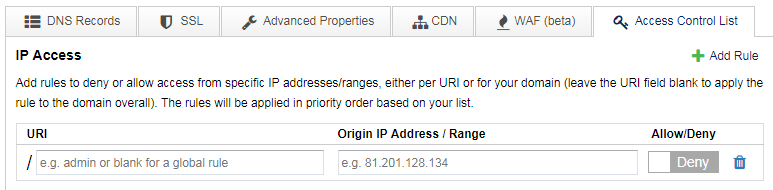
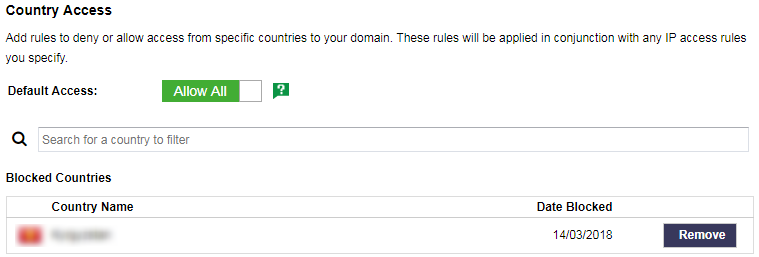

# Access Controls

You can use DDoSX to control access to your domains and individual URIs (a URI is the part of a URL after the `/`, for example in yourdomain.com/*admin*, admin is the URI).

DDoSX enables you to deny or allow incoming requests based on two filters:

- Origin IP address or IP range
- Origin country

This combination allows you to build complex rule sets to meet your individual requirements. Examples of typical rules would be:

```eval_rst
+----------------------------------------------------------------------------------------------------+------------------------------------------------------------------------------------------------------------------------------------------+
| Example rules                                                                                      | Use Case                                                                                                                                 |
+====================================================================================================+==========================================================================================================================================+
| Deny access to your domain from IP address aa.bb.cc.dd                                             | If you've experienced frequent attacks from this IP                                                                                      |
+----------------------------------------------------------------------------------------------------+------------------------------------------------------------------------------------------------------------------------------------------+
| Only allow access to your admin control panel at yourdomain.com/admin from your office IP range(s) | To prevent access from any other location                                                                                                |
+----------------------------------------------------------------------------------------------------+------------------------------------------------------------------------------------------------------------------------------------------+
| Block all access to your domain from country X                                                     | If you have no genuine traffic or users in this country and are concerned about malicious threats                                        |
+----------------------------------------------------------------------------------------------------+------------------------------------------------------------------------------------------------------------------------------------------+
| Block all access to your domain from country X, but allow access from IP address dd.ee.ff.gg       | If you want to block traffic from this country, but have an employee located there who still needs access from their specific IP address |
+----------------------------------------------------------------------------------------------------+------------------------------------------------------------------------------------------------------------------------------------------+
```

## Setting access controls

To set access controls, go to the domain in question within the [DDoSX area of MyUKFast](https://my.ukfast.co.uk/ddosx/) and click on the `Access Control List` tab under `Configure`.  You will see a screen as follows:


### IP Access

To add rules based on an IP address or range, click `+Add Rule`; you'll see an area open up as follows:



- To add a rule for your domain overall (also known as a global rule), leave the URI field blank
- If you want to apply the rule to a specific URI then enter this into the field (enter the part after the `/` - for example `admin`)
- Enter the Origin IP address or range you wish to filter on
- Then choose Allow or Deny using the slider.  

Note that rules will be applied **in priority order**, based on the order you add them.  So make sure to add the first rule you want applied first, then the second, and so on.  If you wish to change the order in which rules are applied you will need to delete and re-add them as appropriate.

### Country Access

You can also manage access to your domain based on the country that requests originate from.  Country filtering is based on either a "blacklist" or "whitelist" approach:



- **Blacklist approach** - set the Default Access to `Allow All` using the slider, then specify individual countries which you wish to block, or "blacklist"
- **Whitelist approach** - set Default Access to `Block All` using the slider, then specify individual countries which you wish to allow, or "whitelist"

The country access rules you specify will work in conjunction with your IP access rules; this is how you can build rulesets such as - *block all access from country X, but allow access from a specific IP address even though it is within country X*.

Once you've specified all your IP access and Country access rules, click `Apply Changes` at the bottom of the screen.  Your access rules will be applied immediately.


```eval_rst
.. meta::
    :title: Access Control Lists on DDoSX | UKFast Documentation
    :description: Detailed guidance on setting IP-based and country-based access controls for your domains
    :keywords: ddos, ddosx, access control, access control list, acl, acls, ip blocking, country blocking, filtering
```
