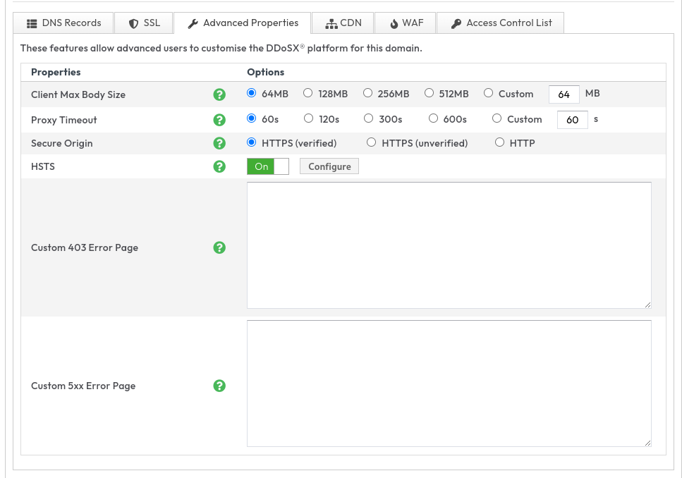

# Custom Error Pages

On occasions DDoSX might report errors with your site such as not being able to connect to the upstream (502), report an invalid SSL on the origin (502), the upstream takes too long to respond (504), IP or country code blocking (403), WAF blocks (403) or even an internal error on the platform (500). 

The platform in these instances will return an error page for each of the above http status code responses. However there may be instances where you might want the above DDoSX errors to show a different error page.

### Adding your custom error page
Once you are logged into your ans portal and browse to DDoSX Protection > Domain > mydomain.example > Advanced Properties

From here you will see the following screen  



You can paste html into both or either of the two custom error page input boxes.

### CLI

```
# custom_403_error_page
ans ddosx domain property update mydomain.example 42ab5f8b-9265-4206-9b62-80c9514a6b75 --value="<html>Hello, world</html>"

#custom_5xx_error_page
ans ddosx domain property update mydomain.example b092897b-e5d1-4f91-bcb9-7a23138fefd5 --value="<html>Hello, world</html>"
```

```
# Output
ans ddosx domain property list mydomain.example 
+--------------------------------------+-----------------------+---------------------------+
|                  ID                  |         NAME          |           VALUE           |
+--------------------------------------+-----------------------+---------------------------+
...
| 42ab5f8b-9265-4206-9b62-80c9514a6b75 | custom_403_error_page | <html>Hello, world</html> |
...
| b092897b-e5d1-4f91-bcb9-7a23138fefd5 | custom_5xx_error_page | <html>Hello, world</html> |
...
+--------------------------------------+-----------------------+---------------------------+
```

### Known Limitations
* HTML files limited to 64KB
* We will only load the error page for error status codes 
* There is no support for dynamic error codes and the pages need to be static html

```eval_rst
   .. title:: Custom Error Pages on DDoSX
   .. meta::
      :title: Custom Error Pages on DDoSX | UKFast Documentation
      :description: Detailed guidance on adding custom error pages and limitations. 
      :keywords: ddos, ddosx, custom error, custom error pages, errors, html
```
