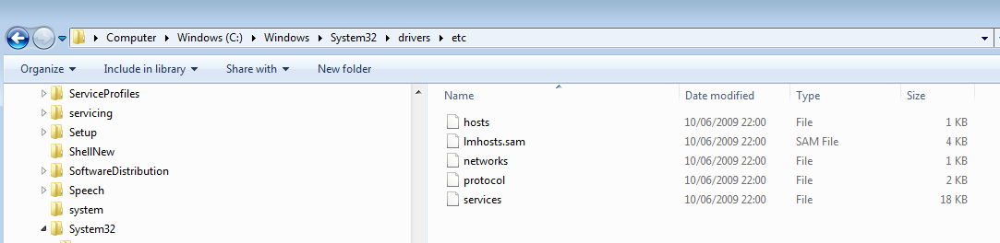

# Getting started

DDoSX<sup>®</sup> and Content Delivery Network (CDN) are two features of our global network that work together to significantly improve your website or web application’s speed and security. DDoSX<sup>®</sup> provides protection against DDoS attacks, and CDN is an **optional** feature that caches your site's content closer to the end user. In order to use CDN, DDoSX must also be enabled on the domain.

```eval_rst
.. seealso::

   To use DDoSX\ :sup:`®` and optional Content Delivery Network from UKFast, you need to have your domains' nameservers pointing to the UKFast nameservers, and you also need to manage your DNS records using SafeDNS.

   Make sure to set up your DNS records correctly in SafeDNS first - see the :doc:`/Domains/safedns/index` guide for assistance.  You must move all records associated with the domains (including sub-domains) you wish to protect, including SMTP, MX, mail etc. to SafeDNS.

   Once you have done this, point your domains to the UKFast nameservers, which are:

   - ns0.ukfast.net
   - ns1.ukfast.net

   You'll need to do this through whichever domain registrar you use to manage your domains (which may not be UKFast).  If you don't know who your domain registrar is you can do a 'WHOIS' lookup on websites such as https://whois.icann.org/

```

To enable DDoSX<sup>®</sup> and CDN on your domains, follow these steps:

**[1. Connect](#connect-domain)** your domain(s) to DDoSX

**[2. Test](#test-domain)** your domains will work properly on the DDoSX network

**[2. Configure](#configure-domain)** which domain records you'd like to protect

**[3. Create CDN Caching Rules](#create-cdn-caching-rules)**

## Connect domain

- Login to [MyUKFast](https://my.ukfast.co.uk) and head to `DDoSX & CDN` in the `Products and Services` menu.
- Click `Connect Now`
- On this page you can search for the domains you're managing through SafeDNS. (if you havent added your domains to SafeDNS yet, please refer to the info box at the top of this page)
- Choose the domain you wish to protect and click `Connect`.
- Optionally, to add CDN to your order, ensure the highlighted toggle switch is set to "On".
- Repeat for each domain you want to add to the network.


- Click `Confirm` to go through the payment process. (You won't have to complete this step if you've already ordered DDoSX<sup>®</sup> or CDN via your UKFast account manager).

## Test domain

- Once you've connected your domain to the DDoSX network, you may wish to test that your website or application will work correctly, before making the necessary changes to your DNS records.  This can be done by modifying your local `hosts` file.

- You will see that initially your DNS Routing is shown as "Server", as per below.


- Before changing the DNS Routing to DDoSX, you can test the impact on your local computer by modifying the `hosts` file to look for the "Assigned IPv4" address for your domain.

- On Windows you'll find the `hosts` file in **C:\Windows\System32\Drivers\etc**



- Open the `hosts` file using Notepad or another plain text editor (you may need administrator rights to make changes), and insert a line for each domain you wish to test, that includes the domain and the Assigned IPv4 address from DDoSX; for example:

```
189.192.54.168 mydomain.co.uk
189.192.54.168 www.mydomain.co.uk
189.192.54.168 blog.mydomain.co.uk
```
- [This article](https://www.howtogeek.com/howto/27350/beginner-geek-how-to-edit-your-hosts-file/) contains instructions on modifying the `hosts` file on MacOS and Linux, as well as more details for the various versions of Windows.

- Once you've added all the domains you need to test, save the file. Then open a web browser and try browsing to your domain.  Your local `hosts` file will route the request directly to the DDoSX IP address so you'll be able to see exactly how your site will perform when you change your DNS records.

## Configure domain

- Once you've completed your testing, the DNS records for your domain need to be configured.
- Click `Configure` next to the domain you wish to setup first within the `DDoSX & CDN` control panel and choose which A Records and AAAA Records you specifically want to protect for each domain.
- You can also assign any existing SSL certificates at this point. SSL certificates purchased from MyUKFast will appear in the dropdown menu, or click `Add SSL` to add details of other SSL certificates manually. SSL certificates can be managed within the `SSL Certificates` tab.
- Ensure the highlighted toggle switches are set to "On" for all of the sub-domains you wish to protect with DDoSX<sup>®</sup>.


- Click `Apply Changes` and your domain is now connected to the UKFast DDoSX<sup>®</sup> network, and configured appropriately.  

Note that it may take [up to 24 hours](/Domains/domains/dnspropagation.html) for DNS changes to propogate across the internet (as with any such changes), and before your domain is fully protected.

## Create CDN caching rules

For any domains with CDN added, content caching will not be activated until rules have been added to the configuration.

[Follow this link to the CDN 'caching rules' setup guide](/network/cdn/cachingrules.html)
